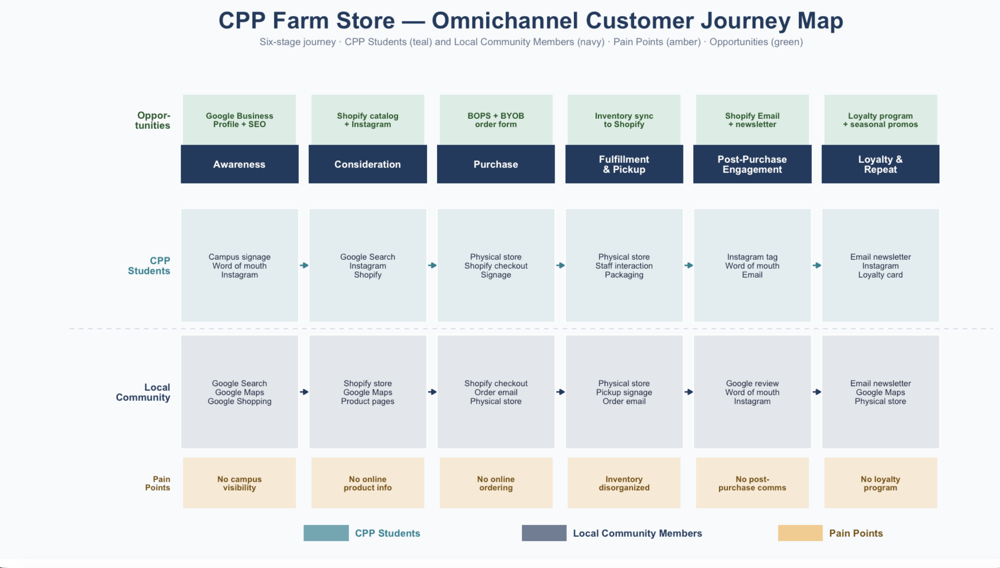

```{r}
#| label: setup
#| echo: false
#| message: false
#| warning: false

if (!require("ggplot2", quietly = TRUE)) install.packages("ggplot2")
if (!require("ggtext", quietly = TRUE))  install.packages("ggtext")

library(ggplot2)
library(ggtext)
```

## Introduction and Purpose {#sec-intro}

The CPP Farm Store, operated by the Huntley College of Agriculture at Cal Poly Pomona, is a unique specialty food retailer selling campus-grown produce, freshly squeezed orange juice, CPP-grown wine, fruits, vegetables, organic produce, and customized gift boxes and baskets. Founded in September 2001, the store operates a physical location at 4102 S. University Drive, Pomona, and an online storefront, generating approximately **\$2 million in annual revenue**. The store is required to be financially self-sufficient and competes with larger retailers such as Sprouts, Whole Foods, and Trader Joe's.[^1]

[^1]: Background information on the CPP Farm Store was gathered through our group store visit and manager interview with Brianna Cox, conducted during Summer 2026 as part of the IBM 6300 consulting project.

This omnichannel journey map documents how CPP Farm Store customers currently discover, evaluate, purchase, receive, and engage with the store across physical and digital touchpoints. It identifies where friction currently exists in the customer experience and proposes specific, measurable omnichannel improvements connected to every remaining deliverable in this project.

> *How can CPP Farm Store create a smoother, more connected customer journey across offline and online channels — and what specific steps should be taken to get there?*

::: callout-note
This report focuses on **two primary target customer segments**: CPP Students and Local Community Members (Pomona, Diamond Bar, and Walnut area). Every section — journey stages, touchpoints, pain points, opportunities, and strategic implications — addresses both segments explicitly.
:::

------------------------------------------------------------------------

## Target Customer Segments {#sec-segments}

### Why These Two Segments {#sec-why}

The two segments were selected based on our store visit, manager interview, and the store's physical location at the edge of the Cal Poly Pomona campus. They represent the two most realistic and highest- value growth opportunities available to CPP Farm Store given its current resources, location, and product mix.

**Why CPP Students matter to CPP Farm Store:** CPP Students are the most geographically accessible customer base — they are already on or near campus every day. However, the store manager confirmed that many students do not know the Farm Store exists or what it sells. This is a low-cost, high-frequency growth opportunity: if even a small percentage of the 29,000+ students on campus became regular visitors, the impact on revenue and foot traffic would be significant. Students also represent the store's mission audience — the people most directly connected to the learn-by-doing agricultural education the store supports.

**Why Local Community Members matter to CPP Farm Store:** Local community members in Pomona, Diamond Bar, and Walnut represent the store's highest-value growth segment for online and gift basket sales. These are shoppers who already buy from Sprouts, Whole Foods, and Trader Joe's — meaning they are willing to pay a premium for quality and local products. They are most likely to purchase gift baskets for holidays and special occasions, which carry the highest average order value in the store's catalog. However, this segment cannot discover the store at all without digital visibility — they do not pass by campus, so Google Search, Google Maps, and Google Shopping are their only realistic discovery channels.

### Segment Profiles {#sec-profiles}

::: panel-tabset
### CPP Students

**Who they are:** Undergraduate and graduate students at Cal Poly Pomona, with the highest concentration in the Colleges of Agriculture, Business, Science, and Engineering. Age range 18–28. Budget-conscious but values-driven — willing to spend slightly more on products that feel authentic, local, and connected to campus identity.

**How they discover businesses:** Instagram, TikTok, word of mouth from peers, campus flyers and signage, and Google Search when looking for food near campus. They are highly mobile-first and unlikely to discover the store through a traditional website visit unprompted.

**What they want from CPP Farm Store:** - Fresh, affordable food options available during the school day - Convenient in-store pickup that fits between class schedules - Clear information about what is in stock and what is seasonal - Student discounts or loyalty incentives that reward repeat visits - A product that feels authentically connected to their university

**Why this segment is currently underserved:** The store has no active Instagram presence, no online inventory visibility, and no student-specific promotions. A student who has never visited campus's south edge has no digital path to discovering the store exists.

### Local Community Members

**Who they are:** Residents of Pomona, Diamond Bar, and Walnut — primarily families, working adults, and gift buyers aged 28–55. Already shopping at Sprouts, Whole Foods, or Trader Joe's, meaning they are quality-conscious and willing to pay for locally sourced products.

**How they discover businesses:** Google Search, Google Maps, word of mouth from neighbors, and increasingly Google Shopping when looking for specific products or gift options. This segment is less likely to discover the store through social media than through intentional search.

**What they want from CPP Farm Store:** - A genuine local alternative to chain grocery stores with a campus-grown origin story they can share with others - The ability to browse products and place gift basket orders online before visiting or without visiting - Clear pickup instructions and reliable order fulfillment - Confidence that the product quality matches the store's premium positioning and campus provenance

**Why this segment is currently underserved:** The store's Google Business Profile is incomplete, Google Shopping listings do not exist, and the online ordering experience is insufficiently developed to support this segment's primary discovery and purchase behavior.
:::

### Customer Goals {#sec-goals}

::: panel-tabset
### CPP Students

What a CPP student is trying to accomplish when interacting with CPP Farm Store:

-   Discover that the store exists and is convenient to reach between classes without a long detour
-   Understand quickly what is available today — fresh produce, juice, seasonal items — without having to visit in person to find out
-   Complete a purchase fast, with a payment method that works for students (Bronco Bucks, Meal Points, or card)
-   Feel good about supporting something connected to their campus and their peers' agricultural education
-   Build the store into a regular routine for weekly produce or juice runs without significant planning effort

### Local Community Members

What a local community member is trying to accomplish:

-   Find a locally sourced, high-quality food and gift option that is meaningfully different from Trader Joe's or Sprouts
-   Discover specific CPP-exclusive products — campus-grown wine, fresh-squeezed orange juice, seasonal produce — that justify a dedicated trip to campus
-   Browse and order gift baskets online for birthdays, holidays, and thank-you occasions without having to call or visit in person
-   Trust that the quality and presentation of their order will match the campus-grown story they want to share with the recipient
-   Receive reminders about seasonal availability so they can plan purchases around harvest windows and holiday occasions
:::

------------------------------------------------------------------------

## Customer Journey Map {#sec-journey}

The following journey maps cover all six stages of the customer experience for both target segments. For each stage, we document what the customer is **doing**, **thinking**, **feeling**, and **needing**, along with the specific **touchpoints** they encounter and the **transition** that moves them from one stage to the next.[^2]

[^2]: The six-stage journey framework is adapted from Lemon and Verhoef (2016), "Understanding Customer Experience Throughout the Customer Journey," Journal of Marketing, as discussed in our IBM 6300 omnichannel strategy presentation.

::: panel-tabset
### CPP Students — Full Journey

**Stage 1: Awareness**

| Element | Detail |
|:---|:---|
| **Doing** | Walking past the red barn on their way to the College of Agriculture, seeing a flyer in a campus hallway, hearing a mention from a classmate or professor, or stumbling across an Instagram post tagged on campus |
| **Thinking** | "Wait — CPP has a farm store? I walk past that barn all the time and never knew what it was." |
| **Feeling** | Mildly curious, a little surprised — the store is physically close but mentally invisible |
| **Needing** | A clear, immediate signal that the store is open, accessible, and sells something worth stopping for |
| **Touchpoints** | Campus signage (red barn exterior, lack of clear wayfinding), peer word of mouth, Instagram posts tagged at CPP, campus club announcements |
| **Online ↔ Offline** | Entirely offline at this stage — discovery happens in the physical campus environment |
| **Transition to next stage** | Student must be curious enough to look the store up, ask someone, or walk in |

**Stage 2: Consideration**

| Element | Detail |
|:---|:---|
| **Doing** | Searching "CPP Farm Store" on Google or Instagram to see what it sells, asking a classmate who has been there, checking if it's open during their free period, looking for prices |
| **Thinking** | "Is this worth the walk? Is it affordable? What's actually fresh right now? Do they take Bronco Bucks?" |
| **Feeling** | Skeptical but interested — price and convenience are the two biggest filters at this stage |
| **Needing** | A website or Instagram page that clearly shows current products, prices, hours, and payment options without requiring a visit to find out |
| **Touchpoints** | Google Search (CPP Farm Store), Google Maps listing, CPP Farm Store website, Instagram profile, word of mouth |
| **Online ↔ Offline** | Moves from physical campus to online search — this is where the digital gap is most costly |
| **Transition to next stage** | Student must be convinced the trip is worth it — price, convenience, and product appeal must all clear the bar |

**Stage 3: Purchase**

| Element | Detail |
|:---|:---|
| **Doing** | Stopping in during a gap between classes, browsing the refrigerated section for juice or produce, checking if Bronco Bucks work at the register, making a quick in-store purchase |
| **Thinking** | "Do I have time before my next class? Is there actually something I want here today? Is the line going to be long?" |
| **Feeling** | Rushed — time pressure is the dominant emotion at this stage for students |
| **Needing** | Fast transaction, visible product availability, accepted payment methods clearly signed, no confusion about pricing |
| **Touchpoints** | Physical store (register, product displays, signage), product packaging, Bronco Bucks payment terminal |
| **Online ↔ Offline** | Entirely in-store — no online ordering or pickup option currently available |
| **Transition to next stage** | Purchase must be fast and smooth — a long line or out-of-stock item ends the journey here |

**Stage 4: Fulfillment / Pickup**

| Element | Detail |
|:---|:---|
| **Doing** | Receiving produce, juice, or a seasonal item at the counter; carrying it to class or home; consuming it the same day |
| **Thinking** | "Was this worth stopping for? Does it actually taste as good as it looked? Did I get what I expected?" |
| **Feeling** | Satisfied if the product delivers on its campus-grown promise; deflated if shelves were sparse or the experience felt disorganized |
| **Needing** | Product quality that matches the origin story, clear labeling of what is campus-grown versus sourced elsewhere, visible freshness |
| **Touchpoints** | Physical store counter, product packaging and labels, store staff interaction |
| **Online ↔ Offline** | Physical only — no digital fulfillment currently supported |
| **Transition to next stage** | Product quality and experience quality must both deliver — a good product creates a story worth sharing |

**Stage 5: Post-Purchase Engagement**

| Element | Detail |
|:---|:---|
| **Doing** | Posting a photo of the juice or produce on Instagram, telling a roommate or classmate, mentioning it in an agriculture or food class |
| **Thinking** | "That was actually really good — and it felt cool to be buying something that my own school grows." |
| **Feeling** | Pleasantly surprised, a little proud — the campus identity connection adds emotional value beyond the product itself |
| **Needing** | A reason to share — a product that is visually appealing, a story that is easy to retell, an Instagram account to tag |
| **Touchpoints** | Instagram (tagging @cppfarmstore), word of mouth, email if subscribed |
| **Online ↔ Offline** | Moves back online — this is where organic social growth happens if the store is discoverable |
| **Transition to next stage** | Student must have a strong enough experience to build it into a routine |

**Stage 6: Loyalty and Repeat Purchase**

| Element | Detail |
|:---|:---|
| **Doing** | Planning weekly produce or juice runs into their campus schedule, watching for seasonal drops, telling friends from other majors about the store |
| **Thinking** | "This is just where I get my produce now — it's fresh, it's on campus, and I know the money supports something I care about." |
| **Feeling** | Comfortable, loyal, invested in the campus identity the store represents |
| **Needing** | Consistent stock and quality, advance notice of seasonal items, a student discount or loyalty incentive that rewards their habit |
| **Touchpoints** | Email newsletter, Instagram, campus events and seasonal pop-ups, in-store loyalty program |
| **Online ↔ Offline** | Both — email and social keep the relationship alive between visits |

: CPP Student Journey — Six Stages {.striped .hover}

### Local Community Members — Full Journey

**Stage 1: Awareness**

| Element | Detail |
|:---|:---|
| **Doing** | Searching Google for "local produce near Pomona," "farm fresh gift baskets," or "things to do near Cal Poly Pomona"; seeing a Google Maps listing while searching for nearby food; hearing about the store from a neighbor or colleague who visited campus |
| **Thinking** | "There's a farm store connected to Cal Poly Pomona? I had no idea that existed — what do they actually sell?" |
| **Feeling** | Intrigued by the novelty of a university-operated farm store; skeptical about whether it is worth a dedicated trip |
| **Needing** | A clear, discoverable digital presence that shows up when searching for local food or gift options in the area |
| **Touchpoints** | Google Search, Google Maps listing, Google Shopping results, neighbor word of mouth |
| **Online ↔ Offline** | Entirely online — this segment has no physical proximity to the store and must discover it digitally |
| **Transition to next stage** | A compelling Google listing with photos, hours, products, and reviews must do enough work to motivate a deeper look |

**Stage 2: Consideration**

| Element | Detail |
|:---|:---|
| **Doing** | Browsing the CPP Farm Store website and Shopify store to see what is available and at what price; comparing mentally to Trader Joe's or a farmers market; looking for CPP-exclusive products that justify a campus trip |
| **Thinking** | "Is this actually different from Trader Joe's? What can I get here that I can't get anywhere else? Is the gift basket worth ordering online?" |
| **Feeling** | Cautiously interested — the campus-grown origin story is compelling, but they need proof before committing to a trip or an online order |
| **Needing** | A Shopify storefront that clearly showcases unique products (CPP wine, fresh-squeezed OJ, gift baskets), product descriptions that tell the campus-grown story, accurate pricing and availability |
| **Touchpoints** | CPP Farm Store website, Shopify product pages, Google Maps reviews, Instagram, Google Shopping listing |
| **Online ↔ Offline** | Entirely online — the purchase decision is made or lost here before a physical visit |
| **Transition to next stage** | Product pages, descriptions, photos, and reviews must collectively answer: is this worth driving to campus for? |

**Stage 3: Purchase**

| Element | Detail |
|:---|:---|
| **Doing** | Placing a gift basket order online through Shopify for in-store pickup; OR driving to campus to browse and purchase in person for the first time |
| **Thinking** | "Is this the right gift? Can I customize it? Is the pickup process going to be easy? Will it look as good as the photos?" |
| **Feeling** | Engaged and motivated if the online ordering process is clear; frustrated and likely to abandon if pickup instructions are unclear or the checkout is confusing |
| **Needing** | A simple, mobile-friendly checkout process with clear pickup instructions, a customization option for gift baskets, and visible trust signals (return policy, contact information, payment options) |
| **Touchpoints** | Shopify checkout, order confirmation email, physical store (if visiting in person) |
| **Online ↔ Offline** | Crosses from online to offline — the online order must set accurate expectations for the in-store pickup |
| **Transition to next stage** | A confirmed order or a completed in-store purchase must meet or exceed expectations to generate the post-purchase story |

**Stage 4: Fulfillment / Pickup**

| Element | Detail |
|:---|:---|
| **Doing** | Arriving at the Farm Store to pick up a gift basket order; meeting staff; seeing the store for the first time if it is their first visit |
| **Thinking** | "Does the basket look as good as I imagined? Is the quality worth the price? Is pickup as easy as the website said it would be?" |
| **Feeling** | Excited if the product exceeds expectations — the physical store experience and the quality of the basket packaging directly determine whether this person becomes a repeat customer or a one-time buyer |
| **Needing** | Clear pickup signage, friendly and knowledgeable staff, a gift basket that is well-presented and matches what was described online, accurate labeling of campus-grown versus sourced items |
| **Touchpoints** | Physical store, order confirmation email, staff interaction, product packaging and labeling |
| **Online ↔ Offline** | Physical — but the online ordering experience set the expectations that are being measured here |
| **Transition to next stage** | Product quality and presentation quality must both exceed the customer's mental comparison to Trader Joe's or a florist |

**Stage 5: Post-Purchase Engagement**

| Element | Detail |
|:---|:---|
| **Doing** | Giving the gift basket to its recipient; telling a neighbor or colleague about the store; leaving a Google review; posting on Instagram |
| **Thinking** | "I'm really glad I found this place — and the story behind it makes the gift feel more meaningful than something I could have bought at a grocery store." |
| **Feeling** | Satisfied and community-minded — the campus connection and student-made story add emotional value that makes the purchase feel purposeful |
| **Needing** | A story easy enough to retell in one sentence ("It's from the farm store at Cal Poly Pomona — the students actually grow everything"), a way to tag the store on Instagram, and an invitation to leave a Google review |
| **Touchpoints** | Word of mouth, Instagram (tagging), Google Maps review prompt, email follow-up from the store |
| **Online ↔ Offline** | Returns online — reviews and social posts become the awareness touchpoints for the next community member |
| **Transition to next stage** | A positive review or social post multiplies awareness for this segment more than any paid advertising |

**Stage 6: Loyalty and Repeat Purchase**

| Element | Detail |
|:---|:---|
| **Doing** | Returning for seasonal specialty items (holiday baskets, harvest produce), subscribing to the email list, becoming a regular gift source for occasions throughout the year |
| **Thinking** | "This is my go-to for thoughtful local gifts now — I know the quality is there and the story behind it always lands with whoever receives it." |
| **Feeling** | Loyal, proud of their local-sourcing choice, invested in the CPP mission |
| **Needing** | Seasonal email reminders about new products and limited availability, a loyalty benefit or returning customer acknowledgment, and consistently available signature products (OJ, honey, wine) year-round |
| **Touchpoints** | Email newsletter, Instagram, Google Maps listing (updated hours and seasonal offerings), physical store |
| **Online ↔ Offline** | Both — email drives return visits, in-store experience sustains loyalty |

: Local Community Member Journey — Six Stages {.striped .hover}
:::

------------------------------------------------------------------------

## Pain Points and Omnichannel Opportunities {#sec-painpoints}

The following section identifies the specific friction points that currently prevent customers from moving from one journey stage to the next. Each pain point is grounded in a specific customer action or need identified in @sec-journey, explains why it matters to CPP Farm Store's business, and is paired with a practical omnichannel opportunity that connects the physical store to digital channels. Pain points are prioritized by impact on revenue and customer acquisition.[^3]

[^3]: Pain points were identified through our group store visit and manager interview, combined with an audit of CPP Farm Store's current digital presence across Google Search, Google Maps, Instagram, and the Shopify storefront.

### Priority 1 — No Digital Discoverability for Community Members

**Affected stage:** Awareness → Consideration (Local Community Members)

**What is happening:** A community member in Diamond Bar searching "local gift baskets Pomona" or "farm fresh produce near me" does not find CPP Farm Store in Google Search results or Google Shopping listings. The store's Google Business Profile is incomplete, and there are no Google Shopping product listings for gift baskets or pantry items.

**Why this matters:** This segment cannot discover the store through any channel other than word of mouth — meaning the store is effectively invisible to its highest-value potential customers. A community member who does not discover the store online will never make the trip to campus unprompted. Every month without digital visibility is lost revenue from this segment.

**How it blocks the journey:** The customer never reaches the Consideration stage because they cannot find the store in the first place.

**Omnichannel opportunity:** Complete the Google Business Profile with accurate hours, address, photos, and product categories. Submit the top five gift basket products to Google Merchant Center for free product listings. This creates a direct path from a Google search to the Shopify product page — connecting digital discovery to online ordering and in-store pickup.

**How it can be measured:** Track Google Business Profile views, clicks to website, and direction requests monthly. Monitor Google Merchant Center impressions and click-through rate for listed products.

------------------------------------------------------------------------

### Priority 2 — Students Cannot Find Basic Store Information Online

**Affected stage:** Awareness → Consideration (CPP Students)

**What is happening:** A student who hears about the Farm Store from a classmate and searches for it online cannot easily find current hours, today's available products, or whether Bronco Bucks are accepted — basic information that determines whether they will make the trip during a gap between classes.

**Why this matters:** Students are high-frequency, low-consideration buyers. If the information is not immediately available on a mobile device within 30 seconds, they will buy from the dining hall or a vending machine instead. The barrier to a student's first purchase is almost entirely informational, not motivational.

**How it blocks the journey:** The student reaches Consideration but cannot answer the key questions (is it open? what's there? does it take Bronco Bucks?) and abandons before visiting.

**Omnichannel opportunity:** Update the Shopify homepage to display real-time or weekly updated inventory highlights, clear hours, and payment options. Add campus-targeted Instagram posts with a simple "what's fresh this week" format. Ensure Google Maps hours are always accurate and that the listing includes photos and a link to the Shopify store.

**How it can be measured:** Track Shopify sessions from mobile devices, Instagram profile visits from campus locations, and Google Maps clicks for directions from the CPP campus area.

------------------------------------------------------------------------

### Priority 3 — No Online Ordering or Browse-Before-Visit Capability

**Affected stage:** Consideration → Purchase (Both Segments)

**What is happening:** Neither target segment can currently browse the store's full product catalog online, check current availability, or place an order for in-store pickup before visiting. A community member wanting to order a gift basket must either call the store, visit in person without knowing what is available, or not order at all.

**Why this matters:** The inability to browse and order online is the single largest barrier to purchase for the community segment and a significant barrier for students who want to plan their visit. Online ordering with pickup also increases average order value — customers who plan their purchase in advance tend to buy more than customers who make impulse decisions in-store.

**How it blocks the journey:** The customer reaches the purchase intent stage but has no online path to complete the transaction, especially for gift baskets requiring customization.

**Omnichannel opportunity:** Fully develop the Shopify product catalog with photos, descriptions, prices, and availability for all products. Enable online ordering with in-store pickup as the default fulfillment method. Add a "Build Your Own Bundle" order form for gift basket customization directly on the product page.

**How it can be measured:** Track Shopify sessions, add-to-cart rate, checkout initiation rate, and pickup order completions weekly after the catalog is live.

------------------------------------------------------------------------

### Priority 4 — Inventory Organization Creates In-Store Friction

**Affected stage:** Purchase → Fulfillment (Both Segments)

**What is happening:** The store manager acknowledged during our visit that inventory organization is a current challenge — products are not always consistently stocked, labeled, or easy to find, which creates friction at the moment of purchase and fulfillment. A customer who drove to campus specifically for a product that turns out to be unavailable or hard to locate is unlikely to return.

**Why this matters:** For the community segment making a dedicated trip to campus, inventory inconsistency is the fastest way to lose a first-time customer permanently. For the student segment, a disorganized in-store experience breaks the "quick and convenient" expectation that motivated the visit.

**How it blocks the journey:** Customers who experience a poor in- store fulfillment moment — out-of-stock item, disorganized display, long wait — do not post positively about the experience and do not return.

**Omnichannel opportunity:** Connect inventory management to the Shopify product catalog so that online availability reflects actual in-store stock. Display a "seasonal availability" notice on product pages for items that change week to week. Use the Shopify analytics dashboard to identify which products consistently sell out and adjust ordering accordingly.

**How it can be measured:** Track the ratio of online orders fulfilled without substitution versus orders requiring substitution. Monitor in-store wait time complaints via Google Maps reviews.

------------------------------------------------------------------------

### Priority 5 — No Post-Purchase Communication or Loyalty Infrastructure

**Affected stage:** Post-Purchase → Loyalty (Both Segments)

**What is happening:** After a customer makes a purchase — in-store or online — they receive no follow-up communication. There is no email newsletter, no loyalty program, no seasonal reminder system, and no mechanism for the store to maintain a relationship between visits.

**Why this matters:** Repeat purchases are the most cost-effective revenue source for any small retailer. A customer who bought orange juice once and received no follow-up is a lost loyalty opportunity. A community member who bought a holiday gift basket and was never reminded about the Mother's Day or Father's Day opportunity is a missed high-value sale.

**How it blocks the journey:** Customers who have a positive first experience do not naturally return without a prompt — especially community members who do not pass by campus regularly and need an external trigger to remember the store exists.

**Omnichannel opportunity:** Set up Shopify Email to send an automated post-purchase thank-you with a seasonal product recommendation. Build an email list through the website and at the physical register. Launch a quarterly email newsletter covering seasonal availability, new products, campus harvest updates, and upcoming events. Implement a simple loyalty card or digital stamp program for in-store students.

**How it can be measured:** Track email open rate, click-through rate, and the percentage of email subscribers who place a second order within 90 days. Monitor returning visitor rate in GA4.

------------------------------------------------------------------------

### Pain Points and Opportunities Summary

| Priority | Pain Point | Stage Blocked | Segment | Omnichannel Fix | Measurable Outcome |
|:---|:---|:---|:---|:---|:---|
| 1 | No digital discoverability | Awareness → Consideration | Community | Google Business Profile + Shopping listings | Profile views, Shopping CTR |
| 2 | Missing basic info online | Awareness → Consideration | Students | Shopify homepage + Instagram + Maps update | Mobile sessions, Maps direction clicks |
| 3 | No online ordering | Consideration → Purchase | Both | Shopify catalog + pickup ordering + BYOB form | Add-to-cart rate, pickup order completions |
| 4 | In-store inventory friction | Purchase → Fulfillment | Both | Shopify inventory sync + seasonal availability notices | Fulfillment rate, Maps review sentiment |
| 5 | No post-purchase comms | Post-Purchase → Loyalty | Both | Shopify Email + newsletter + loyalty program | Email open rate, repeat purchase rate |

: Pain Points and Opportunities by Priority {#tbl-painpoints .striped .hover}

See @tbl-painpoints for the full prioritized summary.

------------------------------------------------------------------------

## Visual Journey Map {#sec-visual}

The ggplot2 visualization below synthesizes the full six-stage journey for both target segments. The map displays customer touchpoints per stage for each segment (teal = CPP Students, navy = Local Community Members), with pain points shown in amber below and omnichannel opportunities in green above. The map is designed to be read left to right, following the customer from first discovery through sustained loyalty.

{width="912" height="485"}

```{r}
#| label: journey-map
#| echo: false
#| message: false
#| warning: false
#| fig-cap: "Figure 1: CPP Farm Store — Omnichannel Customer Journey Map"
#| fig-height: 7
#| fig-width: 12
#| out-width: "100%"
#| dpi: 150

library(ggplot2)

stages <- c("Awareness", "Consideration", "Purchase",
            "Fulfillment\n& Pickup", "Post-Purchase\nEngagement",
            "Loyalty &\nRepeat")
n <- length(stages)

col_s   <- "#028090"
col_c   <- "#1E3A5F"
col_p   <- "#F9A825"
col_o   <- "#27AE60"
col_bg  <- "#F8FAFC"
col_div <- "#CBD5E1"

tp <- data.frame(
  x = rep(1:n, 2),
  y = rep(c(2, 1), each = n),
  seg = rep(c("CPP Students", "Community"), each = n),
  lab = c(
    "Campus signage\nWord of mouth\nInstagram",
    "Google Search\nInstagram\nShopify",
    "Physical store\nShopify checkout\nSignage",
    "Physical store\nStaff interaction\nPackaging",
    "Instagram tag\nWord of mouth\nEmail",
    "Email newsletter\nInstagram\nLoyalty card",
    "Google Search\nGoogle Maps\nGoogle Shopping",
    "Shopify store\nGoogle Maps\nProduct pages",
    "Shopify checkout\nOrder email\nPhysical store",
    "Physical store\nPickup signage\nOrder email",
    "Google review\nWord of mouth\nInstagram",
    "Email newsletter\nGoogle Maps\nPhysical store"
  )
)

pain <- data.frame(
  x = 1:n,
  lab = c("No campus\nvisibility",
          "No online\nproduct info",
          "No online\nordering",
          "Inventory\ndisorganized",
          "No post-\npurchase comms",
          "No loyalty\nprogram")
)

opp <- data.frame(
  x = 1:n,
  lab = c("Google Business\nProfile + SEO",
          "Shopify catalog\n+ Instagram",
          "BOPS + BYOB\norder form",
          "Inventory sync\nto Shopify",
          "Shopify Email\n+ newsletter",
          "Loyalty program\n+ seasonal promos")
)

ggplot() +
  theme_void(base_size = 10) +
  theme(
    plot.background  = element_rect(fill = col_bg, color = NA),
    panel.background = element_rect(fill = col_bg, color = NA),
    plot.title    = element_text(face = "bold", size = 20,
                                 color = "#1E3A5F", hjust = 0.5,
                                 margin = margin(b = 4)),
    plot.subtitle = element_text(size = 8.5, color = "#64748B",
                                 hjust = 0.5, margin = margin(b = 10)),
    plot.margin   = margin(10, 10, 10, 60)
  ) +

  # stage header boxes
  geom_rect(data = data.frame(x = 1:n),
            aes(xmin = x - 0.46, xmax = x + 0.46, ymin = 2.65, ymax = 2.95),
            fill = "#1E3A5F", color = NA) +
  geom_text(data = data.frame(x = 1:n, s = stages),
            aes(x = x, y = 2.80, label = s),
            size = 3.0, fontface = "bold", color = "#FFFFFF",
            lineheight = 0.85) +

  # student lane background
  geom_rect(data = data.frame(x = 1:n),
            aes(xmin = x - 0.46, xmax = x + 0.46, ymin = 1.55, ymax = 2.45),
            fill = col_s, color = "white", linewidth = 0.4, alpha = 0.12) +

  # community lane background
  geom_rect(data = data.frame(x = 1:n),
            aes(xmin = x - 0.46, xmax = x + 0.46, ymin = 0.55, ymax = 1.45),
            fill = col_c, color = "white", linewidth = 0.4, alpha = 0.12) +

  # touchpoint text
  geom_text(data = tp, aes(x = x, y = y, label = lab),
            size = 2.5, color = "#1A2340", lineheight = 0.88) +

  # arrows students
  geom_segment(
    data = data.frame(x = 1:(n-1)),
    aes(x = x + 0.47, xend = x + 0.53, y = 2, yend = 2),
    arrow = arrow(length = unit(0.14, "cm"), type = "closed"),
    color = col_s, linewidth = 0.6) +

  # arrows community
  geom_segment(
    data = data.frame(x = 1:(n-1)),
    aes(x = x + 0.47, xend = x + 0.53, y = 1, yend = 1),
    arrow = arrow(length = unit(0.14, "cm"), type = "closed"),
    color = col_c, linewidth = 0.6) +

  # divider
  geom_hline(yintercept = 1.5, linetype = "dashed",
             color = col_div, linewidth = 0.35) +

  # segment labels left
  annotate("text", x = 0.46, y = 2.0,
           label = "CPP\nStudents", size = 3.0, fontface = "bold",
           color = col_s, hjust = 1, lineheight = 0.85) +
  annotate("text", x = 0.46, y = 1.0,
           label = "Local\nCommunity", size = 3.0, fontface = "bold",
           color = col_c, hjust = 1, lineheight = 0.85) +

  # pain point row
  geom_rect(data = pain,
            aes(xmin = x - 0.44, xmax = x + 0.44, ymin = 0.08, ymax = 0.48),
            fill = col_p, color = NA, alpha = 0.22) +
  geom_text(data = pain, aes(x = x, y = 0.28, label = lab),
            size = 2.5, color = "#7A4F00", fontface = "bold",
            lineheight = 0.85) +
  annotate("text", x = 0.46, y = 0.28,
           label = "Pain\nPoints", size = 2.5, fontface = "bold",
           color = "#7A4F00", hjust = 1, lineheight = 0.85) +

  # opportunity row
  geom_rect(data = opp,
            aes(xmin = x - 0.44, xmax = x + 0.44, ymin = 2.95, ymax = 3.35),
            fill = col_o, color = NA, alpha = 0.18) +
  geom_text(data = opp, aes(x = x, y = 3.15, label = lab),
            size = 2.5, color = "#155724", fontface = "bold",
            lineheight = 0.85) +
  annotate("text", x = 0.46, y = 3.15,
           label = "Oppor-\ntunities", size = 3, fontface = "bold",
           color = "#155724", hjust = 1, lineheight = 0.85) +

  # legend
  annotate("rect", xmin = 1.5, xmax = 1.85, ymin = -0.18, ymax = -0.05,
           fill = col_s, alpha = 0.7) +
  annotate("text", x = 1.9, y = -0.115, label = "CPP Students",
           size = 3, color = col_s, hjust = 0, fontface = "bold") +
  annotate("rect", xmin = 3.2, xmax = 3.55, ymin = -0.18, ymax = -0.05,
           fill = col_c, alpha = 0.7) +
  annotate("text", x = 3.6, y = -0.115, label = "Local Community Members",
           size = 3, color = col_c, hjust = 0, fontface = "bold") +
  annotate("rect", xmin = 5.2, xmax = 5.55, ymin = -0.18, ymax = -0.05,
           fill = col_p, alpha = 0.6) +
  annotate("text", x = 5.6, y = -0.115, label = "Pain Points",
           size = 3, color = "#7A4F00", hjust = 0, fontface = "bold") +

  scale_x_continuous(limits = c(0, n + 0.55)) +
  scale_y_continuous(limits = c(-0.25, 3.45)) +

  labs(
    title    = "CPP Farm Store — Omnichannel Customer Journey Map",
    subtitle = "Six-stage journey · CPP Students (teal) and Local Community Members (navy) · Pain Points (amber) · Opportunities (green)"
  )
```

------------------------------------------------------------------------

## Strategic Implications for the Rest of the Project {#sec-strategic}

The journey map, pain points, and omnichannel opportunities documented in this report provide specific direction for every remaining deliverable in the CPP Farm Store consulting project. This section makes those connections explicit.[^4]

[^4]: Strategic implications connect directly to the group project deliverables outlined in the IBM 6300 course syllabus for Summer 2026, including GP2 through GP7 and the final presentation.

### Shopify Prototype (GP2)

The journey map identifies two specific points where a stronger Shopify storefront directly removes customer friction. First, the Consideration stage for both segments requires a product catalog with accurate photos, descriptions, prices, and current availability — none of which currently exist at a sufficient level. Second, the Purchase stage requires an online ordering flow with clear pickup instructions and a gift basket customization option. **The Shopify prototype should therefore prioritize: a complete product catalog for all gift baskets and individual items, a "Build Your Own Bundle" order form, a homepage that communicates the campus-grown origin story within five seconds of arrival, and a mobile- friendly layout that serves the student audience's primary device.**

### Product Feed and Retail Media Setup (GP3)

The most critical discovery gap identified in this journey map is that local community members cannot find CPP Farm Store through Google Search or Google Shopping. **The product feed should prioritize the five highest- value gift basket products with optimized titles (brand + product type + key attribute + location), clean images on white or neutral backgrounds, and descriptions that lead with the campus-grown origin story before listing ingredients or price.** The Google Business Profile should be completed simultaneously so that direction requests and Maps visibility support the same community audience that Shopping listings will reach.

### Campaign Plan (GP4)

The journey map shows that awareness for community members is entirely digital and that awareness for students is entirely physical — these two audiences require different channels to reach the same Consideration stage. **The campaign plan should use Instagram and campus signage for the student segment and Google Shopping, Google Maps, and local SEO for the community segment, with the Shopify storefront as the unified conversion destination for both.** The campaign objective should be omnichannel — not purely online sales or purely store visits, but a connected flow that moves customers from digital discovery to physical pickup.

### Creative Assets (GP5)

The Post-Purchase Engagement stage reveals that both segments naturally want to share their experience — students through Instagram, community members through word of mouth and Google reviews. **Creative assets should be designed to be shareable and story-worthy, leading with the campus- grown origin narrative rather than product features or price.** The core campaign message ("Campus-made gifts, ready when you are") directly addresses the Consideration stage barrier by communicating both the product origin and the convenience of online ordering with pickup in a single phrase.

### Performance Dashboard (GP6)

The five pain points and their corresponding measurable outcomes in @tbl-painpoints define exactly what the performance dashboard should track. **The dashboard should include: Google Business Profile views and direction clicks (Pain Point 1), Shopify mobile sessions and Maps clicks (Pain Point 2), add-to-cart rate and pickup order completions (Pain Point 3), fulfillment rate and review sentiment (Pain Point 4), and email open rate and 90-day repeat purchase rate (Pain Point 5).** Each metric maps directly to a stage transition in the customer journey, making the dashboard a tool for diagnosing friction rather than simply reporting activity.

### Priority Order for Implementation

Based on the revenue impact and customer volume of each pain point, the recommended implementation priority is:

1.  **Immediate:** Complete Google Business Profile and submit basic product listings to Google Merchant Center — this unlocks discoverability for the highest-value segment at zero cost
2.  **Week 1:** Update Shopify homepage with current products, hours, and payment options — this removes the most common barrier to a student's first visit
3.  **Week 2:** Build out the full Shopify product catalog with photos, descriptions, and pickup ordering — this enables the community segment to convert online
4.  **Week 3:** Set up Shopify Email and launch the first newsletter — this begins building the loyalty infrastructure
5.  **Ongoing:** Monitor the dashboard metrics weekly and adjust content, inventory visibility, and promotions based on what the data shows

------------------------------------------------------------------------

## Appendix {.unnumbered}

| Resource | Link |
|:---|:---|
| Group GitHub Repository | <https://dmcpp26.github.io/ibm6300-assignments/GP1/GP1_OMICHL.html> |
| GitHub Pages — Live HTML Report | <https://dmcpp26.github.io/ibm6300-assignments/GP1/GP1_OMICHL.html> |
| CPP Farm Store Website | <https://www.cpp.edu/farmstore> |
| CPP Farm Gifts Shopify Store | <https://bzgshk-14.myshopify.com> |

: Assignment and Resource Links {.striped .hover}

------------------------------------------------------------------------

*Submitted for IBM 6300 — Business Analytics \| Cal Poly Pomona \| Summer 2026* *Group Members: Julie Diaz, Cecilia Espina, Angela Qian, Danielle Meza*
