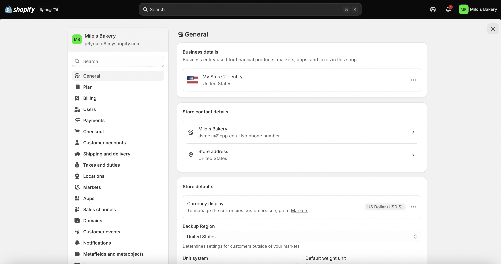
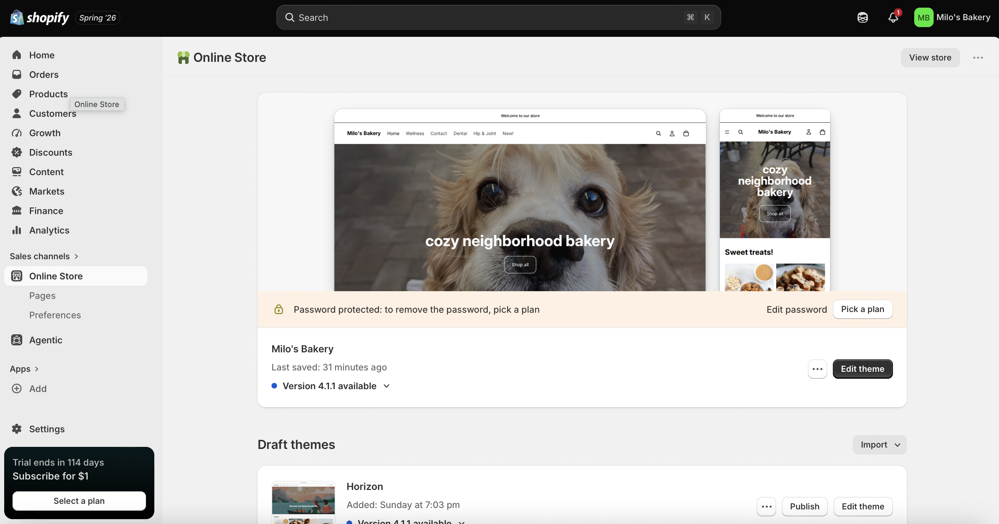
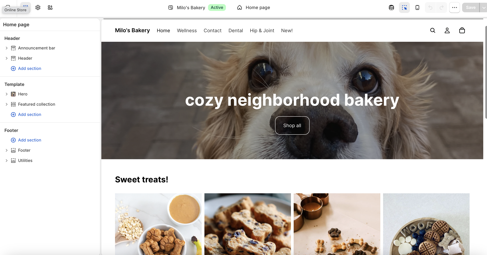

## Introduction

Milo's Bakery is an organic dog biscuit bakery that handcrafts wholesome, clean-ingredient treats for dogs and the people who love them. This document outlines the store name and concept, target customer profile, product category plan, initial Shopify setup, and the connection between this project and the CPP Farm Store consulting work.

------------------------------------------------------------------------

## Store Name and Concept {#sec-concept}

::: callout-note
**Store Name:** Milo's Bakery **Tagline:** *Baked with love. Made for dogs.*
:::

Milo's Bakery is a neighborhood-inspired online dog biscuit bakery that brings the warmth and care of a local bakehouse to health-conscious pet owners. Every biscuit is handcrafted using organic, dog-safe ingredients — no artificial preservatives, no fillers, no ingredients you can't pronounce. Just real food, baked with intention, for dogs who deserve better than the generic treat aisle.

The brand aesthetic is **cozy, warm, and approachable** — think natural kraft paper packaging, warm cream and terracotta tones, playful paw illustrations, and photography that feels like a sunny Saturday at the farmers market. Milo's Bakery is not a clinical pet health brand. It leads with love and personality first, and lets the clean organic ingredient story be the quiet differentiator underneath.

> *"Because your dog deserves real ingredients too."*

The name "Milo" — a classic, beloved dog name — immediately communicates the brand's warmth and pet-first personality. It signals that this is a brand built by a dog lover, for dog lovers. Every touchpoint, from the Shopify storefront to the packaging and order confirmation emails, reflects that cozy, caring identity.

The store will launch with five core biscuit flavors and expand into seasonal, wellness, dental, and functional treat lines — including hip and joint support biscuits — as the brand grows.

------------------------------------------------------------------------

## Target Customer {#sec-customer}

Milo's Bakery's primary target customer is a **health-conscious millennial or Gen Z pet owner** who treats their dog as a full member of the family. They read ingredient labels on their own food and have started applying the same scrutiny to what their dog eats. They are willing to pay a premium for quality and are drawn to brands that feel authentic, small-batch, and story-driven.

| Characteristic | Description |
|:-----------------------------------|:-----------------------------------|
| Age | 24–42 years old |
| Lifestyle | Wellness-oriented, pet-centered, community-minded |
| Shopping behavior | Shops online, follows pet brands on social media, values transparency |
| Pet values | Organic ingredients, no artificial additives, functional health benefits |
| Brand affinity | Cozy, artisan, small-batch aesthetics — not corporate pet food brands |
| Location | Urban and suburban — comfortable with online ordering and local pickup |
| Income | Middle to upper-middle income — invests in premium pet products |
| Dog ownership | One or more dogs; considers the dog a family member or "fur baby" |

: Milo's Bakery Target Customer Profile

### Jobs to Be Done

Milo's Bakery customers are motivated by three core jobs:

**Functional:** Find organic, clean-ingredient dog treats that support their dog's health — without having to spend hours researching or baking at home themselves.

**Emotional:** Feel like a great pet parent. Show love for their dog through food choices that reflect their own values around health and quality ingredients.

**Social:** Share their dog's treat haul on Instagram, bring Milo's biscuits to the dog park, or gift a box to a fellow dog lover — and feel proud of what they are sharing.

------------------------------------------------------------------------

## Product Category Plan {#sec-products}

Milo's Bakery will organize its Shopify store around five launch categories, with three additional categories planned for future expansion. Each category is designed to serve a specific customer and dog need while staying true to the brand's organic, clean-ingredient philosophy.

### Current Launch Categories

::::::: panel-tabset
### 🍌 Banana Biscuits

**Category:** Banana Biscuits **Description:** Classic banana-flavored dog biscuits made with organic bananas, oat flour, and a touch of honey. A fan-favorite flavor that dogs go wild for and owners feel great about.

**Why dogs love it:** Naturally sweet, soft enough for most dogs, and a familiar flavor that works as an everyday treat or training reward.

**Key ingredients:** Organic banana, whole oat flour, organic honey, egg

**Best for:** Everyday treating, training rewards, picky eaters

::: callout-note
Banana is one of the most popular dog-safe fruits and a natural source of potassium, vitamin B6, and vitamin C — making this biscuit as nutritious as it is delicious.
:::

### 🫐 Blueberry Biscuits

**Category:** Blueberry Biscuits **Description:** Antioxidant-rich blueberry biscuits made with organic blueberries and whole grain oat flour. A superfood treat that supports immune health in every bite.

**Why dogs love it:** Slightly tart and sweet, with a satisfying crunch. Blueberries are a beloved dog-safe superfood that owners recognize and trust.

**Key ingredients:** Organic blueberries, whole oat flour, coconut oil, egg

**Best for:** Health-conscious owners, dogs who love fruity flavors, immune support

::: callout-note
Blueberries are widely recognized as a superfood for dogs, rich in antioxidants that help combat free radicals and support long-term cellular health.
:::

### 🌰 Hazel Biscuits

**Category:** Hazel Biscuits **Description:** A warm, nutty biscuit made with hazelnut flour and organic ingredients. A more indulgent flavor profile for dogs who deserve a special treat — without any ingredients that are unsafe for dogs.

**Why dogs love it:** Rich, savory-sweet flavor that feels more like a real baked good than a standard dog treat.

**Key ingredients:** Hazelnut flour (dog-safe, xylitol-free), oat flour, organic coconut oil, egg, cinnamon

**Best for:** Special occasions, spoiling your pup, dogs who love richer flavors

::: callout-warning
Milo's Bakery hazel biscuits use only dog-safe hazelnut flour and contain absolutely no xylitol, chocolate, or other ingredients harmful to dogs. Every recipe is reviewed for pet safety.
:::

### 🐾 Paw Biscuits

**Category:** Paw Biscuits **Description:** Milo's Bakery signature flavor — a classic peanut butter and oat biscuit shaped like a paw print. The original Milo's treat and the heart of the brand.

**Why dogs love it:** Peanut butter is the universal dog treat flavor. Every dog loves it. The paw shape makes it Instagram-worthy for owners.

**Key ingredients:** Organic peanut butter (xylitol-free), whole oat flour, banana, egg

**Best for:** Everyday treating, gifting, new customers trying Milo's for the first time, photo opportunities

::: callout-tip
The Paw Biscuit is Milo's Bakery's hero product and the recommended starting point for first-time customers. It is the most giftable and most shareable item in the lineup.
:::

### 🍽️ Mix Plate

**Category:** Mix Plate **Description:** A sampler assortment featuring all four of Milo's Bakery's current biscuit flavors — banana, blueberry, hazel, and paw. The perfect introduction to the full Milo's lineup.

**Why owners love it:** Takes the guesswork out of choosing. Great for first-time buyers, gift givers, and owners who want to discover their dog's favorite flavor.

**Includes:** A selection of banana, blueberry, hazel, and paw biscuits in one box

**Best for:** First-time customers, gifting, discovering your dog's favorite flavor, dog birthdays
:::::::

### Coming Soon — Expansion Categories

The following three product categories are planned for future launch as Milo's Bakery grows:

| Category | Description | Target Launch |
|:-----------------------|:-----------------------|:----------------------:|
| 🎃 Seasonal Biscuits | Limited-edition holiday and seasonal flavors (e.g., Pumpkin Spice Fall Biscuit, Holiday Peppermint Crunch) | Season-by-season |
| 🦷 Dental & Wellness Biscuits | Biscuits formulated to support dental hygiene — designed to help reduce plaque and freshen breath naturally | Future Expansion |
| 💪 Hip & Joint Biscuits | Functional biscuits infused with glucosamine, turmeric, and omega-3s to support mobility and joint health in aging or active dogs | Future Expansion |

: Milo's Bakery Planned Expansion Categories {.striped .hover}

::: callout-important
The dental and hip & joint categories represent the highest-value opportunity for Milo's Bakery. Functional pet treats are the fastest-growing segment of the premium pet food market, and health- conscious dog owners are actively seeking treat options that do more than just taste good.
:::

------------------------------------------------------------------------

## Initial Shopify Setup {#sec-setup}

This section documents the initial setup of the Milo's Bakery Shopify practice store, including the admin area, selected theme, and homepage draft.

### Shopify Admin Area

The screenshot below shows the Milo's Bakery Shopify admin dashboard after initial account creation and store naming.

{width="85%"}

### Selected Theme

For Milo's Bakery, the selected Shopify theme is **Horizon**. This theme was chosen because its clean layout and large imagery sections allow the warm, artisan photography style of the brand to lead the experience. The neutral base colors of the theme complement the kraft, cream, and terracotta palette planned for Milo's Bakery.

{width="85%"}

### Homepage Draft / Theme Customization

The Milo's Bakery homepage is being built around three priorities: a strong hero section that immediately communicates the organic, dog-first brand personality; a featured products section highlighting the five launch biscuit flavors; and a short brand story section that introduces the "baked with love, made for dogs" positioning.

{width="85%"}

------------------------------------------------------------------------

## Connection to CPP Farm Store {#sec-farmstore}

Setting up Milo's Bakery on Shopify has directly sharpened my thinking about the CPP Farm Store consulting project in several meaningful ways. Both stores are built around a product with a genuine origin story — Milo's Bakery with its organic, handcrafted dog biscuits and CPP Farm Store with its campus-grown produce and fresh-squeezed orange juice — and both face the same core challenge of communicating that story digitally to customers who cannot yet experience the product in person. Working through the Shopify product category structure for Milo's Bakery reinforced how critical clean organization and intuitive navigation are for an online store — customers need to find what they are looking for quickly, and the categories need to make sense at a glance. The CPP Farm Store would benefit from the same thinking: organizing its products into clear, browsable collections (fresh produce, beverages, ready-to-eat items), and building a homepage that leads immediately with the campus-origin and farm-fresh story that makes the store unique. The Mix Plate sampler concept I developed for Milo's Bakery also sparked a direct idea for the Farm Store — a curated "Campus Harvest Box" featuring the store's best seasonal products could serve as a high-value gift and discovery item that introduces new customers to the full range of what the Farm Store offers, without requiring a large marketing investment.

------------------------------------------------------------------------

## Appendix {.unnumbered}

| Resource | Link |
|:-----------------------------------|:-----------------------------------|
| GitHub Repository | <https://github.com/dmcpp26/ibm6300-assignments> |
| GitHub Pages (Live Report) | <https://dmcpp26.github.io/ibm6300-assignments/ITP-Assign2/Meza_Danielle-ITP-Assign2.html> |
| Shopify Admin | <https://admin.shopify.com> |

------------------------------------------------------------------------

*Submitted for IBM 6300 — Business Analytics \| Cal Poly Pomona \| Summer 2026*
