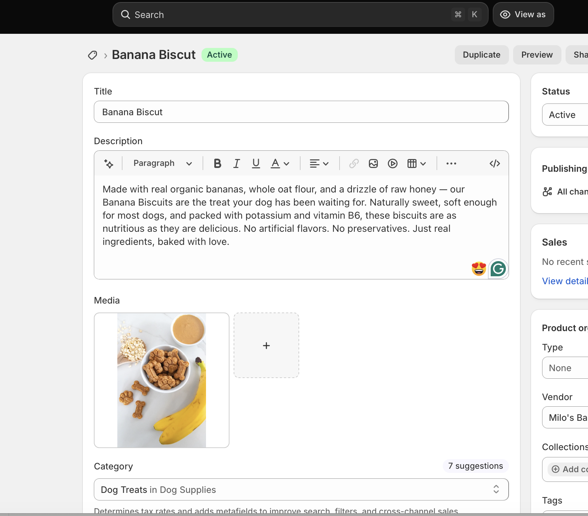
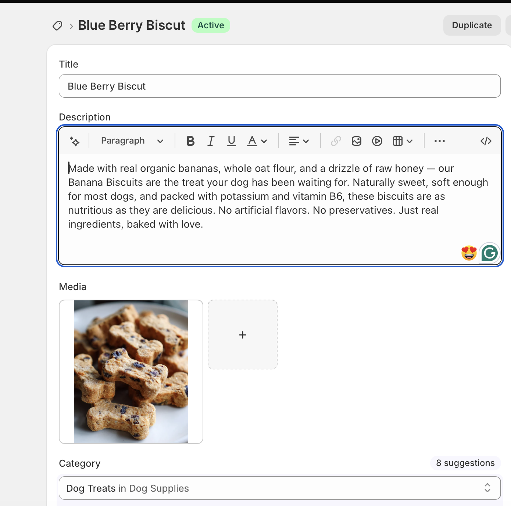
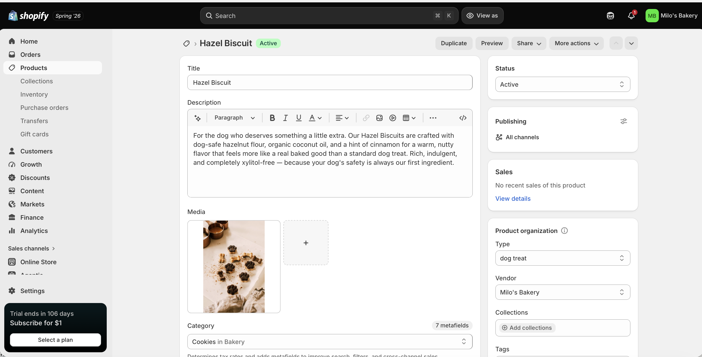
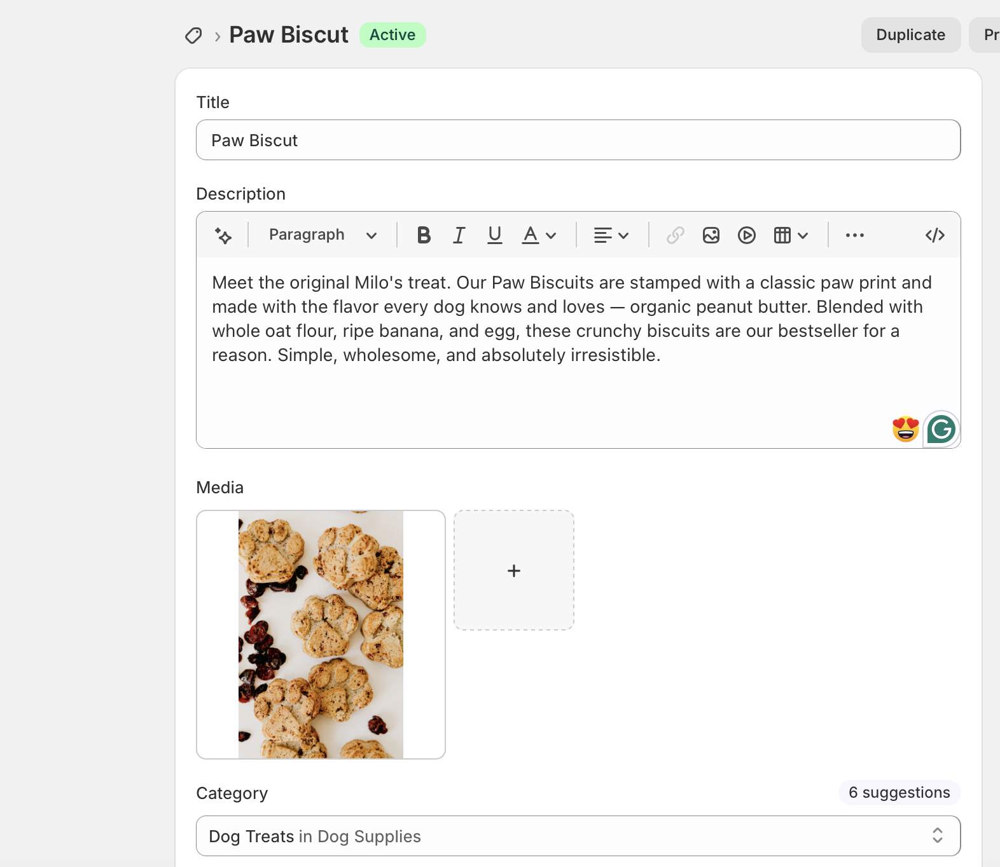
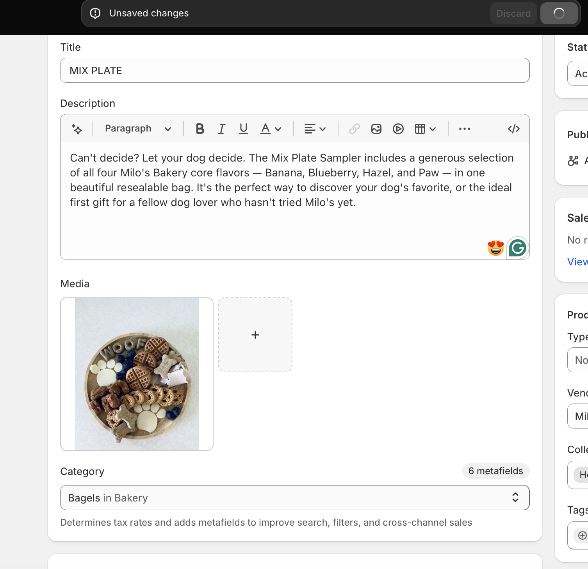
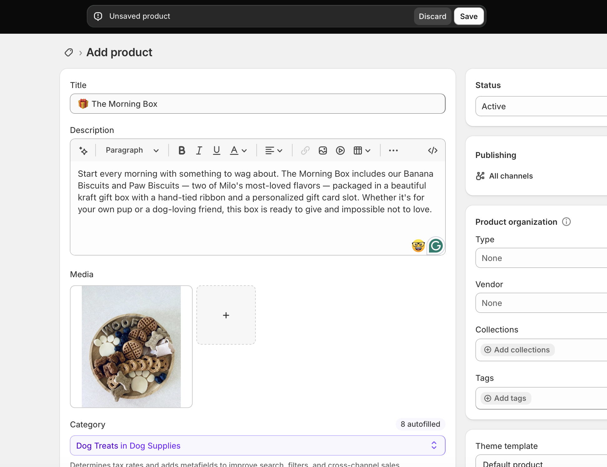
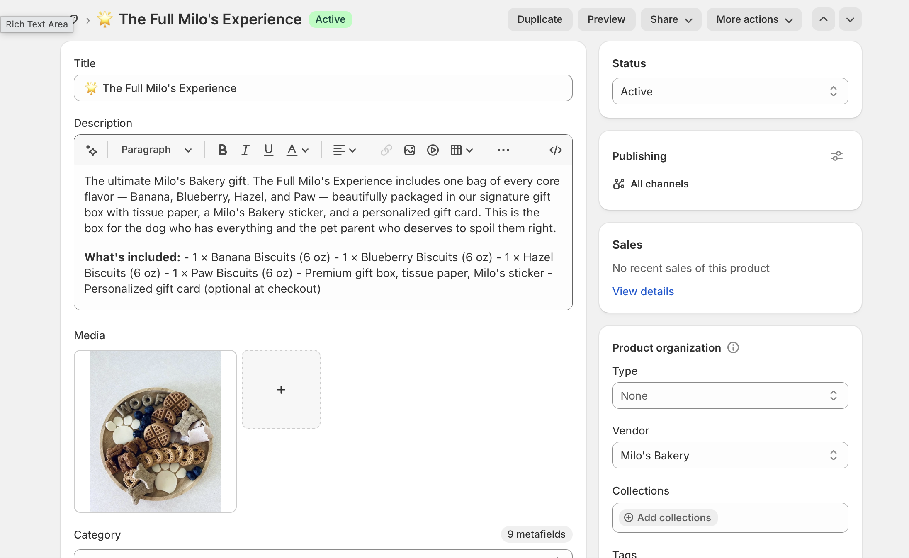
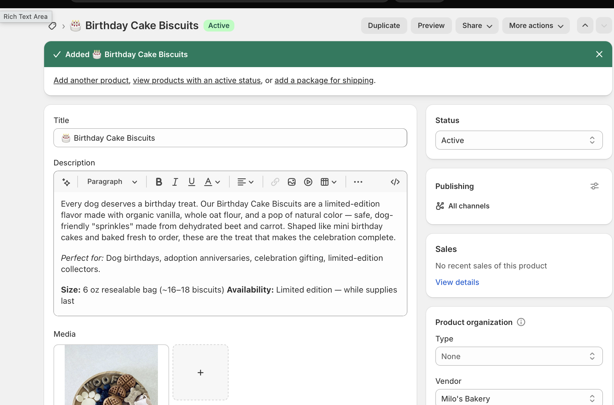
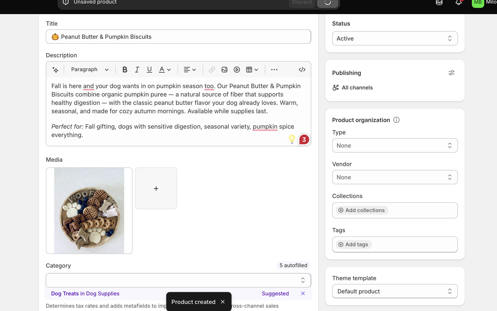

## Introduction

This report documents the product catalog development for **Milo's Bakery**, an organic dog biscuit bakery practice store built on Shopify as part of the IBM 6300 course project. The catalog includes ten products across the store's core biscuit flavors and bundle offerings, each developed with clear, customer-friendly descriptions and consistent pricing and inventory information.

------------------------------------------------------------------------

## Product List {#sec-products}

Milo's Bakery's Shopify catalog launches with **ten products** organized across three collections: Core Biscuits, Bundles & Gift Boxes, and Seasonal & Functional Treats.

| \# | Product Title | Collection | Price |
|:---|:---|:---|---:|
| 1 | Banana Biscuits — 6 oz bag | Core Biscuits | \$12.99 |
| 2 | Blueberry Biscuits — 6 oz bag | Core Biscuits | \$12.99 |
| 3 | Hazel Biscuits — 6 oz bag | Core Biscuits | \$13.99 |
| 4 | Paw Biscuits — 6 oz bag | Core Biscuits | \$11.99 |
| 5 | Mix Plate Sampler — 8 oz assortment | Core Biscuits | \$15.99 |
| 6 | The Morning Box — Gift Set | Bundles & Gift Boxes | \$32.99 |
| 7 | The Sweet Treat Box — Gift Set | Bundles & Gift Boxes | \$28.99 |
| 8 | The Full Milo's Experience — Gift Set | Bundles & Gift Boxes | \$44.99 |
| 9 | Birthday Cake Biscuits — Limited Edition | Seasonal & Functional | \$14.99 |
| 10 | Peanut Butter & Pumpkin Biscuits — Fall Seasonal | Seasonal & Functional | \$13.99 |

: Milo's Bakery — Full Product Catalog {#tbl-products .striped .hover}

------------------------------------------------------------------------

## Product Information {#sec-info}

The following section provides complete product information for each item in the Milo's Bakery catalog, including title, description, price, inventory, and category information.

::::::: panel-tabset
### 🍌 Banana Biscuits

**Product Title:** Banana Biscuits — 6 oz bag **Collection:** Core Biscuits **Price:** \$12.99 **Vendor:** Milo's Bakery **Type:** Dog Treat — Biscuit **Tags:** banana, organic, everyday treat, training reward, grain-friendly **Inventory:** 50 units in stock

**Product Description:**

Made with real organic bananas, whole oat flour, and a drizzle of raw honey — our Banana Biscuits are the treat your dog has been waiting for. Naturally sweet, soft enough for most dogs, and packed with potassium and vitamin B6, these biscuits are as nutritious as they are delicious. No artificial flavors. No preservatives. Just real ingredients, baked with love.

*Perfect for:* Daily treating, training rewards, dogs who love fruity flavors, sensitive stomachs.

**Size:** 6 oz resealable bag (\~18–20 biscuits)

{width="85%"}

------------------------------------------------------------------------

### 🫐 Blueberry Biscuits

**Product Title:** Blueberry Biscuits — 6 oz bag **Collection:** Core Biscuits **Price:** \$12.99 **Vendor:** Milo's Bakery **Type:** Dog Treat — Biscuit **Tags:** blueberry, organic, antioxidant, superfood, immune support **Inventory:** 50 units in stock

**Product Description:**

Give your dog a superfood treat they'll actually beg for. Our Blueberry Biscuits are made with organic blueberries, whole oat flour, and cold- pressed coconut oil — rich in antioxidants that support immune health and help your pup feel their best. Crunchy on the outside, tender in the middle, and bursting with real berry flavor.

*Perfect for:* Health-conscious pet owners, dogs who love fruity flavors, immune and cellular health support.

**Size:** 6 oz resealable bag (\~18–20 biscuits)

{width="85%"}

------------------------------------------------------------------------

### 🌰 Hazel Biscuits

**Product Title:** Hazel Biscuits — 6 oz bag **Collection:** Core Biscuits **Price:** \$13.99 **Vendor:** Milo's Bakery **Type:** Dog Treat — Biscuit **Tags:** hazel, hazelnut flour, artisan, special occasion, xylitol-free **Inventory:** 35 units in stock

**Product Description:**

For the dog who deserves something a little extra. Our Hazel Biscuits are crafted with dog-safe hazelnut flour, organic coconut oil, and a hint of cinnamon for a warm, nutty flavor that feels more like a real baked good than a standard dog treat. Rich, indulgent, and completely xylitol-free — because your dog's safety is always our first ingredient.

*Perfect for:* Special occasions, dogs who love richer flavors, spoiling your pup without compromise.

**Size:** 6 oz resealable bag (\~16–18 biscuits)

::: callout-warning
All Milo's Bakery products are formulated without xylitol, chocolate, grapes, raisins, macadamia nuts, or any other ingredients harmful to dogs. Every recipe is reviewed for pet safety before production.
:::

{width="85%"}

------------------------------------------------------------------------

### 🐾 Paw Biscuits

**Product Title:** Paw Biscuits — 6 oz bag **Collection:** Core Biscuits **Price:** \$11.99 **Vendor:** Milo's Bakery **Type:** Dog Treat — Biscuit **Tags:** peanut butter, paw print, signature, bestseller, everyday treat **Inventory:** 75 units in stock

**Product Description:**

Meet the original Milo's treat. Our Paw Biscuits are stamped with a classic paw print and made with the flavor every dog knows and loves — organic peanut butter. Blended with whole oat flour, ripe banana, and egg, these crunchy biscuits are our bestseller for a reason. Simple, wholesome, and absolutely irresistible.

*Perfect for:* Everyday treating, first-time Milo's customers, training rewards, gifting, and Instagram-worthy treat moments.

**Size:** 6 oz resealable bag (\~18–20 biscuits)

::: callout-tip
The Paw Biscuit is Milo's Bakery's hero product and the best place to start if you're new to the brand. It's the most giftable and most shareable item in the lineup.
:::

{width="85%"}

------------------------------------------------------------------------

### 🍽️ Mix Plate Sampler

**Product Title:** Mix Plate Sampler — 8 oz assortment **Collection:** Core Biscuits **Price:** \$15.99 **Vendor:** Milo's Bakery **Type:** Dog Treat — Sampler **Tags:** sampler, mix, gift, variety, first order, bestseller **Inventory:** 40 units in stock

**Product Description:**

Can't decide? Let your dog decide. The Mix Plate Sampler includes a generous selection of all four Milo's Bakery core flavors — Banana, Blueberry, Hazel, and Paw — in one beautiful resealable bag. It's the perfect way to discover your dog's favorite, or the ideal first gift for a fellow dog lover who hasn't tried Milo's yet.

*Perfect for:* First-time buyers, discovering your dog's favorite flavor, gifting, dog birthdays, and introducing friends to Milo's Bakery.

**Size:** 8 oz resealable bag (mixed flavor assortment)

{width="85%"}

------------------------------------------------------------------------

### 🎁 The Morning Box

**Product Title:** The Morning Box — Gift Set **Collection:** Bundles & Gift Boxes **Price:** \$32.99 **Vendor:** Milo's Bakery **Type:** Gift Box — Bundle **Tags:** gift, bundle, morning, birthday, dog mom, dog dad **Inventory:** 20 units in stock

**Product Description:**

Start every morning with something to wag about. The Morning Box includes our Banana Biscuits and Paw Biscuits — two of Milo's most-loved flavors — packaged in a beautiful kraft gift box with a hand-tied ribbon and a personalized gift card slot. Whether it's for your own pup or a dog-loving friend, this box is ready to give and impossible not to love.

**What's included:** - 1 × Banana Biscuits (6 oz) - 1 × Paw Biscuits (6 oz) - Branded kraft gift box + ribbon - Personalized gift card (optional at checkout)

*Perfect for:* Birthdays, holidays, new puppy gifts, dog moms and dads.

{width="85%"}

------------------------------------------------------------------------

### 🍪 The Sweet Treat Box

**Product Title:** The Sweet Treat Box — Gift Set **Collection:** Bundles & Gift Boxes **Price:** \$28.99 **Vendor:** Milo's Bakery **Type:** Gift Box — Bundle **Tags:** gift, bundle, sweet, blueberry, hazel, occasion **Inventory:** 20 units in stock

**Product Description:**

For the dog with sophisticated taste. The Sweet Treat Box pairs our Blueberry Biscuits and Hazel Biscuits — two of our most unique and indulgent flavors — in a keepsake gift box that's as beautiful to give as it is for your dog to eat. A thoughtful gift for any occasion, or a treat-yourself moment for the pet parent who wants the best.

**What's included:** - 1 × Blueberry Biscuits (6 oz) - 1 × Hazel Biscuits (6 oz) - Branded kraft gift box + ribbon - Personalized gift card (optional at checkout)

*Perfect for:* Dog birthdays, thank-you gifts, housewarmings, holidays.

{width="85%"}

------------------------------------------------------------------------

### 🌟 The Full Milo's Experience

**Product Title:** The Full Milo's Experience — Gift Set **Collection:** Bundles & Gift Boxes **Price:** \$44.99 **Vendor:** Milo's Bakery **Type:** Gift Box — Bundle **Tags:** gift, bundle, full set, premium, bestseller, all flavors **Inventory:** 15 units in stock

**Product Description:**

The ultimate Milo's Bakery gift. The Full Milo's Experience includes one bag of every core flavor — Banana, Blueberry, Hazel, and Paw — beautifully packaged in our signature gift box with tissue paper, a Milo's Bakery sticker, and a personalized gift card. This is the box for the dog who has everything and the pet parent who deserves to spoil them right.

**What's included:** - 1 × Banana Biscuits (6 oz) - 1 × Blueberry Biscuits (6 oz) - 1 × Hazel Biscuits (6 oz) - 1 × Paw Biscuits (6 oz) - Premium gift box, tissue paper, Milo's sticker - Personalized gift card (optional at checkout)

*Perfect for:* Milestone occasions, premium gifting, holidays, spoiling your pup on their birthday.

::: callout-tip
The Full Milo's Experience is Milo's Bakery's highest-value product and a strong gifting anchor. At \$44.99, it carries the highest average order value in the catalog and the strongest word-of-mouth potential.
:::

{width="85%"}

------------------------------------------------------------------------

### 🎂 Birthday Cake Biscuits

**Product Title:** Birthday Cake Biscuits — Limited Edition **Collection:** Seasonal & Functional Treats **Price:** \$14.99 **Vendor:** Milo's Bakery **Type:** Dog Treat — Seasonal / Limited Edition **Tags:** birthday, seasonal, limited, celebration, vanilla, sprinkles **Inventory:** 25 units in stock

**Product Description:**

Every dog deserves a birthday treat. Our Birthday Cake Biscuits are a limited-edition flavor made with organic vanilla, whole oat flour, and a pop of natural color — safe, dog-friendly "sprinkles" made from dehydrated beet and carrot. Shaped like mini birthday cakes and baked fresh to order, these are the treat that makes the celebration complete.

*Perfect for:* Dog birthdays, adoption anniversaries, celebration gifting, limited-edition collectors.

**Size:** 6 oz resealable bag (\~16–18 biscuits) **Availability:** Limited edition — while supplies last

::: callout-note
Birthday Cake Biscuits are a seasonal item produced in limited quantities. Sign up for the Milo's Bakery email list to be notified when new seasonal flavors drop.
:::

{width="85%"}

------------------------------------------------------------------------

### 🎃 Peanut Butter & Pumpkin Biscuits

**Product Title:** Peanut Butter & Pumpkin Biscuits — Fall Seasonal **Collection:** Seasonal & Functional Treats **Price:** \$13.99 **Vendor:** Milo's Bakery **Type:** Dog Treat — Seasonal **Tags:** fall, pumpkin, peanut butter, seasonal, fiber, digestive health **Inventory:** 30 units in stock

**Product Description:**

Fall is here and your dog wants in on pumpkin season too. Our Peanut Butter & Pumpkin Biscuits combine organic pumpkin puree — a natural source of fiber that supports healthy digestion — with the classic peanut butter flavor your dog already loves. Warm, seasonal, and made for cozy autumn mornings. Available while supplies last.

*Perfect for:* Fall gifting, dogs with sensitive digestion, seasonal variety, pumpkin spice everything.

**Size:** 6 oz resealable bag (\~18–20 biscuits) **Availability:** Fall seasonal — September through November

{width="85%"}
:::::::

------------------------------------------------------------------------

## Assortment Strategy {#sec-strategy}

The Milo's Bakery product assortment was built around a single guiding principle: **serve the health-conscious dog owner at every purchase occasion**. The five core biscuit flavors — Banana, Blueberry, Hazel, Paw, and the Mix Plate Sampler — form the foundation of the catalog and are designed to be complementary rather than redundant. Each flavor has a distinct ingredient story and a distinct customer motivation: Banana and Paw are everyday treats that drive repeat purchase; Blueberry leads with a functional health angle that resonates with the wellness-oriented target customer; Hazel positions as an indulgent, special-occasion option that commands a slight price premium; and the Mix Plate Sampler serves as both a discovery vehicle for new customers and a natural gifting item. The three gift box bundles — Morning Box, Sweet Treat Box, and the Full Milo's Experience — extend the catalog upward in price point and serve the gifting occasion that the target customer actively participates in. Bundles also increase average order value without requiring new product development. Finally, the two seasonal items — Birthday Cake and Peanut Butter & Pumpkin — introduce scarcity and urgency into the catalog, giving customers a reason to return and providing the brand with content opportunities tied to the seasonal calendar. Together, the ten products create a catalog that is focused enough to feel curated and intentional, while broad enough to serve everyday treating, gifting, and seasonal occasions.[^1]

[^1]: Assortment strategy informed by IBM 6300 coursework on omnichannel retailing, product catalog management, and the Neslin (2022) framework for omnichannel continuum strategy.

------------------------------------------------------------------------

## CPP Farm Store Application {#sec-farmstore}

Working through the Milo's Bakery product catalog has reinforced several lessons that apply directly to the CPP Farm Store consulting project. The most significant is the importance of **leading with the product story, not just the product name**. In Milo's Bakery, each product description explains not just what the biscuit is made of, but why those ingredients matter to the customer — the antioxidants in the blueberries, the xylitol-free safety note on the hazel biscuits, the natural fiber in the pumpkin biscuits. CPP Farm Store has an equally compelling product story — campus-grown produce, student-crafted wine, fresh-squeezed orange juice made from trees on university land — but that story is not currently visible on its product pages. A customer browsing the Farm Store's online catalog should immediately understand not just what they are buying but where it came from, who grew it, and why that matters. CPP Farm Store should also consider how it structures its collections: grouping products into clear, browsable categories (fresh produce, beverages, gift baskets, nursery plants) with consistent pricing, inventory visibility, and product descriptions would dramatically lower the friction for both CPP students and local community members discovering the store online for the first time. Finally, the bundle and gift box strategy developed for Milo's Bakery translates directly — a "Campus Harvest Box" featuring the Farm Store's best seasonal items could serve as a high-value, giftable product that introduces new customers to the full range of what the store offers, while driving a meaningfully higher average order value than individual produce items purchased separately.

------------------------------------------------------------------------

## Appendix {.unnumbered}

| Resource | Link |
|:---|:---|
| GitHub Repository | <https://github.com/dmcpp26/ibm6300-assignments> |
| GitHub Pages (Live Report) | <https://dmcpp26.github.io/ibm6300-assignments/ITP-Assign3/milobkry_ITP.html> |
| Shopify Admin | <https://admin.shopify.com> |

: Assignment Links {.striped .hover}

------------------------------------------------------------------------

*Submitted for IBM 6300 — Business Analytics \| Cal Poly Pomona \| Summer 2026*
