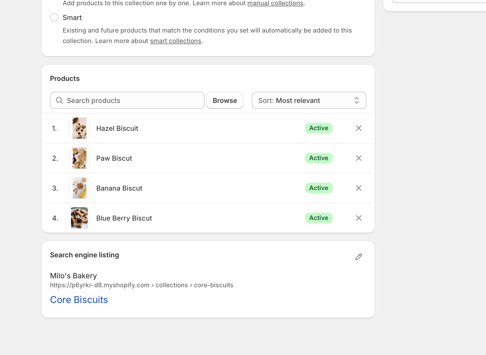
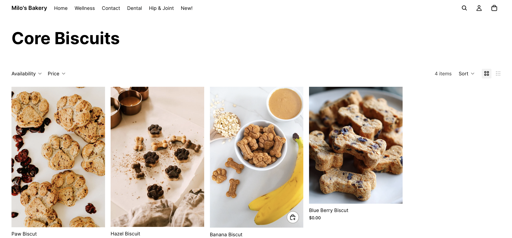
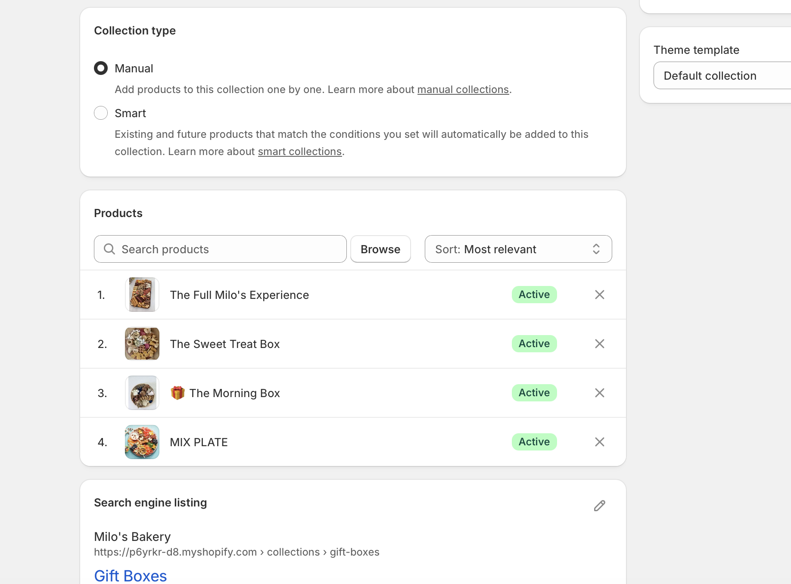
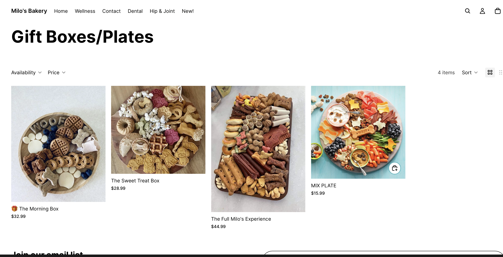
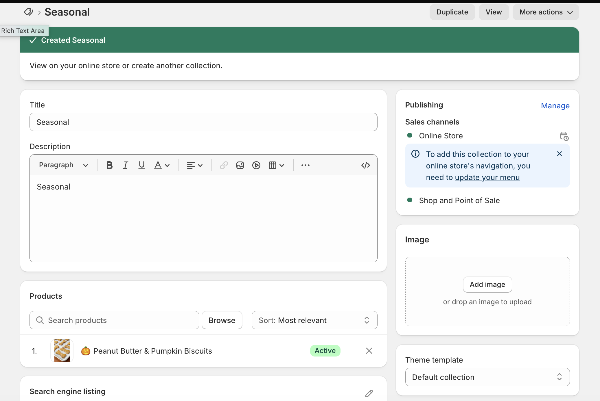
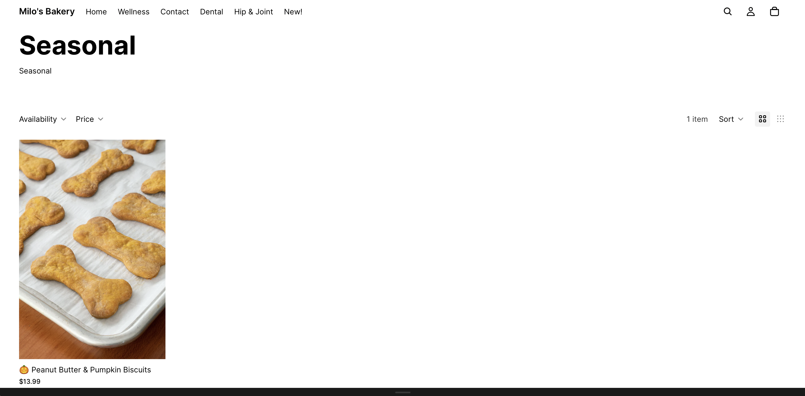
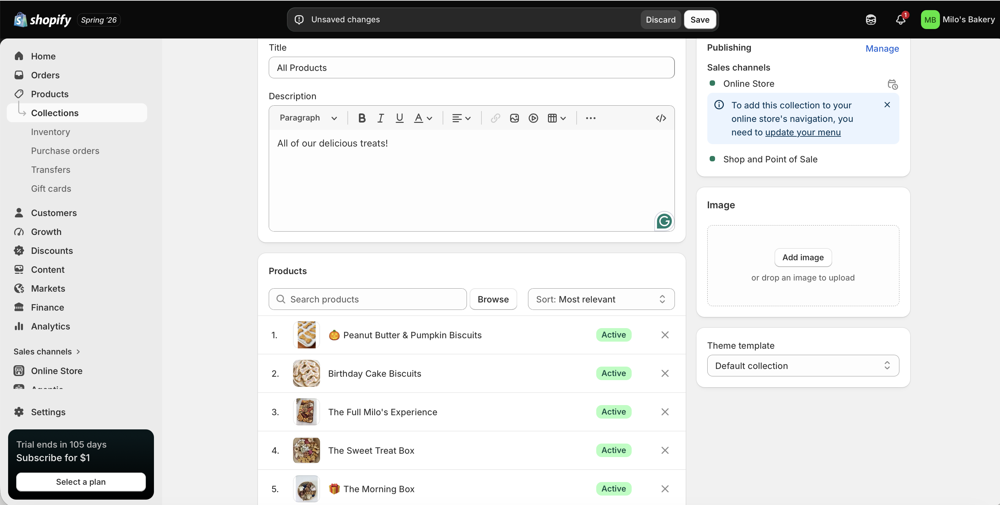
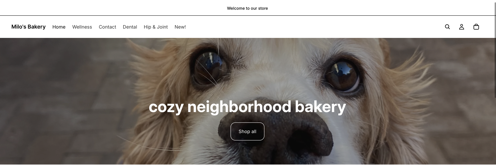
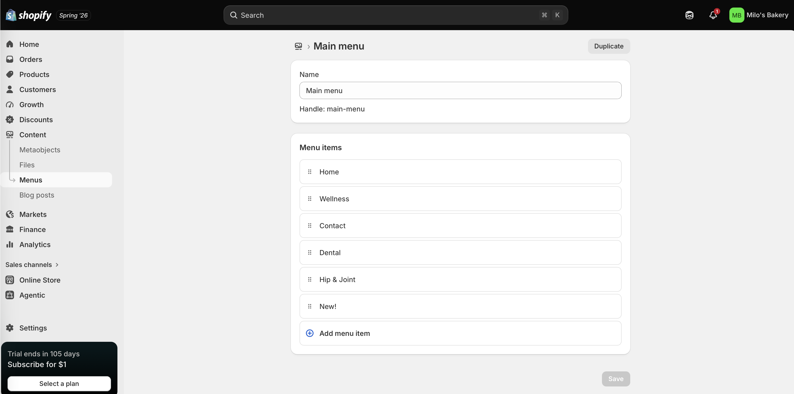

## Introduction

This report documents the collections, navigation structure, and merchandising logic developed for **Milo's Bakery**, an organic dog biscuit bakery practice store built on Shopify as part of the IBM 6300 course project. Organizing products into clear, browsable collections and building an intuitive navigation menu are foundational steps in making any e-commerce store easy and enjoyable to shop.

------------------------------------------------------------------------

## Collections Overview {#sec-collections}

Milo's Bakery is organized into **four collections** in Shopify, each designed to serve a distinct customer need and browsing intent. See @tbl-collections for a summary of all four collections and the products assigned to each.

| Collection | Description | Products Included | \# of Products |
|:---|:---|:---|:--:|
| Core Biscuits | Everyday single-flavor treat bags | Banana, Blueberry, Hazel, Paw, Mix Plate | 5 |
| Bundles & Gift Boxes | Curated multi-product gift sets | Morning Box, Sweet Treat Box, Full Milo's Experience | 3 |
| Seasonal & Functional | Limited-edition and health-focused treats | Birthday Cake Biscuits, Peanut Butter & Pumpkin | 2 |
| All Products | Full store catalog | All 10 products | 10 |

------------------------------------------------------------------------

## Collections in Detail {#sec-detail}

The following section provides detail on each collection, including its purpose, the products it contains, and the browsing logic behind it.

:::::: panel-tabset
### Core Biscuits

**Collection name:** Core Biscuits **Purpose:** The everyday treat lineup — the heart of the Milo's Bakery catalog.

This collection groups all five of Milo's Bakery's single-flavor biscuit products into one browsable space. It is the first collection most customers will visit, and is designed to serve two primary use cases: customers who already know which flavor they want, and customers who are still discovering which flavor their dog prefers.

**Products in this collection:**

-   Banana Biscuits — 6 oz bag (\$12.99)
-   Blueberry Biscuits — 6 oz bag (\$12.99)
-   Hazel Biscuits — 6 oz bag (\$13.99)
-   Paw Biscuits — 6 oz bag (\$11.99)
-   Mix Plate Sampler — 8 oz assortment (\$15.99)

**Sorting logic:** Products are sorted by popularity, with Paw Biscuits (the signature bestseller) displayed first, followed by Banana and Blueberry (everyday staples), then Hazel (the premium option), and the Mix Plate Sampler last as a natural bridge to the Bundles collection.

::: callout-tip
The Mix Plate Sampler is intentionally placed in Core Biscuits rather than Bundles because its primary function is flavor discovery — helping first-time customers find their dog's favorite — rather than gifting.
:::

{width="85%"}

{width="85%"}

------------------------------------------------------------------------

### Bundles & Gift Boxes

**Collection name:** Bundles & Gift Boxes **Purpose:** High-value gift sets for special occasions and premium shoppers.

This collection groups all three of Milo's Bakery's curated gift box products. It is designed to serve customers who are shopping for someone else — a gift for a dog-loving friend, a birthday present, or a holiday basket — and who want a polished, ready-to-give option without having to assemble their own selection.

**Products in this collection:**

-   The Morning Box — Gift Set (\$32.99)
-   The Sweet Treat Box — Gift Set (\$28.99)
-   The Full Milo's Experience — Gift Set (\$44.99)

**Sorting logic:** Products are sorted by price ascending, starting with the most accessible gift option (Sweet Treat Box at \$28.99) and building up to the premium full-catalog experience (\$44.99). This nudges customers toward higher-value options without making the entry point feel unattainable.

::: callout-note
Bundles & Gift Boxes carries the highest average order value of any collection in the store. A customer who lands here is typically a motivated gift buyer — the collection page should emphasize the unboxing experience and gifting occasion rather than ingredient details.
:::

{width="85%"}

{width="85%"}

------------------------------------------------------------------------

### Seasonal & Functional

**Collection name:** Seasonal & Functional **Purpose:** Limited-edition and occasion-specific treats that create urgency and repeat visits.

This collection houses Milo's Bakery's rotating seasonal items and any future functional treat lines (dental, hip and joint, wellness). Currently it contains two products — Birthday Cake Biscuits (a limited-edition celebratory treat) and Peanut Butter & Pumpkin Biscuits (a fall seasonal offering). This collection is designed to give loyal customers a reason to check back regularly and to generate email and social media content opportunities tied to the seasonal calendar.

**Products in this collection:**

-   Birthday Cake Biscuits — Limited Edition (\$14.99)
-   Peanut Butter & Pumpkin Biscuits — Fall Seasonal (\$13.99)

**Sorting logic:** Sorted by availability window — items with the shortest remaining availability window display first to create urgency.

::: callout-important
Planned additions to this collection include Dental & Wellness Biscuits and Hip & Joint Biscuits — two functional treat lines targeting the fastest-growing segment of the premium pet food market. These will be added in the Q2 expansion phase.
:::

{width="85%"}

{width="85%"}

------------------------------------------------------------------------

### All Products

**Collection name:** All Products **Purpose:** Full catalog view for customers who want to browse everything.

This is an automatically populated Shopify collection that displays all active products in the store. It serves customers who are exploring Milo's Bakery for the first time and want to see the full range before committing to a specific category. It also functions as a fallback for customers who arrived via search or a direct product link and want to browse more.

**Products in this collection:** All 10 active products.

**Sorting logic:** Best-selling products first, updated automatically by Shopify based on order history.

{width="85%"}
::::::

------------------------------------------------------------------------

## Navigation Menu {#sec-nav}

### Main Navigation Structure

The Milo's Bakery main navigation menu is organized into six items, designed to give every customer a clear and direct path to what they are looking for within two clicks or fewer.

| Menu Item | Destination | Primary Audience |
|:---|:---|:---|
| Shop all | All Products collection | New visitors, explorers |
| Core biscuits | Core Biscuits collection | Repeat buyers, flavor-specific shoppers |
| Gift boxes | Bundles & Gift Boxes collection | Gift shoppers |
| Seasonal treats | Seasonal & Functional collection | Loyal customers, occasion shoppers |
| Our story | About page | New visitors, brand-curious shoppers |
| Contact | Contact page | Any customer with a question or custom order |

: Milo's Bakery — Main Navigation Menu Structure {.striped .hover}

{width="85%"}

{width="85%"}

### Footer Navigation

The footer navigation provides secondary access to less-visited but important pages:

-   FAQ
-   Ingredients & safety
-   Shipping & returns
-   Join the email list
-   Instagram

------------------------------------------------------------------------

## Merchandising Logic {#sec-merch}

The collection structure for Milo's Bakery was built around one central principle: **organize by customer intent, not by product type**. Rather than grouping products alphabetically or by ingredient, each collection represents a distinct reason a customer might visit the store — browsing everyday treats, shopping for a gift, or looking for something seasonal and special. This logic mirrors how the target customer actually thinks about dog treats: a customer buying for their own dog's daily routine has a fundamentally different mindset than one buying a birthday gift for a friend's new puppy, and the store's collections reflect that. The four- collection structure is intentionally kept tight — too many collections fragment the browsing experience and create decision fatigue, while too few obscure meaningful distinctions between product types. Keeping Core Biscuits, Bundles & Gift Boxes, Seasonal & Functional, and All Products as the primary organization gives customers a clear mental map of the store within seconds of landing on any page.

------------------------------------------------------------------------

## Customer Experience {#sec-cx}

The navigation structure for Milo's Bakery is designed to minimize the number of decisions a customer has to make before finding what they are looking for. Every item in the main navigation menu is a direct link to a collection or key page — there are no dropdown submenus, no hidden categories, and no dead ends. A first-time visitor can arrive on the homepage, read the six navigation items, and immediately know whether this store has what they need. A repeat buyer who knows they want Paw Biscuits can click "Core biscuits" and be looking at their product within one click. A gift shopper who is unsure what to buy can click "Gift boxes" and find three pre-curated options that take the guesswork out of the decision entirely. This frictionless browsing structure directly supports the consideration stage of the customer journey — where customers evaluate whether the store fits their needs — and reduces the likelihood of a visitor bouncing before making a purchase.

> "Customers don't abandon stores because the products are wrong. They abandon them because they can't find what they're looking for."

------------------------------------------------------------------------

## CPP Farm Store Application {#sec-farmstore}

The product organization work completed for Milo's Bakery surfaces several direct lessons for the CPP Farm Store's online presence. Currently, the Farm Store's website does not present its products in clearly browsable collections — visitors must navigate through a general store page without a clear sense of what product categories exist or how they relate to each other. Based on the Milo's Bakery experience, the Farm Store would benefit from organizing its online catalog into at least four distinct collections: **Fresh Produce** (campus-grown fruits and vegetables, updated seasonally), **Beverages** (fresh-squeezed orange juice, CPP-grown wines, and other drinks), **Gift Baskets & Boxes** (curated gift sets for holidays and occasions), and **Nursery & Plants** (the AGRIscapes nursery offerings). Each collection should have a clear description that tells the customer not just what is in it, but why those products are special — particularly the campus-grown provenance story that makes the Farm Store genuinely unique compared to Sprouts or Trader Joe's. The navigation menu should be reorganized to reflect these collections directly, replacing the current text-heavy footer links with a clean top-level menu that gives both CPP students and local community members a clear path to what they came for within one or two clicks.

------------------------------------------------------------------------

## Appendix {.unnumbered}

| Resource | Link |
|:---|:---|
| GitHub Repository | <https://github.com/dmcpp26/ibm6300-assignments> |
| GitHub Pages (Live Report) | <https://dmcpp26.github.io/ibm6300-assignments/ITP-Assign4/itp4_milobkry.html> |
| Shopify Admin | <https://admin.shopify.com> |

: Assignment Links {.striped .hover}

------------------------------------------------------------------------

*Submitted for IBM 6300 — Business Analytics \| Cal Poly Pomona \| Summer 2026*
