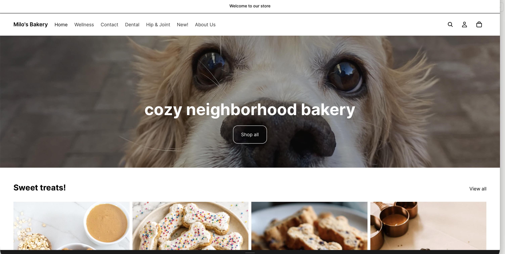
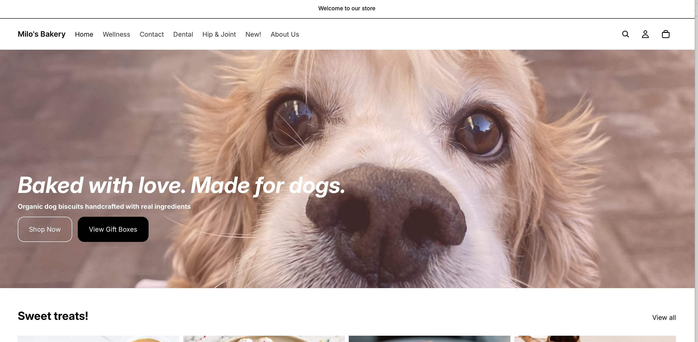
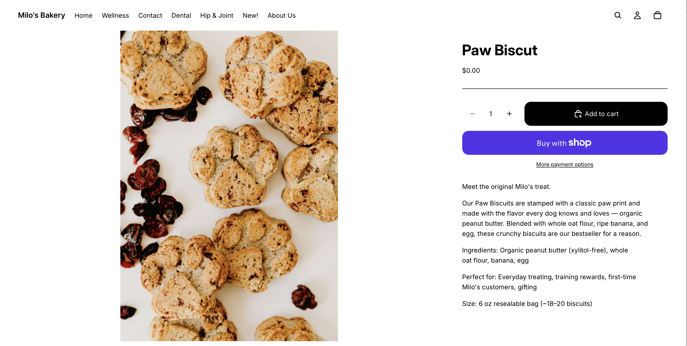
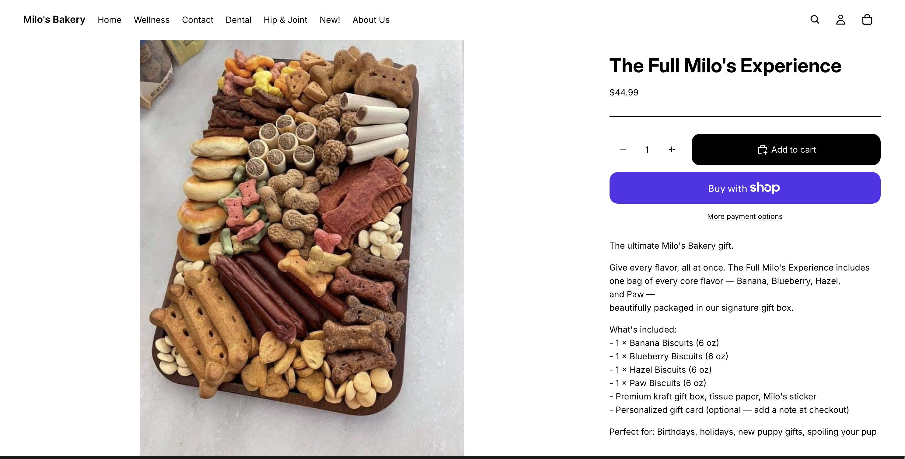
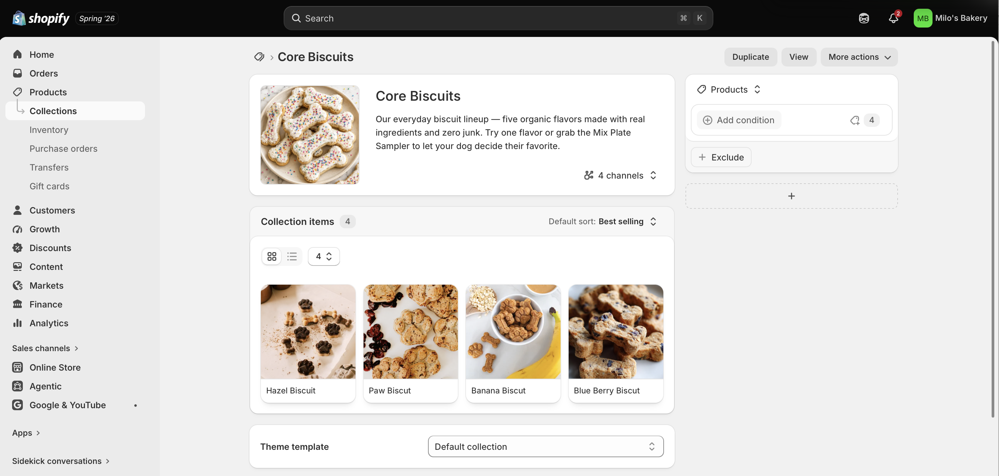

## Homepage Design Improvements {#sec-homepage}

The Milo's Bakery homepage was redesigned to immediately communicate the brand story and guide customers toward products. The improved homepage includes the following sections in order:[^1]

[^1]: Homepage sections were built using Shopify's theme customizer under Online Store → Themes → Customize. Each section was added, reordered, and styled within the theme editor without custom code.

1.  **Hero banner** — Full-width image with the store tagline *"Baked with love. Made for dogs."* and two call-to-action buttons: Shop Now and View Gift Boxes
2.  **Brand introduction text** — A short two-sentence brand story explaining what Milo's Bakery is and who it is for
3.  **Featured collections** — Three collection tiles linking directly to Core Biscuits, Bundles & Gift Boxes, and Seasonal & Functional
4.  **Bestselling products** — A four-product grid featuring the Paw Biscuits, Banana Biscuits, Mix Plate Sampler, and The Full Milo's Experience
5.  **Brand values section** — Three icons with short captions: Organic Ingredients, Dog-Safe Always, and Made with Love
6.  **Email signup banner** — A simple email capture section with the prompt: *"Be the first to know when new flavors drop."*

### Homepage Screenshots

**Before — Default Theme Homepage:**

{width="85%"}

**After — Improved Homepage:**

{width="85%"}

{width="85%"}

{width="85%"}

------------------------------------------------------------------------

## Product Page Improvements {#sec-products}

At least two product pages were improved to include clearer descriptions, better image presentation, and stronger customer-facing copy. See @sec-cx for the customer experience improvements that informed these changes.

::: panel-tabset
### Paw Biscuits — Improved Product Page

**Why this product was prioritized:** The Paw Biscuits are Milo's Bakery's bestselling hero product and the first product most new customers will click. A strong product page here directly impacts conversion rate across the whole store.

**Improvements made:**

-   Rewrote the product description to lead with the emotional hook ("Meet the original Milo's treat") before listing ingredients
-   Added a bulleted ingredient list for easy scanning
-   Added a "Perfect for" section at the bottom of the description
-   Ensured the product image is set as the featured image and displays cleanly on both desktop and mobile

**Improved product page screenshot:**

{width="85%"}

------------------------------------------------------------------------

### The Full Milo's Experience — Improved Product Page

**Why this product was prioritized:** At \$44.99, The Full Milo's Experience is the highest-price product in the store. Customers need more information and reassurance at this price point before they feel confident purchasing. A stronger product page directly supports conversion for this high-value item.

**Improvements made:**

-   Added a clear "What's included" bulleted list so customers know exactly what they are getting before clicking Add to Cart
-   Rewrote the opening line to speak directly to the gifting occasion
-   Added packaging details (kraft box, tissue paper, sticker) to reinforce the premium feel
-   Added the optional personalized gift card note to reduce purchase hesitation for gift shoppers

**Improved product page screenshot:**

{width="85%"}
:::

------------------------------------------------------------------------

## Collection Page Improvements {#sec-collections}

The **Core Biscuits** collection page was improved to create a more organized and visually consistent browsing experience for customers discovering Milo's Bakery's main product lineup for the first time.

**Improvements made:**

-   Added a collection description at the top of the page explaining what the Core Biscuits collection contains and who it is for
-   Confirmed all five products have consistent image dimensions and display at the same size in the grid
-   Set the default sort order to "Best selling" so the Paw Biscuits hero product displays first
-   Confirmed product titles, prices, and images are all visible on the collection grid without requiring a click

**Collection page screenshot:**

{width="85%"}

------------------------------------------------------------------------

## Customer Experience Improvements {#sec-cx}

The following three customer experience improvements were made during this assignment. Each one addresses a specific friction point in the customer journey identified through the IBM 6300 omnichannel coursework.[^2]

[^2]: Customer experience improvements were informed by the six-stage customer journey framework developed in our IBM 6300 GP1 Omnichannel Journey Map assignment and by Chatterjee and Latinovic (2024), "The Future of Physical Retail: 5 Actions to Elevate Customer Experience," MIT Sloan School of Management.

:::: panel-tabset
### Improvement 1 — Hero Banner with Clear CTA

**What was improved:** The default theme homepage had no hero banner or call to action. The first thing a visitor saw was a generic product grid with no brand context.

**What was done:** A full-width hero banner was added with the Milo's Bakery tagline, a short brand statement, and two clear call-to-action buttons — Shop Now and View Gift Boxes — targeting the two primary customer intents (everyday treat buyers and gift shoppers).

**Why it matters:** Customers who land on the homepage need to understand within three seconds what the store sells and what to do next. Without a clear hero section, most first-time visitors will bounce before reaching any products. This change directly improves the Awareness and Consideration stages of the customer journey.

------------------------------------------------------------------------

### Improvement 2 — Featured Collections Section

**What was improved:** Previously, customers had to use the navigation menu to find product collections. There was no visual pathway from the homepage to collection pages.

**What was done:** A featured collections section was added to the homepage with three visual tiles — Core Biscuits, Bundles & Gift Boxes, and Seasonal & Functional — each linking directly to the corresponding collection page. Each tile includes the collection name and a short one-line description.

**Why it matters:** Customers who arrive with a specific intent — "I want a gift" or "I want to try a single flavor first" — can now reach the right section of the store in one click from the homepage. This reduces the number of decisions required before reaching a product, directly lowering bounce rate and improving time-to-purchase.

------------------------------------------------------------------------

### Improvement 3 — Clearer Product Descriptions with Structured Format

**What was improved:** The original product descriptions were written as long paragraphs without clear structure. Customers had to read the entire description to find basic information like what the product contains or who it is for.

**What was done:** All ten product descriptions were restructured to follow a consistent format: an emotional opening hook, a one-sentence ingredient summary, a short ingredient list in bullet form, and a "Perfect for" line at the end. The same format was applied across all products to create a predictable, scannable reading experience.

**Why it matters:** Research on e-commerce consumer behavior consistently shows that customers scan product pages rather than reading them linearly. A structured description that leads with the benefit and follows with the details serves both the scanner and the reader — and increases the likelihood of an Add to Cart action.

::: callout-tip
This improvement also directly supports Google Merchant Center eligibility. Well-structured, detailed product descriptions with clear ingredient information and use cases perform better in Google Shopping matching than vague or promotional copy.
:::
::::

------------------------------------------------------------------------

## Customer Journey Reflection {#sec-journey}

A customer visiting Milo's Bakery for the first time would move through the store in the following sequence. Upon landing on the homepage, the hero banner immediately communicates the brand identity — organic dog biscuits, made with love — and presents two clear next steps: Shop Now or View Gift Boxes. A customer shopping for their own dog would click Shop Now and land on the Core Biscuits collection, where five products are displayed in a consistent grid sorted by popularity. The Paw Biscuits appear first and the product tile shows the image, name, and price without requiring a click. The customer clicks through to the Paw Biscuits product page, reads the structured description leading with the emotional hook and followed by a clear ingredient list, and clicks Add to Cart. A gift shopper, by contrast, would click View Gift Boxes from the hero banner, land directly on the Bundles & Gift Boxes collection, and browse three clearly differentiated options at different price points. The Full Milo's Experience product page reinforces the purchase with a clear "What's included" list and packaging details that justify the \$44.99 price. In both paths, the customer reaches a product page within two clicks of the homepage — meeting the standard of frictionless omnichannel browsing discussed in our IBM 6300 coursework.

------------------------------------------------------------------------

## CPP Farm Store Application Reflection {#sec-farmstore}

The storefront design work completed for Milo's Bakery surfaces several direct lessons for the CPP Farm Store's online presence. The most important is that a retail website must communicate its identity and value proposition within the first few seconds of a visit — before a customer scrolls, clicks, or reads a single product description. For CPP Farm Store, that identity is powerful and genuinely unique: a campus-grown, student-operated farm store with products you cannot find anywhere else. But that story is not currently visible on the store's homepage. A redesigned CPP Farm Store homepage should lead with a hero banner that immediately communicates the campus-grown origin of its products, features a strong visual of the store's signature fresh-squeezed orange juice or farm produce, and includes two clear calls to action — one for shoppers looking to buy produce and one for shoppers looking for a gift basket. Below the hero, the homepage should include a featured collections section grouping products into Fresh Produce, Beverages, and Gift Baskets so both CPP students and local community members can find what they need within one click. Product pages should be rewritten to lead with the campus-origin story before listing ingredients or prices — because for CPP Farm Store, the story is the differentiator. A shopper who understands that the honey was harvested from beehives on Kellogg Ranch and that the orange juice was pressed from trees grown by Cal Poly Pomona students is far more likely to complete a purchase than one who sees only a product name and a price.

------------------------------------------------------------------------

## Appendix {.unnumbered}

| Resource | Link |
|:--------------------------------------------|:--------------------------|
| GitHub Repository | <https://github.com/dmcpp26/ibm6300-assignments> |
| GitHub Pages (Live Report) | <https://dmcpp26.github.io/ibm6300-assignments> |
| Shopify Admin | <https://admin.shopify.com> |

: Assignment Links {.striped .hover}

------------------------------------------------------------------------

*Submitted for IBM 6300 — Business Analytics \| Cal Poly Pomona \| Summer 2026*
