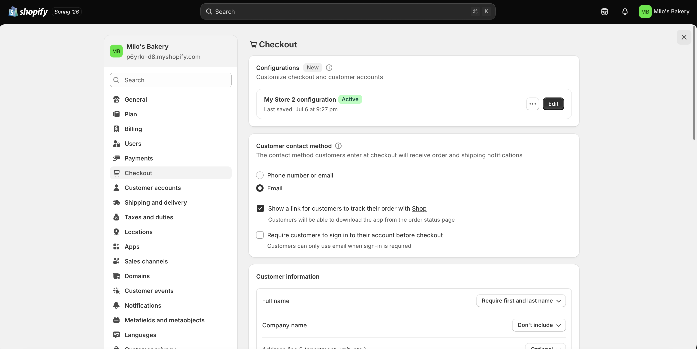
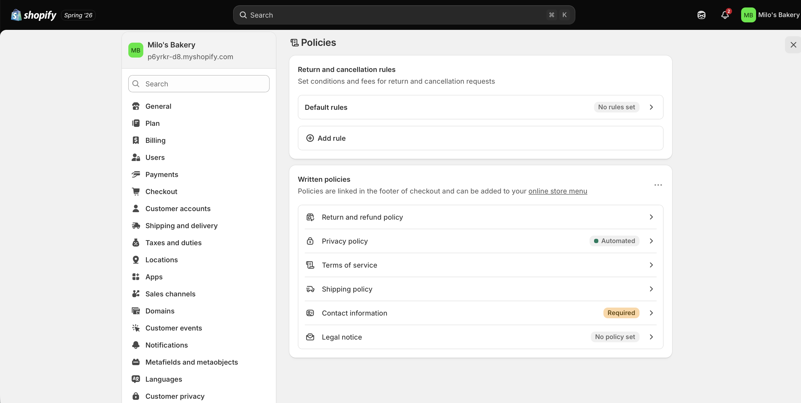
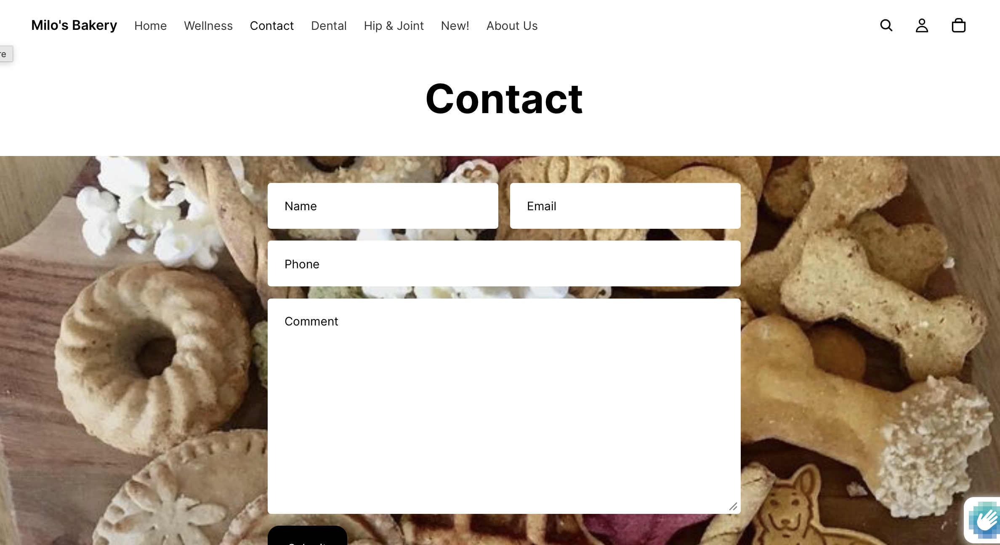

## Introduction

This report documents the checkout settings review, store policies, and trust-building information added to **Milo's Bakery**, an organic dog biscuit bakery practice store built on Shopify as part of the IBM 6300 course project. In online retailing, customers need clear information about how their order will be fulfilled, what happens if something goes wrong, and how their personal information will be handled — before they feel confident enough to complete a purchase.

## Checkout Settings Review {#sec-checkout}

The Shopify checkout settings were reviewed to confirm the store's order flow, customer contact requirements, and payment configuration before adding policies and trust signals.

**Settings reviewed:**

-   Customer account settings — set to "Accounts are optional" so customers can check out as guests without creating an account
-   Contact method — set to email so customers receive order confirmation and pickup notification by email
-   Order processing — set to hold fulfillment until manually marked as ready for pickup
-   Tipping — disabled (not appropriate for a baked goods pickup store)
-   Marketing consent — email opt-in checkbox added at checkout

{width="85%"}

{width="85%"}

------------------------------------------------------------------------

## Shipping and Pickup Information {#sec-shipping}

Milo's Bakery does not offer home delivery or shipping. All orders are fulfilled through **in-store pickup only** at the Milo's Bakery location. The following pickup policy was drafted and added to the Shopify Policies settings and the store footer.

------------------------------------------------------------------------

**Milo's Bakery — Pickup Policy**

Thank you for ordering from Milo's Bakery! All orders are available for in-store pickup only. We do not currently offer home delivery or shipping.

**How pickup works:**

1.  Place your order online through the Milo's Bakery Shopify store
2.  You will receive an email confirmation when your order is placed
3.  You will receive a second email when your order is ready for pickup — please wait for this notification before visiting
4.  Pick up your order at the Milo's Bakery counter during store hours
5.  Bring your order confirmation email (printed or on your phone)

**Store hours:** Open daily · Hours vary by season · Check our Instagram for current hours and holiday closures

**Important notes:**

-   Orders placed before 12pm are typically ready for same-day pickup
-   Orders placed after 12pm are typically ready the following day
-   Pickup orders are held for 48 hours — unclaimed orders after 48 hours will be cancelled and refunded
-   All biscuits are baked fresh — please store in a cool, dry place after pickup and consume within 3 weeks

::: callout-tip
Customers who are unsure about pickup timing can email us at hello\@milosbakery.com and we will confirm when their order will be ready.
:::

------------------------------------------------------------------------

## Return and Refund Policy {#sec-returns}

The following return and refund policy was drafted and added to Shopify under Settings → Policies.

------------------------------------------------------------------------

**Milo's Bakery — Return and Refund Policy**

Because our biscuits are made fresh to order, we are unable to accept returns of opened or consumed products. However, your satisfaction is our top priority — if something is wrong with your order, we will always make it right.

**If there is a problem with your order:**

Contact us within 48 hours of pickup at hello\@milosbakery.com with your order number and a brief description of the issue. We will respond within one business day.

**We will offer a full refund or replacement if:**

-   Your order was incorrect (wrong products, wrong quantity)
-   Your biscuits arrived damaged or in an unsatisfactory condition
-   Your order was not ready within the communicated timeframe and you were unable to wait

**We are unable to offer refunds if:**

-   The product was consumed and you simply changed your mind
-   The product was stored incorrectly after pickup
-   You did not notify us within 48 hours of pickup

**Gift orders:** If you purchased Milo's Bakery products as a gift and the recipient is unsatisfied, please contact us — we will work with you to find a solution.

**Refund processing:** Approved refunds are processed within 5–7 business days to the original payment method.

------------------------------------------------------------------------

## Privacy Policy {#sec-privacy}

The following privacy policy was drafted and added to Shopify under Settings → Policies.

------------------------------------------------------------------------

**Milo's Bakery — Privacy Policy**

*Last updated: Summer 2026*

Milo's Bakery is committed to protecting your personal information. This policy explains what data we collect, how we use it, and how we protect it.

**What information we collect:**

-   Name and email address (provided when you place an order or sign up for our email list)
-   Shipping or pickup address (for order processing only)
-   Payment information (processed securely by Shopify — Milo's Bakery does not store your payment details)
-   Order history (to help us serve you better)

**How we use your information:**

-   To process and fulfill your pickup order
-   To send you order confirmation and pickup notification emails
-   To send you occasional updates about new products and seasonal flavors (only if you opted in at checkout)
-   To improve our store and customer experience

**What we do not do:**

-   We do not sell your personal information to third parties
-   We do not share your information with advertisers
-   We do not store your payment details

**Email communications:** You can unsubscribe from our email list at any time by clicking the unsubscribe link at the bottom of any email.

**Questions:** If you have questions about your data or this policy, contact us at hello\@milosbakery.com.

::: callout-note
This privacy policy was generated using Shopify's policy template and customized for Milo's Bakery's specific business model. For a real operating business, a formal legal review would be recommended before publishing a privacy policy.
:::

------------------------------------------------------------------------

## Contact Information {#sec-contact}

The following contact information was added to Milo's Bakery's Shopify store as a dedicated Contact page and in the store footer.

------------------------------------------------------------------------

**Milo's Bakery — Contact Us**

We love hearing from fellow dog lovers! Whether you have a question about an order, want to customize a gift box, or just want to say hello, we are here.

| Contact Method  | Details                                   |
|:----------------|:------------------------------------------|
| Email           | hello\@milosbakery.com                    |
| Instagram       | @milosbakery                              |
| Response time   | Within 1 business day                     |
| Order questions | Include your order number in your message |

: Milo's Bakery Contact Information {.striped .hover}

**Custom and bulk orders:** Interested in a custom flavor, a large gift order, or biscuits for a dog-friendly event? Email us at hello\@milosbakery.com with the details and we will get back to you within 24 hours.

**Follow us:** Stay up to date on new flavors, seasonal drops, and dog content by following @milosbakery on Instagram.

{width="85%"}

------------------------------------------------------------------------

## Trust Signals Reflection {#sec-trust}

The policies and contact information added to Milo's Bakery work together to reduce the three primary reasons a first-time online shopper hesitates before completing a purchase: uncertainty about what happens if something goes wrong, uncertainty about how their personal data will be handled, and uncertainty about whether the store is real and reachable. The refund and return policy directly addresses the first concern — a shopper considering a \$44.99 gift box needs to know that if the order is wrong, they are not stuck with it. The privacy policy addresses the second concern — especially relevant for a health-conscious pet owner audience that tends to be thoughtful about which brands they share personal information with. The contact page and Instagram handle address the third concern — a visible, responsive email address and an active social media account signal that there is a real person behind the store who will answer if something goes wrong. Taken together, these trust signals move Milo's Bakery from feeling like an anonymous e-commerce page to feeling like a small, accountable, community-oriented brand — which is exactly the identity the store is built on.

------------------------------------------------------------------------

## CPP Farm Store Application Reflection {#sec-farmstore}

For CPP Farm Store, the most important trust signals are those that address the unique characteristics of its customer base and product type. The two target segments identified in our group's journey map — CPP students and local community members — share a common hesitation about online ordering from a store they may not have visited before: they need to know that pickup is easy, that their order will be accurate, and that the store is reachable if something goes wrong. A clear pickup policy explaining exactly how the in-store pickup process works at 4102 S. University Drive — including when orders will be ready, how long they will be held, and what to bring when collecting — would significantly reduce friction at the consideration and purchase stages of the customer journey. A return policy that acknowledges the perishable nature of farm-fresh products while still offering a fair resolution for incorrect or damaged orders would build confidence among community members making higher-value gift basket purchases online for the first time. Contact information — specifically a direct email address, a phone number, and active social media accounts — is especially important for CPP Farm Store because many community members in the Pomona and Diamond Bar area are not digital- native shoppers and will want the reassurance that they can reach a real person before completing an online order. Finally, a brief note on the checkout page that Bronco Bucks and EBT are accepted in-store — even if not online — would serve as a trust and inclusion signal for the CPP student segment, reinforcing that the store was built with their community in mind.

------------------------------------------------------------------------

## Appendix {.unnumbered}

| Resource | Link |
|:---|:---|
| GitHub Repository | <https://github.com/dmcpp26/ibm6300-assignments> |
| GitHub Pages (Live Report) | <https://dmcpp26.github.io/ibm6300-assignments> |
| Shopify Admin | <https://admin.shopify.com> |

: Assignment Links {.striped .hover}

------------------------------------------------------------------------

*Submitted for IBM 6300 — Business Analytics \| Cal Poly Pomona \| Summer 2026*
