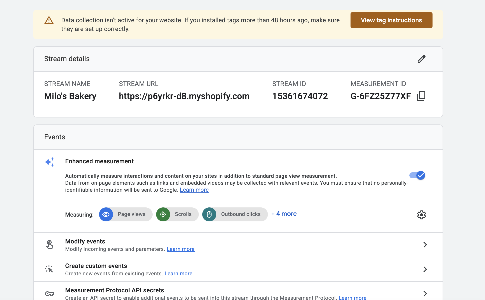
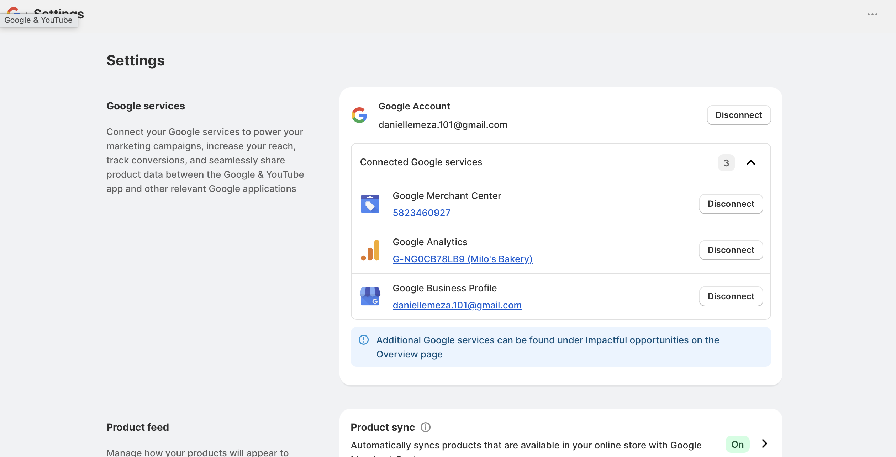
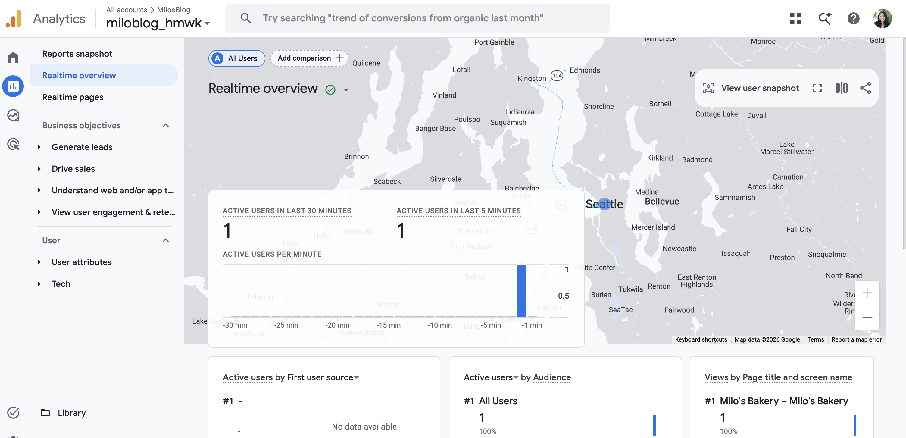

## Introduction

This report documents the setup of Google Analytics 4 and its connection to the **Milo's Bakery** Shopify practice store as part of the IBM 6300 course project. GA4 is Google's current analytics platform for tracking customer behavior, traffic sources, product interest, and e-commerce activity across web and app properties.

------------------------------------------------------------------------

## GA4 Property and Web Stream Evidence {#sec-property}

A new GA4 property was created for Milo's Bakery through Google Analytics. The property is configured to track web activity from the Milo's Bakery Shopify storefront.

**Property details:**

| Setting        | Value                           |
|:---------------|:--------------------------------|
| Property name  | Milo's Bakery                   |
| Platform       | Web                             |
| Timezone       | United States — Pacific Time    |
| Currency       | US Dollar                       |
| Stream name    | Milo's Bakery Web               |
| Stream URL     | milosbakery.myshopify.com       |
| Measurement ID | *(visible in screenshot below)* |

: GA4 Property Configuration {.striped .hover}

{width="85%"}

::: callout-tip
The Measurement ID (beginning with `G-`) is the key identifier that links the GA4 property to the Shopify store. This ID is entered in Shopify's Online Store → Preferences settings to activate data collection.
:::

------------------------------------------------------------------------

## Shopify Connection Evidence {#sec-connection}

The GA4 Measurement ID was connected to the Milo's Bakery Shopify store through the Google Analytics field in Shopify's Online Store Preferences settings.

**Connection method used:** Shopify Online Store → Preferences → Google Analytics field (Measurement ID entry)

**What this connection enables:**

-   Automatic pageview tracking across all storefront pages
-   Session-level data including traffic source, device type, and location
-   Product page view events
-   Add to cart events
-   Checkout initiation events
-   Purchase completion events (when real transactions occur)

{width="85%"}

------------------------------------------------------------------------

## Analytics Evidence {#sec-analytics}

After connecting the Measurement ID in Shopify, the GA4 Realtime report was accessed to confirm that data collection was active. The Realtime report shows users currently active on the property within the last 30 minutes. {width="85%"}

::: panel-tabset
### If data is visible

The Realtime report confirms that the GA4 connection is active and data is being collected from the Milo's Bakery storefront. At least one active user (the store owner visiting the storefront to test the connection) is visible in the report, confirming that pageview events are being sent from Shopify to the GA4 property successfully.
:::

------------------------------------------------------------------------

## Technical Issue Documentation {#sec-issues}

The following section documents any technical issues encountered during the setup process and the steps taken to address them.

**Issues encountered:**

-   **No data in Realtime report** — try visiting the storefront in an incognito window without browser extensions. If still no data after 5 minutes, the connection may need 24 hours to activate.

-   **Google & YouTube app conflict** — if the Google & YouTube sales channel is also installed in Shopify, it may attempt to manage GA4 settings separately. Check that the Measurement ID in Online Store → Preferences matches the one in your GA4 property.

------------------------------------------------------------------------

## CPP Farm Store Analytics Reflection {#sec-farmstore}

Connecting GA4 to the CPP Farm Store's Shopify storefront would give the store manager and student consulting team access to a range of customer behavior data that is currently completely invisible. At the most basic level, GA4 would show how many people are visiting the online store, where they are coming from — whether that is a Google search, an Instagram link, a campus QR code scan, or a direct URL visit — and which pages they spend the most time on. For CPP Farm Store specifically, the most valuable data would come from product page behavior: which gift baskets are viewed most frequently, how long customers spend on each product page before leaving or adding to cart, and at which step of the checkout process customers drop off before completing a pickup order. This funnel data would directly answer the question the store manager most needs answered — are people finding the gift baskets online and is the online ordering experience working well enough to convert that interest into an actual pickup order? GA4's traffic source reports would also allow the consulting team to evaluate the effectiveness of the GP4 campaign — whether Google Shopping is driving more sessions than Instagram, whether campus QR code traffic is measurable through UTM parameters, and whether the community audience in Pomona and Diamond Bar is discovering the store through organic Google search. For a store that currently has no digital analytics infrastructure at all, even basic GA4 setup would represent a meaningful improvement in the store's ability to make data-informed decisions about inventory, marketing, and online experience.

------------------------------------------------------------------------

## Appendix {.unnumbered}

| Resource | Link |
|:-----------------------------------|:-----------------------------------|
| GitHub Repository | <https://github.com/dmcpp26/ibm6300-assignments> |
| GitHub Pages (Live Report) | <https://dmcpp26.github.io/ibm6300-assignments/ITP-Assign7/ITP-W09_DMEZA.html> |
| Google Analytics | <https://analytics.google.com> |
| Shopify Admin | <https://admin.shopify.com> |
| GA4 Help — Connect Shopify | <https://support.google.com/analytics/answer/10447272> |

: Assignment Links {.striped .hover}

------------------------------------------------------------------------

*Submitted for IBM 6300 — Business Analytics \| Cal Poly Pomona \| Summer 2026*
