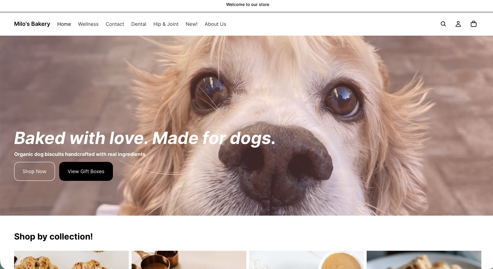
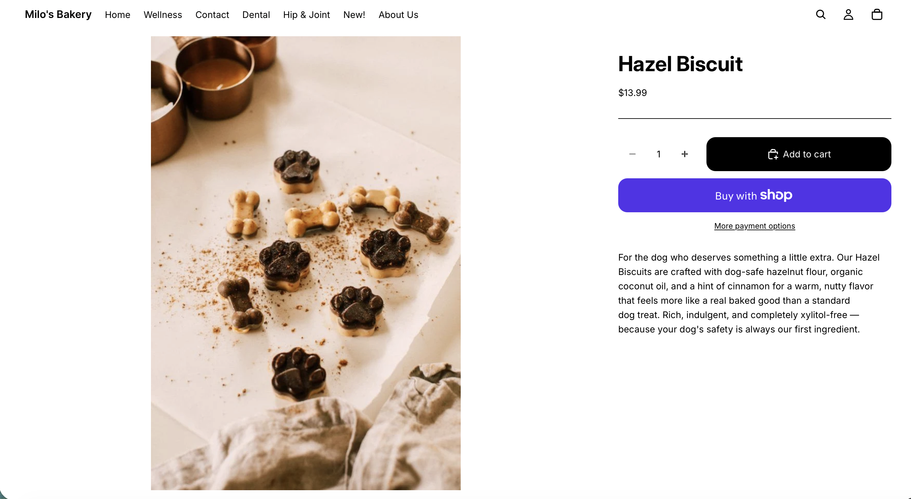
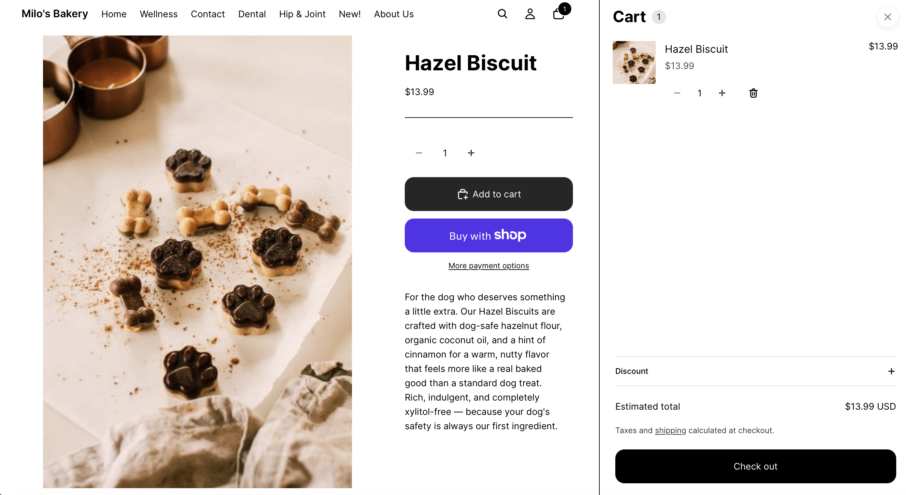
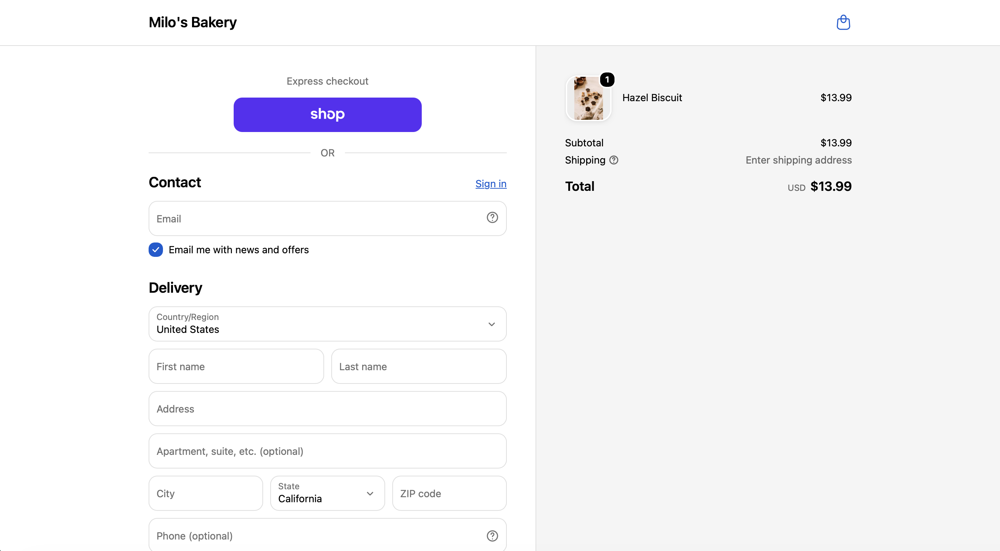
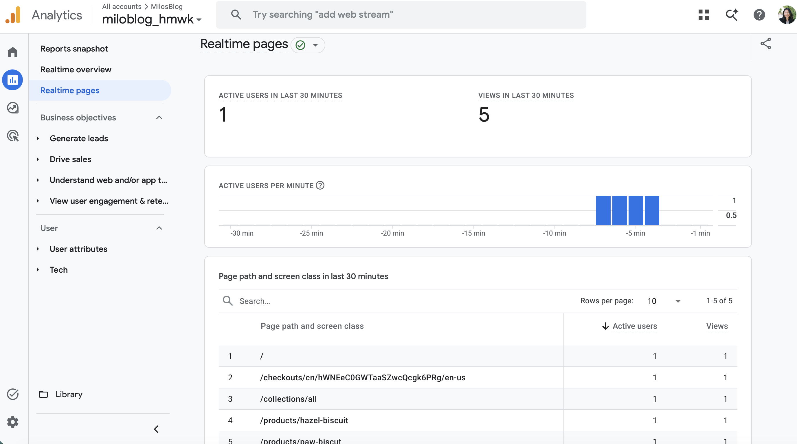

------------------------------------------------------------------------

## Customer Journey Test {#sec-journey}

The following five-stage customer journey was tested on the Milo's Bakery storefront to evaluate the shopping experience from first arrival through checkout preview.

| Stage | Action Tested          | Result                     |
|:------|:-----------------------|:---------------------------|
| 1     | Homepage arrival       | *(pass / note any issues)* |
| 2     | Collection page browse | *(pass / note any issues)* |
| 3     | Product page review    | *(pass / note any issues)* |
| 4     | Add to cart            | *(pass / note any issues)* |
| 5     | Checkout preview       | *(pass / note any issues)* |

: Customer Journey Test Results {#tbl-journey .striped .hover}

See @tbl-journey for the full test results at each stage and @sec-improvements for the areas identified for improvement.

------------------------------------------------------------------------

## Screenshots of Testing Process {#sec-screenshots}

::: panel-tabset
### Stage 1 — Homepage

**What was tested:** Homepage load, hero banner visibility, navigation menu, featured collections section, and call-to-action buttons.

**Observation:** *(Describe what you saw — did the hero image load? Were the CTA buttons visible? Did the navigation look clean?)*

{width="85%"}

------------------------------------------------------------------------

### Stage 2 — Collection Page

**What was tested:** Core Biscuits collection page layout, product grid display, product images, prices visible on grid tiles, and collection description.

**Observation:** *(Describe what you saw — were all five products showing? Did the images load correctly? Was the collection description visible at the top?)*

{width="85%"}

------------------------------------------------------------------------

### Stage 3 — Product Page

**What was tested:** Paw Biscuits product page including product image, title, price, description formatting, add to cart button, and related products section.

**Observation:** *(Describe what you saw — was the description structured with the ingredient list and "Perfect for" section? Did the image display clearly? Was the price prominent?)*

{width="85%"}

------------------------------------------------------------------------

### Stage 4 — Cart

**What was tested:** Cart drawer or cart page after clicking Add to Cart, including product name, image, price, quantity selector, and proceed to checkout button.

**Observation:** *(Describe what you saw — did the cart update correctly? Was the product information accurate? Was the total clearly displayed?)*

{width="85%"}

------------------------------------------------------------------------

### Stage 5 — Checkout Preview

**What was tested:** Checkout page layout including contact information field, shipping or pickup option, order summary sidebar, and payment section visibility.

**Observation:** *(Describe what you saw — was the pickup option clearly presented? Was the order summary correct? Did the checkout feel trustworthy?)*

{width="85%"}
:::

------------------------------------------------------------------------

## Store Strengths {#sec-strengths}

Based on the customer journey test, the following three strengths were identified in the current Milo's Bakery storefront:

**Strength 1 — Clear brand identity communicated immediately**

The hero banner on the homepage communicates the Milo's Bakery brand story — organic dog biscuits, baked with love, campus-made aesthetic — within the first few seconds of arrival. A first-time visitor understands what the store sells and why it is different before they scroll past the fold. This directly reduces bounce rate at the awareness stage of the customer journey.

**Strength 2 — Structured, scannable product descriptions**

The product descriptions across all ten products follow a consistent format — emotional hook, ingredient summary, bulleted ingredient list, and a "Perfect for" closing line. A customer landing on the Paw Biscuits product page can scan the description in under 30 seconds and understand what the product is, what it contains, and whether it is right for their dog. This structure reduces decision friction at the consideration stage.

**Strength 3 — Clear collection organization**

The three collections — Core Biscuits, Bundles & Gift Boxes, and Seasonal & Functional — are logically organized around customer intent rather than product type. A gift shopper can navigate directly to gift boxes in one click from the homepage. A repeat buyer looking for their dog's regular flavor can go straight to Core Biscuits. The navigation structure reduces the number of clicks between homepage arrival and product discovery.

------------------------------------------------------------------------

## Areas for Improvement {#sec-improvements}

Based on the customer journey test, the following three areas were identified as needing improvement before the final submission:

**Improvement 1 — Product images need consistency**

Inconsistent or missing product images are the most common reason customers hesitate before adding to cart. A collection grid where some products have images and others show a placeholder creates an unprofessional impression and signals that the store may not be fully operational.

**Improvement 2 — Mobile layout needs review**

A significant portion of Milo's Bakery's target audience — health- conscious millennials and Gen Z pet owners — shops primarily on mobile. A storefront that looks strong on desktop but breaks on mobile will lose a large portion of its intended audience before they reach a product page.

**Improvement 3 — Checkout pickup instructions could be clearer**

Because Milo's Bakery operates on a pickup-only model, the checkout experience must make the pickup process feel clear and easy. A customer who reaches checkout and is unsure how pickup works — when their order will be ready, where to go, or what to bring — is likely to abandon the cart rather than complete the purchase.

------------------------------------------------------------------------

## Analytics Review {#sec-analytics}

The following section presents available analytics data from GA4 and Shopify for the Milo's Bakery practice store.

{width="85%"}

::: panel-tabset
### GA4 data

**Available data from GA4:**

*(Fill in what your GA4 report shows. Common data points to note:)*

-   Total users since connection was established
-   Sessions by traffic source — are any sources showing?
-   Realtime users during the testing session
-   Pages viewed — which pages are being visited?

The GA4 connection was confirmed active in Assignment 7, where the Realtime report showed one active user during storefront testing. Since then, *(describe any additional data that has appeared in GA4 — or note if the store is too new for meaningful data to have accumulated.)*

### Shopify analytics

**Available data from Shopify Analytics:**

*(Fill in what your Shopify admin analytics page shows. Common data points to note:)*

-   Total sessions
-   Total orders (likely zero for a practice store)
-   Top products by page views
-   Traffic sources

Shopify Analytics provides a basic overview of store activity even before GA4 data accumulates. For a newly launched practice store, the most useful data at this stage is which pages are being visited and whether any add-to-cart events have been recorded during testing.
:::

::: callout-note
For a practice store with limited real traffic, the most valuable analytics insight at this stage comes from the testing sessions themselves — each manually conducted journey test generates real behavioral data in GA4 and Shopify that can be reviewed and interpreted.
:::

------------------------------------------------------------------------

## Improvement Plan {#sec-plan}

Before the final Shopify project submission in Week 11, the following improvements will be made to the Milo's Bakery storefront. The highest priority is product image consistency — every product in the catalog needs a clean, appropriately sized image that displays correctly in the collection grid and on the individual product page. Missing or inconsistent images undermine the store's credibility more than any other single issue, and addressing this first will have the largest positive impact on the overall customer experience. The second priority is a mobile layout review — the storefront will be tested on a mobile device or in a narrow browser window to identify any layout issues with the hero banner, navigation, or product grid that need to be corrected before final submission. The third priority is a checkout experience review — the pickup instructions and order confirmation messaging will be reviewed to ensure a first-time customer understands exactly what happens after they complete their order. These three improvements directly address the areas identified during the customer journey test and will bring the Milo's Bakery storefront to a polished, submission-ready state that accurately reflects the brand's organic, community-oriented identity.

------------------------------------------------------------------------

## Appendix {.unnumbered}

| Resource | Link |
|:--------------------------------------------|:--------------------------|
| GitHub Repository | <https://github.com/dmcpp26/ibm6300-assignments> |
| GitHub Pages (Live Report) | <https://dmcpp26.github.io/ibm6300-assignments> |
| Shopify Admin | <https://admin.shopify.com> |
| Google Analytics | <https://analytics.google.com> |

: Assignment Links {.striped .hover}

------------------------------------------------------------------------

*Submitted for IBM 6300 — Business Analytics \| Cal Poly Pomona \| Summer 2026*
