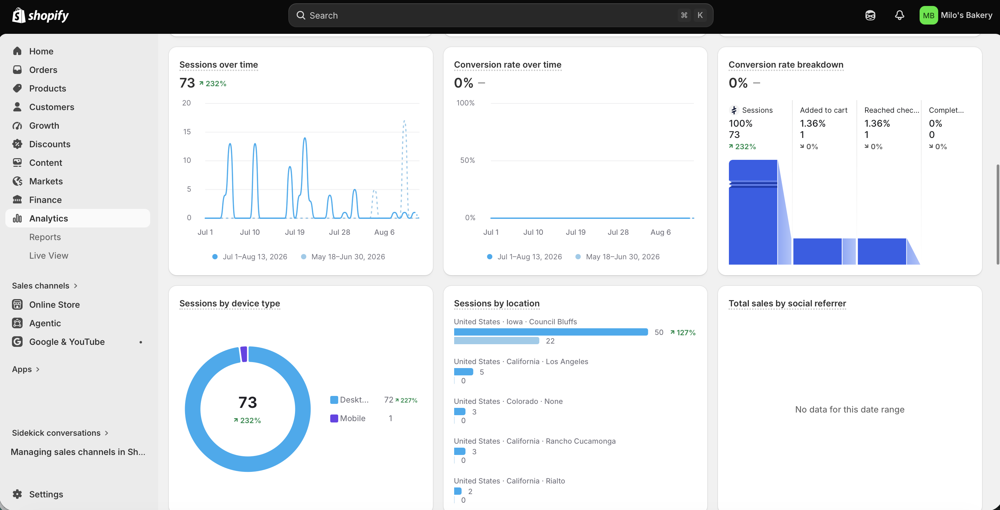
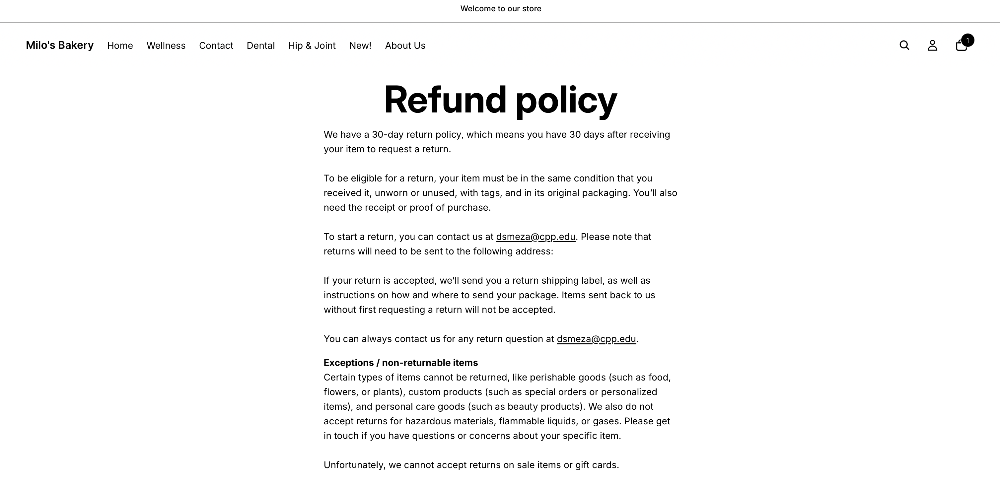
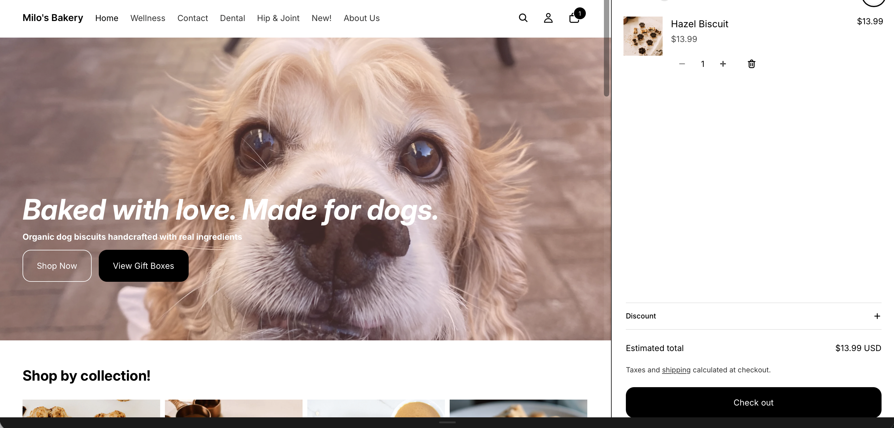
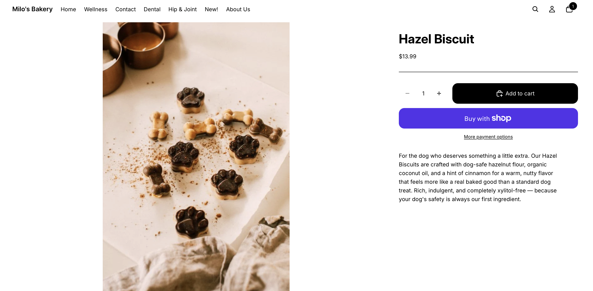
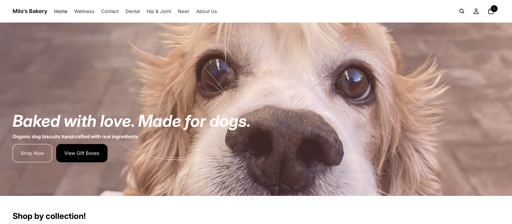

## Introduction

This report serves as the final reflection for the Milo's Bakery Shopify practice store project, completed as part of IBM 6300 at Cal Poly Pomona during Summer 2026. Over the course of the semester, I built a complete Shopify e-commerce store from scratch — defining a store concept, developing a product catalog, organizing collections and navigation, designing the storefront, setting up checkout and store policies, connecting Google Analytics 4, and testing the full customer journey. This report synthesizes those experiences and connects them to the CPP Farm Store omnichannel consulting project.[^1]

[^1]: Milo's Bakery is a fictional practice store created for educational purposes only. No real products, payments, or transactions were involved in this project.

------------------------------------------------------------------------

## Store Overview {#sec-overview}

### Store Concept

**Milo's Bakery** is an organic dog biscuit bakery that handcrafts wholesome, clean-ingredient treats for dogs and the people who love them. The store sells freshly made biscuits using organic, dog-safe ingredients — no artificial preservatives, no fillers, no ingredients you cannot pronounce. The brand aesthetic is cozy, warm, and approachable — natural kraft paper packaging, warm cream and terracotta tones, and photography that feels like a sunny Saturday at a farmers market.

> *"Baked with love. Made for dogs."*

### Target Customer

Milo's Bakery's primary target customer is a **health-conscious millennial or Gen Z pet owner** who treats their dog as a full member of the family. They read ingredient labels on their own food and apply the same scrutiny to what their dog eats. They are willing to pay a small premium for quality and are drawn to brands that feel authentic, small-batch, and story-driven.

| Characteristic | Description |
|:---|:---|
| Age | 24–42 years old |
| Lifestyle | Wellness-oriented, pet-centered, community-minded |
| Shopping behavior | Shops online, values brand transparency |
| Brand affinity | Cozy, artisan, small-batch — not corporate pet food |
| Income | Middle to upper-middle — invests in premium pet products |

: Milo's Bakery Target Customer Profile {.striped .hover}

### Product Assortment

The store launched with **ten products** across three collections:

::: panel-tabset
### Core Biscuits

Five single-flavor biscuit bags — Banana, Blueberry, Hazel, Paw, and Mix Plate Sampler — ranging from \$11.99 to \$15.99. These are the everyday treat lineup and the heart of the catalog.

### Bundles & Gift Boxes

Three curated gift sets — The Morning Box (\$32.99), The Sweet Treat Box (\$28.99), and The Full Milo's Experience (\$44.99) — designed for gifting occasions at different price points.

### Seasonal & Functional

Two limited-edition products — Birthday Cake Biscuits (\$14.99) and Peanut Butter & Pumpkin Biscuits (\$13.99) — designed to create urgency and repeat visits through seasonal availability.
:::

------------------------------------------------------------------------

## Final Store Evidence {#sec-evidence}

The following screenshots document the final state of the Milo's Bakery Shopify store across all major customer-facing sections.[^2]

[^2]: All screenshots were captured from the Milo's Bakery Shopify practice store storefront during Week 11, Summer 2026.

### Homepage

The homepage was designed around three priorities: a hero banner that communicates the brand identity immediately, a featured collections section for easy navigation, and a bestsellers grid that surfaces the most popular products without requiring a collection click.

{width="85%"}

### Product Page

Product pages were built with a consistent structure across all ten products: an emotional opening hook, an ingredient summary, a bulleted ingredient list, and a "Perfect for" closing line.

{width="85%"}

### Collection Page

The Core Biscuits collection page displays all five products in a consistent grid, sorted by best-selling, with a collection description at the top explaining the assortment.

{width="85%"}

### Navigation Menu

The main navigation menu provides direct access to all three collections, the Build Your Own Bundle page, the About page, and the Contact page — all within one click from any page.

{width="85%"}

### Policies and Contact Information

Store policies — including the pickup policy, return and refund policy, and privacy policy — were added through Shopify's Settings → Policies and are linked in the store footer. A dedicated Contact page was built with store hours, email, and a contact form.

{width="85%"}

### GA4 and Shopify Analytics Evidence

Google Analytics 4 was connected to the Milo's Bakery Shopify store in Assignment 7. The Realtime report confirmed an active user during the connection test, and Shopify Analytics provides a baseline overview of sessions and page views.

{width="85%"}

------------------------------------------------------------------------

## Retail Technology Reflection {#sec-retail}

Building Milo's Bakery from scratch gave me a genuinely hands-on understanding of Shopify as an e-commerce platform that I could not have gotten from reading about it. The most important thing I learned is that Shopify is not just a place to list products — it is a complete retail management system. Every part of the customer experience, from how products are organized to how policies are communicated at checkout, is controlled through a single admin interface that is surprisingly intuitive once you understand its structure.

The process of setting up the Google & YouTube sales channel, connecting Google Merchant Center, and configuring GA4 taught me how the different layers of a retailer's technology stack fit together. Shopify is the storefront and order management layer. Google Merchant Center is the product data layer that connects the store to Google Shopping. GA4 is the behavioral data layer that tracks what customers do once they arrive. And the product feed is the structured data file that makes all three work together. Understanding how these tools connect — and where the dependencies are — is something I now feel confident explaining to a client.

I also learned how much product data quality matters. Before this course I assumed that a product listing was just a photo and a price. The Google Merchant Center work taught me that a listing is a structured data record with a title, description, category, GTIN, availability status, price, image URL, and shipping information — and that each of those fields affects whether the product appears in Google Shopping results at all, and how high it appears when it does.

::: callout-tip
The most practically useful Shopify skill I developed this semester is understanding the relationship between the product catalog, collections, and navigation — and how organizing them around customer intent rather than product type reduces friction and increases the likelihood of a purchase.
:::

------------------------------------------------------------------------

## Merchandising Reflection {#sec-merch}

The merchandising work across Assignments 2 through 5 taught me that online product organization is a strategic decision, not just an administrative one. The most important insight was the difference between organizing products by type versus organizing them by customer intent.

When I first set up Milo's Bakery, I instinctively grouped products by flavor. But as I worked through the collections and navigation assignments, I realized that a customer arriving at the store is not thinking "I want to see all biscuits" they are thinking "I want an everyday treat for my dog" or "I need a gift for someone's new puppy." Reorganizing the collections around those intent-based categories — Core Biscuits, Bundles & Gift Boxes, Seasonal & Functional; made the navigation feel immediately more intuitive for both use cases.

I also learned how much work a well-written product description does at the conversion stage. The first drafts of my product descriptions were generic, just ingredients and sizes. After revising them to lead with an emotional hook, follow with a scannable ingredient list, and close with a "Perfect for" use case line, the pages felt significantly more compelling. The structured format also made the pages consistent across all ten products, which gave the catalog a polished, professional feel that plain paragraphs did not.

The storefront design work taught me that the homepage is a customer's first and often only chance to understand what a store is and whether it is worth exploring. A hero banner that communicates brand identity, a featured collections section that gives customers a clear next step, and a bestsellers grid that surfaces the most relevant products, in that order, consistently outperform a default product dump in terms of customer engagement and time on page.

------------------------------------------------------------------------

## Analytics Reflection {#sec-analytics}

Connecting GA4 to Milo's Bakery and completing the Google Shopping Ads certification series gave me a much more concrete understanding of how analytics actually functions in a retail context than I had before this course.

The most significant shift in my thinking came from the GA4 Realtime report. Seeing myself appear as an active user within two minutes of completing the Measurement ID connection made the concept of behavioral tracking feel genuinely real rather than abstract. From that moment, I understood that every click, every page view, and every add-to-cart event is a data point, and that a store with GA4 connected is constantly generating information about what customers do and do not do.

The funnel analysis work in the GP6 Looker Studio dashboard deepened this further. Mapping the simulated conversion funnel, from sessions to product page views to add-to-cart to checkout start to pickup order, made it immediately clear where the biggest drop-off points would be in a real store and what kinds of questions the data could answer. The 45% drop from add-to-cart to checkout start in our simulated data suggested a specific problem: something about the checkout experience was causing customers to abandon before completing their purchase. That is the kind of actionable diagnostic insight that makes analytics genuinely useful for a retail manager rather than just a reporting exercise.

I also learned the important distinction between metrics that describe activity (total sessions, page views) and metrics that describe behavior and intent (add-to-cart rate, checkout initiation rate, returning visitor rate). The former tells you how many people showed up. The latter tells you whether the store is working.

------------------------------------------------------------------------

## CPP Farm Store Application {#sec-farmstore}

The Shopify and analytics skills developed through the Milo's Bakery project connect directly to the CPP Farm Store consulting work in three specific and actionable ways.[^3]

[^3]: These recommendations are grounded in the store visit and manager interview conducted during Summer 2026, the omnichannel journey map developed in GP1, the product feed work in GP3, and the campaign plan in GP4.

### Application 1 \| Shopify as the Missing Digital Infrastructure

CPP Farm Store currently has no meaningful online product catalog, no online ordering capability, and no digital path for a community member in Diamond Bar to discover and purchase a gift basket without driving to campus first. The Milo's Bakery project demonstrated exactly how to build that infrastructure from scratch using Shopify: a complete product catalog with photos and descriptions, collections organized by customer intent (fresh produce, beverages, gift baskets), a homepage that leads with the campus-grown origin story, and an online ordering flow with in-store pickup as the default fulfillment method.

Every assignment I completed for Milo's Bakery from the initial store concept to the final storefront design maps directly to what CPP Farm Store would need to do to close the digital gap identified in the GP1 journey map. The process is the same; only the products and the brand story are different.

### Application 2 \| Google Merchant Center and Free Product Listings

The Google Shopping Ads certification series and the GP3 product feed work taught me that CPP Farm Store could gain meaningful Google Shopping visibility at zero cost by simply connecting its Shopify store to Google Merchant Center and submitting a well-prepared product feed. Free product listings are available to any verified retailer no advertising budget required.

For CPP Farm Store, the highest-priority products to list would be the gift baskets (Classic Farm Basket, Anti-Pasti Gift Box, Sweet Gift Box) because they carry the highest search intent from the local community audience and the strongest visual differentiation from what a shopper would find on Amazon or at a grocery store. A community member searching "local gift baskets near Pomona" would see a CPP Farm Store product with a photo, a price, and a campus-grown story, before they have ever heard of the store.

### Application 3 \| GA4 for Understanding Customer Behavior

The biggest knowledge gap for CPP Farm Store right now is that it has almost no information about how customers behave, what they search for, which products generate the most interest, where they drop off in the purchase process, and which marketing channels actually drive visits. Connecting GA4 to the Farm Store's Shopify storefront would change this entirely.

Within the first week of connection, the Farm Store would have data on which product pages are most visited, how customers arrive at the site, whether they are browsing on mobile or desktop, and whether the checkout flow is working. Within the first month, the team would have enough data to identify the most impactful optimization, whether that is improving a product page that is getting traffic but not converting, or doubling down on a traffic source that is generating high-intent visitors. The Looker Studio dashboard we built in GP6 provides the exact framework for tracking these KPIs from day one.

------------------------------------------------------------------------

## Final Self-Assessment {#sec-self}

### What I Am Most Proud Of

The part of the Milo's Bakery project I am most proud of is the **Build Your Own Bundle custom order form** built directly into the Shopify product page using HTML and JavaScript. This went significantly beyond the basic Shopify assignments and required me to think like a product designer rather than just a store builder. The form allows customers to select from every product category gift baskets, wines, jams, honey, nuts, fresh produce with live quantity selectors, a running order summary, a real- time price total, and a validated submission flow. It handles the exact use case that makes CPP Farm Store's gift basket offering genuinely compelling: the ability to customize a basket before purchasing, rather than having to buy a fixed pre-built set.

Building it also reinforced something I now understand much more clearly that e-commerce is not just about having a catalog of products. It is about designing a purchase experience that matches the way customers actually think about what they want to buy.

### What I Would Improve With More Time

The area I would most want to improve with more time is the **product photography and visual consistency** across the Milo's Bakery catalog. Throughout the semester, the product images were placeholder or inconsistent; different backgrounds, different sizes, different lighting. I learned from the Google Merchant Center work that image quality is the single most important factor in whether a product gets clicked in a Google Shopping result, and that inconsistent images across a collection grid create a credibility gap that undermines even well-written product descriptions.

With more time, I would reshoot all ten products on a clean, consistent white or natural wood background with consistent lighting and sizing, and then resubmit the product feed with the updated images to see the impact on click-through rate. That one improvement would do more to improve the store's commercial performance than any other single change.

------------------------------------------------------------------------

## Appendix {.unnumbered}

| Resource | Link |
|:---|:---|
| GitHub Repository | <https://github.com/dmcpp26/ibm6300-assignments> |
| GitHub Pages — Portfolio | <https://dmcpp26.github.io/ibm6300-assignments/> |
| Milo's Bakery Shopify Store | <https://admin.shopify.com> |
| Google Analytics | <https://analytics.google.com> |
| CPP Farm Gifts Store | <https://bzgshk-14.myshopify.com> |

: Assignment and Resource Links {.striped .hover}

------------------------------------------------------------------------

*Submitted for IBM 6300 — Business Analytics \| Cal Poly Pomona \| Summer 2026* *Individual Final Submission — Danielle Meza*
