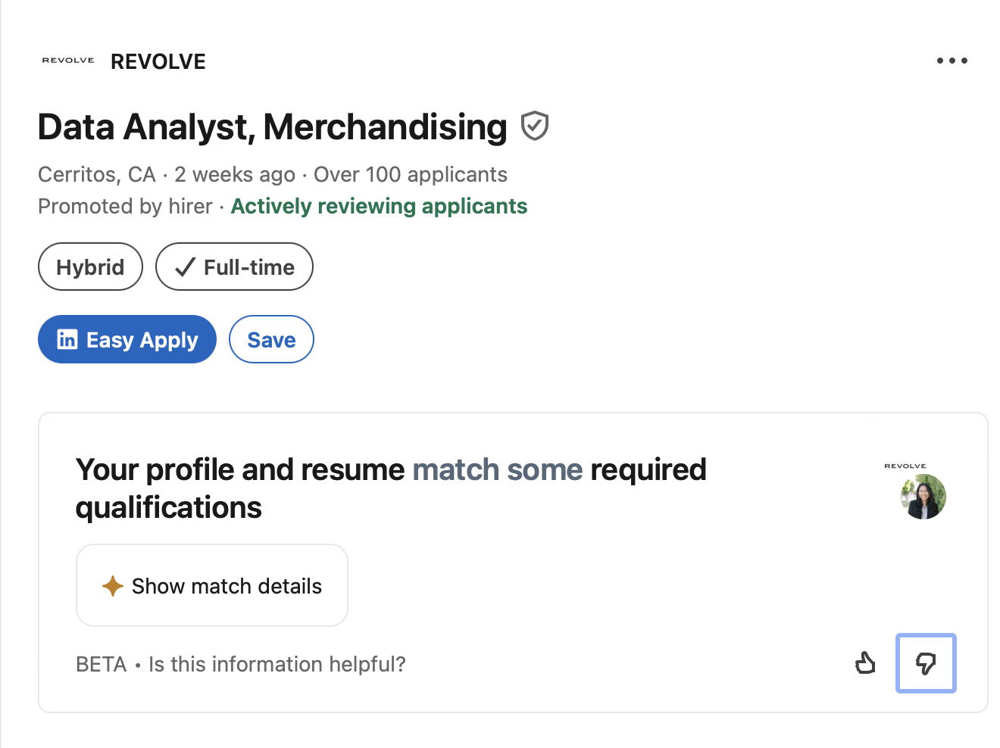
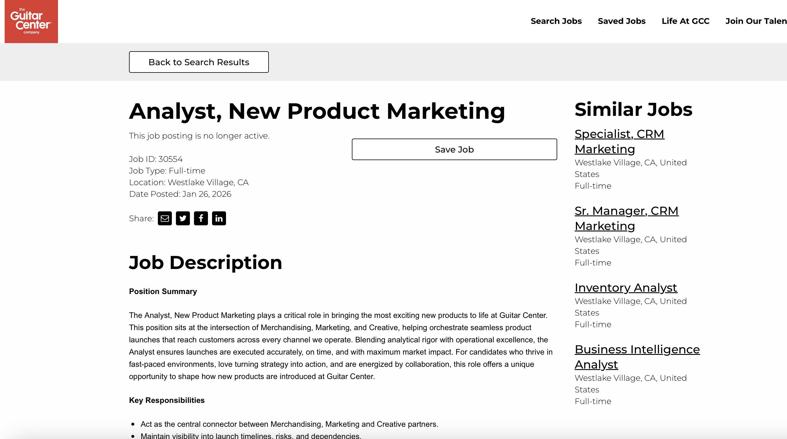
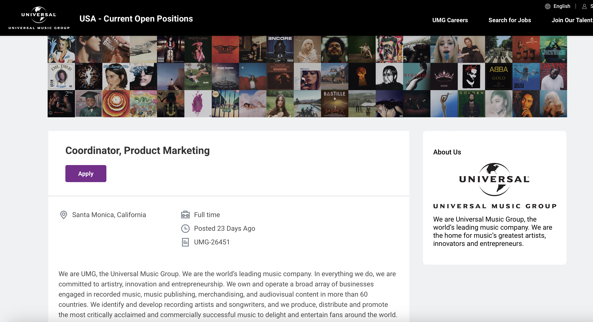

## Introduction

Omnichannel retailing is no longer a trend — it is the expectation. Today's consumers move between online and offline channels, and the brands that win are the ones that make that movement feel effortless. As a result, careers in omnichannel retailing, e-commerce, digital merchandising, and retail analytics have become some of in-demand roles in modern marketing. These positions sit at the intersection of data, creativity, and strategy — requiring professionals who can think analytically, communicate clearly, and move quickly in fast-paced environments.

For this assignment, I researched three job postings on LinkedIn that reflect the career opportunities available in this space. The roles I selected cover editorial analytics, new product marketing, and product coordination, within companies in fashion e-commerce, musical instruments retail, and the music industry. Together they paint a clear picture of what employers in omnichannel and e-commerce environments are looking for, and how the IBM 6300 course and the broader MSDM program at Cal Poly Pomona directly prepare students for these paths.

------------------------------------------------------------------------

## Summary of Job Postings {#sec-postings}

The three roles I selected represent different functions within the omnichannel and retail marketing ecosystem — from data and analytics to campaign coordination and product launches.

::: panel-tabset
### REVOLVE — Data Analyst

**Job Title:** Data Analyst, Editorial & Merchandising Strategy\
**Company:** REVOLVE\
**Source:** LinkedIn\
**Level:** Mid-level (2–4 years experience)

REVOLVE is a fashion e-commerce company known for its influencer-driven marketing and strong digital merchandising presence. This role sits within the Merchandising team and is focused on connecting performance data to brand storytelling. The analyst is responsible for aggregating data from multiple channels — email, site, social, paid media, and merchandising reports — and translating those numbers into clear, actionable insights for leadership.

Key responsibilities include building dashboards in BI tools like Tableau, owning recurring weekly and monthly reporting, identifying shifts in customer behavior, and acting as what the posting calls a *"data translator"* — someone who can take complex analytics and frame them within the context of editorial and merchandising strategy. The role reports directly to the Director of Editorial & Merchandising Strategy.

{width="80%"}

### Guitar Center — Marketing Analyst

**Job Title:** Analyst, New Product Marketing\
**Company:** Guitar Center\
**Source:** LinkedIn\
**Level:** Early-to-mid level (2–4 years experience)

Guitar Center is one of the largest musical instrument retailers in the United States, operating both physical stores and a major e-commerce platform. This analyst role sits at the center of new product launches, serving as the connector between Merchandising, Marketing, and Creative teams.

Responsibilities include maintaining a product launch database in Quickbase, analyzing sales and marketing performance metrics, partnering with channel teams across email, e-commerce, paid media, in-store, social, and affiliate channels, and developing new workflows and documentation to support scalable execution. The role is explicitly omnichannel — requiring coordination across every customer touchpoint simultaneously.

{width="80%"}

### Universal Music Group — Marketing Coordinator

**Job Title:** Coordinator, Product Marketing\
**Company:** Universal Music Group (UMG)\
**Source:** LinkedIn\
**Level:** Entry-level (1–2 years experience)

Universal Music Group is one of the world's largest music companies. While this role is in the music industry rather than traditional retail, it maps directly to the skills developed in omnichannel and e-commerce marketing. The coordinator supports campaign execution for catalog artist releases, coordinating creative assets, managing timelines, tracking budgets, and monitoring campaign performance across DSPs, social media, and retail channels.

This role is a strong entry point for someone looking to develop cross-functional coordination skills, campaign management experience, and familiarity with digital marketing tools in a fast-paced creative environment.

{width="80%"}
:::

------------------------------------------------------------------------

## Skills and Knowledge Required {#sec-skills}

After reviewing all three postings carefully, a clear set of overlapping skills and competencies emerged. See @tbl-skills for a structured comparison across the three roles.

| Skill / Competency                   | REVOLVE | Guitar Center | UMG |
|:-------------------------------------|:-------:|:-------------:|:---:|
| Data analysis & reporting            |    ✓    |       ✓       |  ✓  |
| Cross-functional collaboration       |    ✓    |       ✓       |  ✓  |
| Project & timeline management        |    ✓    |       ✓       |  ✓  |
| Excel proficiency                    |    ✓    |       ✓       |  ✓  |
| BI / analytics tools (Tableau, etc.) |    ✓    |       ✓       |  —  |
| E-commerce platform knowledge        |    ✓    |       ✓       |  —  |
| Creative asset coordination          |    ✓    |       ✓       |  ✓  |
| Written & verbal communication       |    ✓    |       ✓       |  ✓  |
| Campaign performance tracking        |    ✓    |       ✓       |  ✓  |
| Budget & expense management          |    —    |       —       |  ✓  |
| SQL / database skills                |    ✓    |       ✓       |  —  |

: Skills Comparison Across Three Job Postings {#tbl-skills .striped .hover}

### Technical Skills

All three postings place significant emphasis on **data analysis and reporting**. REVOLVE specifically requires advanced Excel and SQL skills, plus experience with BI visualization tools like Tableau, Looker, PowerBI, or Domo. Guitar Center similarly requires comfort with databases, spreadsheets, and BI tools. Even the entry-level UMG role expects familiarity with project management tools and the ability to monitor campaign performance metrics.

**E-commerce platform knowledge** is explicitly valued at both REVOLVE and Guitar Center, where analysts must understand how product data, inventory status, and campaign performance connect across digital and physical channels. Familiarity with tools like Google Analytics, Shopify, and marketing calendars is increasingly expected at even the coordinator level.

**Design and content tools** appear across all three postings as well. Adobe Creative Suite, Canva, and similar platforms are listed as preferred or required — reflecting the reality that modern marketing roles blur the line between analytical and creative work.

### Soft Skills

Beyond technical tools, all three postings share a consistent set of soft skill expectations:

-   **Cross-functional collaboration** — every role requires working across multiple departments simultaneously
-   **Strong written and verbal communication** — especially the ability to present data or campaign updates to non-technical stakeholders
-   **Attention to detail and time management** — managing multiple projects and deadlines without dropping the ball
-   **Adaptability and problem-solving** — all three describe fast-paced environments where priorities shift quickly

::: callout-important
It is no longer enough to pull a report — employers want people who can explain what the numbers mean and recommend what to do next. A critical pattern across all three postings is the expectation that candidates can **translate data into narrative**.
:::

------------------------------------------------------------------------

## Connection to This Course and the MSDM Program {#sec-connection}

The skills identified in these job postings map directly to the work being done in IBM 6300 and across the MSDM program at Cal Poly Pomona.

### IBM 6300 — Business Analytics

IBM 6300 provides hands-on preparation for exactly the kind of work these roles require:

-   **Shopify Store Development** directly maps to the e-commerce platform knowledge expected at REVOLVE and Guitar Center
-   **Google Analytics 4 and retail analytics** prepare students to pull, interpret, and present performance data
-   **The CPP Farm Store consulting project** develops real cross-functional collaboration skills and experience presenting findings to a client
-   **Omnichannel strategy coursework** builds the strategic vocabulary and framework knowledge that employers like Guitar Center expect
-   **Quarto and data reporting** builds the documentation and communication skills that every posting lists as essential

### Other MSDM Courses

::: panel-tabset
### Marketing Analytics

Courses in marketing analytics build the quantitative foundation needed for roles like the REVOLVE data analyst position — including data visualization, KPI tracking, and performance reporting using tools like Tableau or advanced Excel.

### Consumer Behavior

Understanding why consumers make the decisions they do is critical for roles that require connecting data to storytelling — exactly what REVOLVE describes. Consumer behavior coursework provides the conceptual framework for interpreting shifts in engagement and conversion data.

### Digital Marketing

Digital marketing courses build knowledge of paid media, email, SEO, social, and affiliate channels — all of which appear explicitly in the Guitar Center posting as channels the analyst must coordinate across.

### Marketing Research

The Backward Research Process and secondary data research methodology taught in IBM 6300 — and reinforced in marketing research courses — directly prepares students to synthesize information from multiple sources into clear, actionable insights.
:::

> "The best preparation for a data-driven marketing career is not just learning the tools — it is learning how to ask the right questions and communicate the answers clearly."

------------------------------------------------------------------------

## Personal Career Reflection {#sec-reflection}

Of the three roles I researched, the **Data Analyst, Editorial & Merchandising Strategy position at REVOLVE** interests me the most. REVOLVE operates at the intersection of fashion, data, and digital storytelling — and the idea of being the person who connects what the numbers say to how the brand tells its story is genuinely exciting to me. This role is not just about pulling reports — it is about framing insights within a narrative and helping the team make real-time decisions. That combination of analytical rigor and creative context feels like the right fit.

### Current Strengths

Through IBM 6300 and the MSDM program, I have already begun building a relevant foundation:

-   Experience with **Quarto and data reporting**
-   Familiarity with **omnichannel strategy frameworks** from our group presentation on customer journey mapping
-   Applied **consulting experience** through the CPP Farm Store project
-   Growing proficiency in **Shopify** and e-commerce platform logic

### Areas for Development

-   **SQL** — listed as required at REVOLVE and a gap I need to address
-   **Tableau or another BI tool** — building dashboard skills beyond Excel
-   **Portfolio of analytical work** — compiling course projects into a professional portfolio that demonstrates applied skills

### Next Steps

**Two specific actions I will take this semester:**

1.  **Complete a free SQL course** on Mode Analytics, Khan Academy, or DataCamp to strengthen my candidacy for analyst roles.

2.  **Update my LinkedIn profile** to reflect skills and projects completed in IBM 6300 — including the Shopify store, the Farm Store consulting project, and the omnichannel strategy presentation.

------------------------------------------------------------------------

## References & Job Posting Links {.unnumbered}

| Role | Company | Link |
|:---|:---|:---|
| Data Analyst, Editorial & Merchandising Strategy | REVOLVE | [View on LinkedIn](https://www.linkedin.com/jobs/view/4426171220/?alternateChannel=search&eBP=CwEAAAGfC1Iyd26i2FZAYPsYwNX_7hCrMlcIqGQrdUASUEDZyOlegtRSvTSiLoD5XB8X0JBbBYidGdHfmi40mbxQLfaodoei7dDT2PUUBwu5iFAC6KFs3lYC9wt6Q8FfqJZbXBQSmuSoWdXIS4MyTL8rYJc2bgOlZd2YKiiTWahmbqDNwyZC6M4LigMLK2yCNZ60Eq5rPAwpNSJjJVaro8f5bQKlsObViUfK0r9Nq94TOKpBJrQ9aVOY3yW_FEed4iil9BbI8WWTFJh24j4_OTnB2xy6rAvjXUnqUs3x00__xP1Fk3lKKkbSEYsH6HcNlW4Z37RwA1kXDu6op6W-gcsqezsS76fMHf5lleP-yJvmP8Odep00RK4QiW45czP3vvCHEZHFUkYHQlNVT6fMaaI2K7gHyKzKlHRTdavGoyihE-8W4YT7XZb3hsS_WbEQqmlX4WaWHPlTabSkYqPMbNxfmaZeoiMqyZkfr58r9_5nVg&refId=PvcoXQbFtwKtG40wMJqqUg%3D%3D&trackingId=pje01lQV5VwgDoB1U6KcLg%3D%3D) |
| Analyst, New Product Marketing | Guitar Center | [View on LinkedIn](https://careers.guitarcenter.com/jobs/17263831-analyst-new-product-marketing?bid=370&tm_company=44985&tm_event=view&tm_job=30554) |
| Coordinator, Product Marketing | Universal Music Group | [View on LinkedIn](https://umusic.wd5.myworkdayjobs.com/en-US/UMGUS/job/Santa-Monica-California/Coordinator--Product-Marketing_UMG-26451?source=LinkedIn) |

------------------------------------------------------------------------

## Appendix {.unnumbered}

| Resource | Link |
|:---|:---|
| GitHub Repository | <https://github.com/dmcpp26/ibm6300-assignments> |
| GitHub Pages (Live Report) | <https://dmcpp26.github.io/ibm6300-assignments/OACP-Career-Research/OACP-W4-Retail.html> |
