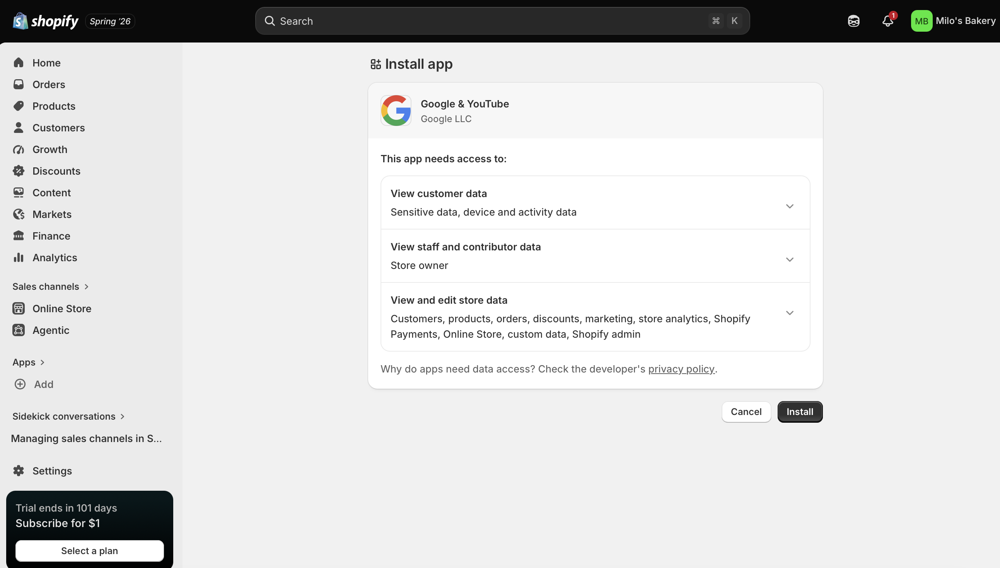
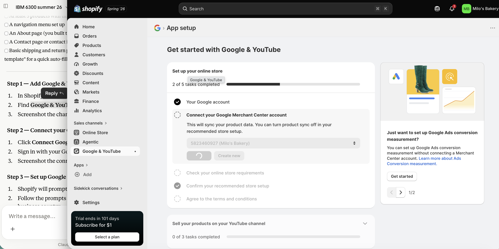
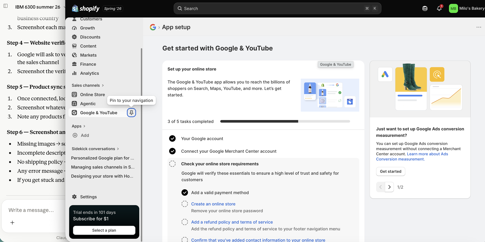
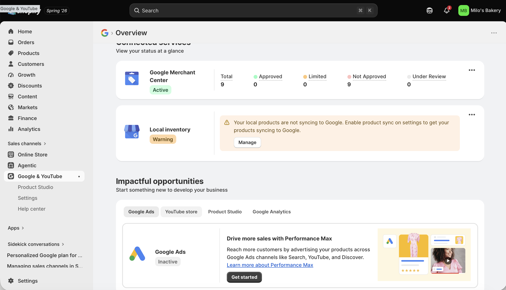
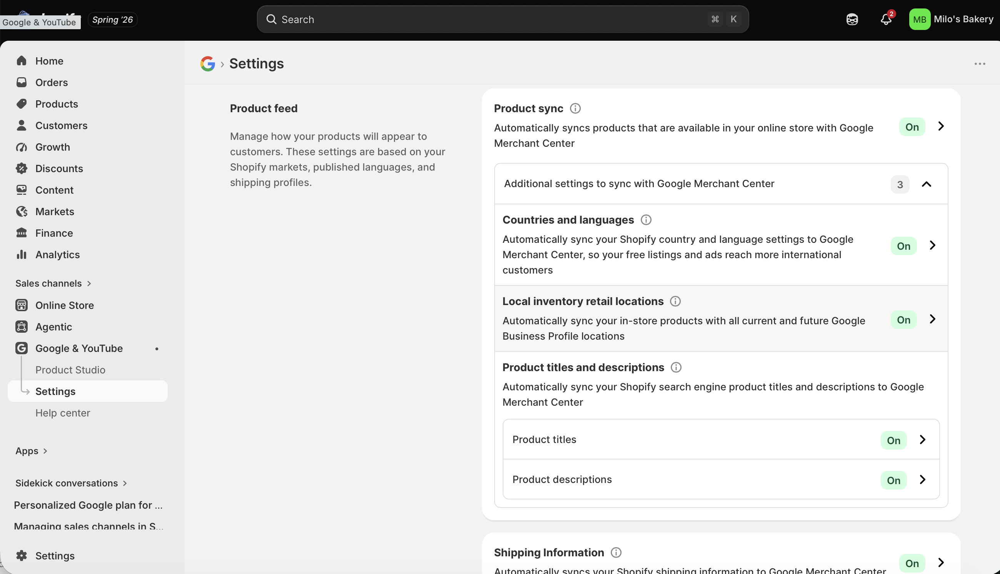
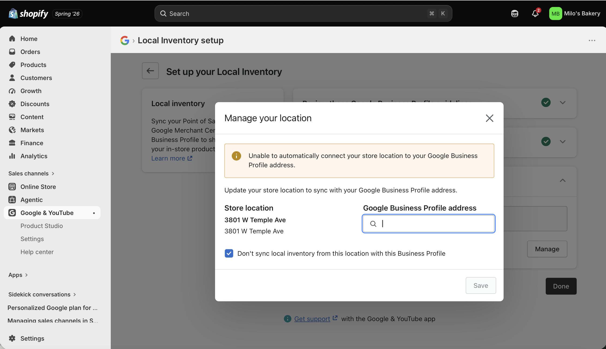

## Introduction

This report documents my attempt to connect the **Milo's Bakery** Shopify practice store to Google Merchant Center as part of the IBM 6300 Google Merchant Center Connection Lab. Milo's Bakery is an organic dog biscuit bakery practice store built on Shopify, featuring ten products across three collections — Core Biscuits, Bundles & Gift Boxes, and Seasonal & Functional Treats.

------------------------------------------------------------------------

## Shopify Store Overview {#sec-store}

Before attempting the connection, the following elements were confirmed in the Milo's Bakery Shopify store:

| Element                         |   Status    |
|:--------------------------------|:-----------:|
| Store name (Milo's Bakery)      | ✅ Complete |
| Product catalog (10 products)   | ✅ Complete |
| Product titles and descriptions | ✅ Complete |
| Product images                  | ✅ Complete |
| Product prices and availability | ✅ Complete |
| Navigation menu and collections | ✅ Complete |
| About page                      | ✅ Complete |
| Contact page                    | ✅ Complete |
| Shipping policy                 | ✅ Complete |
| Return policy                   | ✅ Complete |

: Milo's Bakery — Store Readiness Checklist Before GMC Connection {.striped .hover}

------------------------------------------------------------------------

## Connection Attempt Evidence {#sec-connection}

This section documents each major step of the Shopify to Google Merchant Center connection attempt, with screenshots from the process.[^1]

[^1]: Screenshots were taken during the connection attempt completed in Summer 2026 using the Milo's Bakery Shopify practice store and a personal Google account.

### Step 1 — Google & YouTube Sales Channel in Shopify

To begin the connection, I added the Google & YouTube sales channel through the Shopify admin. This channel is the primary bridge between a Shopify store and Google Merchant Center, allowing products to sync automatically without manual CSV uploads.

{width="85%"}

------------------------------------------------------------------------

### Step 2 — Google Account Connection

After adding the sales channel, Shopify prompted me to connect a Google account. This step links the Shopify store to a Google profile, which is required to access Google Merchant Center and Google Ads.

{width="85%"}

------------------------------------------------------------------------

### Step 3 — Google Merchant Center Account Setup

Following the Google account connection, Shopify guided me through the Google Merchant Center account setup. This step required entering the store name, website URL, and business country.

{width="85%"}

------------------------------------------------------------------------

### Step 4 — Website Verification

Google Merchant Center requires verification that the seller owns or controls the website connected to the account. When connecting through Shopify's Google & YouTube sales channel, Shopify handles website verification automatically by injecting a verification meta tag into the storefront.

{width="85%"}

------------------------------------------------------------------------

## Product Sync Evidence {#sec-sync}

### Product Sync or Listing Status

After completing the initial connection steps, I documented what happened to Milo's Bakery's products during the sync process.

{width="85%"}

::: panel-tabset
### Sync outcome

**Partial sync:** 9 of 10 products synced successfully. The following products were flagged or blocked: Blue Berry Biscut. The most common reason for flagging was: *(describe issue — e.g., missing image, incomplete description, no shipping policy)*

### Products flagged

| Product | Issue Flagged | Google Warning |
|:---|:---|:---|
| Blue Berry Biscut | Invalid price | The value you've submitted for the price attribute is `0` or less than `0` and is invalid |

: Products Flagged During Sync {.striped .hover}
:::

------------------------------------------------------------------------

## Setup Barriers and Warnings {#sec-barriers}

### Barriers Encountered

The following issues were identified during the connection attempt. Each barrier is described along with what would need to be fixed before a real retailer could use Google Merchant Center successfully.

{width="85%"}

::: panel-tabset

------------------------------------------------------------------------

### Shipping and return policies

**Issue:** *Missing policies were flagged. I forgot to add policies before connecting, Google Merchant Center flagged this as a required fix.)*

------------------------------------------------------------------------

### Product data completeness

**Issue:** *Missing product data flags — e.g., no GTIN, missing product category, incomplete description.) I have a few products where i forgot to set the price.*

------------------------------------------------------------------------

### Business information

**Issue:** *Business information was missing — e.g., no physical address. I Used the school address for this homework assignment.* A real retailer would need to provide verified business information including a physical address, phone number, and tax settings before Google Merchant Center would approve the account for paid Shopping Ads.
:::

------------------------------------------------------------------------

## Fixes Needed Before a Real Launch {#sec-fixes}

Based on the setup barriers encountered, the following fixes would be required before Milo's Bakery — or any similar small retail store — could realistically use Google Merchant Center and Google Shopping Ads:

| Priority | Fix Required                                               |
|:---------|:-----------------------------------------------------------|
| 1        | Register a custom domain (e.g., milosbakery.com)           |
| 2        | Add shipping and return policies via Shopify Settings      |
| 3        | Retake product images to meet Google's image specs         |
| 4        | Add Google Product Category to all 10 products             |
| 5        | Add brand name and MPN to all products (no GTIN available) |
| 6        | Add physical business address to Merchant Center account   |
| 7        | Complete all product descriptions to 150+ words            |
| 8        | Set up tax settings in Shopify admin                       |

: Fixes Required Before Google Merchant Center Launch {#tbl-fixes .striped .hover}

------------------------------------------------------------------------

## CPP Farm Store Reflection {#sec-farmstore}

Based on my experience attempting to connect Milo's Bakery to Google Merchant Center, there are several critical things CPP Farm Store should prepare before connecting its own Shopify store and launching Google Shopping Ads.

The first and most fundamental requirement is a **custom domain**. A Shopify subdomain will not pass Google's website verification in a way that supports a credible, approvable Merchant Center account. CPP Farm Store would need a domain like `cppfarmstore.com` or similar before proceeding. This is a small investment — typically \$15–20 per year — but a necessary one.

The second priority is **store policies**. Google Merchant Center requires publicly accessible shipping and return policies before any products can be approved for Shopping listings. Given that CPP Farm Store offers in-store pickup and limited online ordering, the shipping policy should clearly communicate the store's local pickup model at 4102 S. University Drive, Pomona, and explain what happens if a product is out of stock or unavailable. A return policy should specify the conditions under which farm-fresh or perishable products can or cannot be returned.

The third priority — and arguably the most impactful for CPP Farm Store specifically — is **product photography**. Google Shopping is a visual channel. When a community member in Diamond Bar searches "local honey gift basket" or "farm fresh produce near Pomona," the product image is the first thing they see before they read a title or a price. Every product the Farm Store wants to promote on Google Shopping needs a clean, high-resolution image on a simple background, with no text overlays and accurate product representation. Based on what we observed during our store visit, this is an area that would require dedicated effort before the feed would be approved.

Fourth, the Farm Store should invest time in **product data quality** before connecting. This means writing complete, descriptive product titles in the format Google prefers — for example, "CPP Farm Store Fresh-Squeezed Orange Juice, 16 oz" rather than just "Orange Juice." It also means assigning Google Product Categories to each item and ensuring prices and availability are accurate and consistent between the Shopify store and the physical store.

Finally, CPP Farm Store should start with its **strongest, most visual products** — the gift baskets, the fresh-squeezed orange juice, and the specialty preserves — rather than trying to list everything at once. A focused, high-quality product feed of five to eight well- prepared items will perform better in Google Shopping than a large feed of poorly prepared listings.

------------------------------------------------------------------------

## Appendix {.unnumbered}

| Resource | Link |
|:---|:---|
| GitHub Repository | <https://github.com/dmcpp26/ibm6300-assignments> |
| GitHub Pages (Live Report) | <https://dmcpp26.github.io/ibm6300-assignments/OACP-W06-Merchant-Center/dmeza_W6OACP.html> |
| Google Merchant Center | <https://merchants.google.com> |
| Shopify Google & YouTube Channel | <https://apps.shopify.com/google> |
| Google Product Taxonomy | <https://www.google.com/basepages/producttype/taxonomy-with-ids.en-US.txt> |

: Assignment Links {.striped .hover}

------------------------------------------------------------------------

*Submitted for IBM 6300 — Business Analytics \| Cal Poly Pomona \| Summer 2026*
