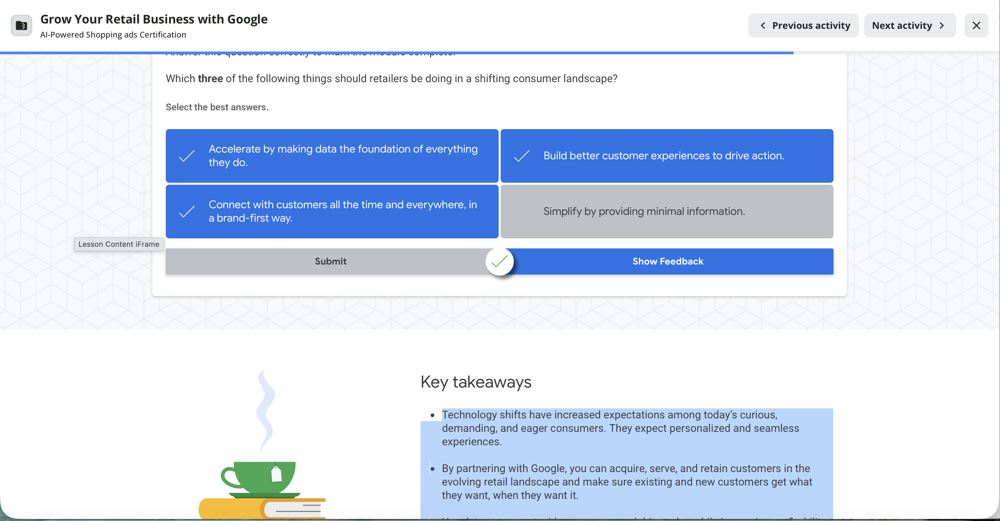
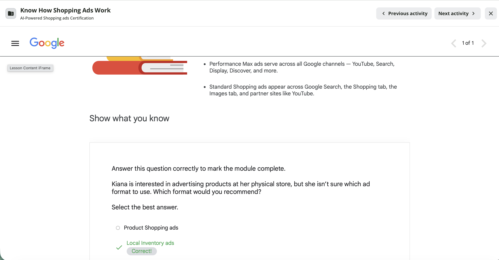
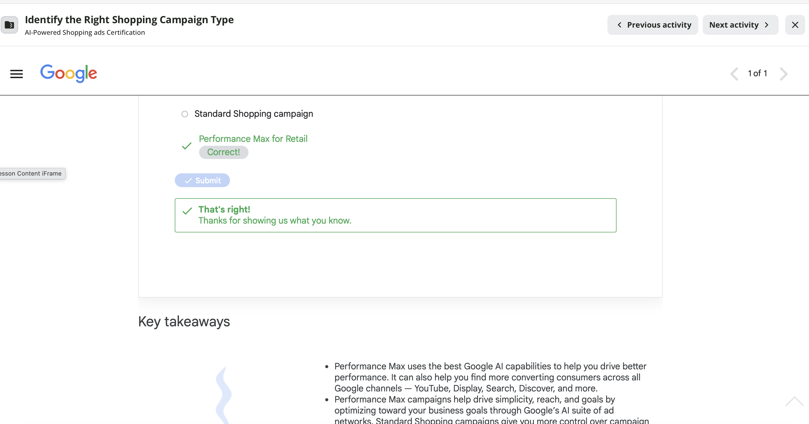

## Introduction

This report documents the completion of three Google Skillshop modules as part of the Google Shopping Ads Certification Part 1 assignment for IBM 6300. The modules covered the foundations of Google Shopping Ads, how Shopping Ads function in the retail ecosystem, and the key requirements retailers must meet before their products can appear in Google Shopping results.

::: callout-note
Google Shopping Ads allow retailers to display product images, titles, prices, and store names directly in Google Search results — giving shoppers a visual, shoppable experience before they even visit a website. For a store like CPP Farm Store, appearing in these results could meaningfully expand reach beyond the campus community.
:::

------------------------------------------------------------------------

## Module Completion Evidence {#sec-completion}

The following section provides proof of completion for all three assigned Google Skillshop modules.[^1]

[^1]: Screenshots were captured upon successful completion of each module. Google Skillshop displays a completion confirmation screen or badge upon finishing each module — these are included below as required evidence.

::: panel-tabset
### Module 1 — Grow Your Retail Business with Google

**Module title:** Grow Your Retail Business with Google **Platform:** Google Skillshop

**Completion screenshot:**

{width="85%"}

------------------------------------------------------------------------

### Module 2 — Know How Shopping Ads Work

**Module title:** Know How Shopping Ads Work **Platform:** Google Skillshop **Path:** Learn the Basics of Shopping Ads

**Completion screenshot:**

{width="85%"}

------------------------------------------------------------------------

### Module 3 — Identify Key Shopping Ad Requirements

**Module title:** Identify Key Shopping Ad Requirements **Platform:** Google Skillshop **Path:** Learn the Basics of Shopping Ads

**Completion screenshot:**

{width="85%"}
:::

------------------------------------------------------------------------

## Key Shopping Ads Concepts {#sec-concepts}

### How Google Shopping Ads Work

Google Shopping Ads are product-level advertisements that appear in Google Search results when a shopper searches for a product. Unlike text-based search ads, Shopping Ads display:

-   A **product image**
-   A **product title**
-   A **price**
-   A **store name**
-   Sometimes a **rating** or **promotion label**

This visual format gives shoppers a richer, more informative experience before they click — which means the quality of the product information in the feed directly determines whether the ad gets clicked or ignored.

Shopping Ads are powered by a **product feed** stored in **Google Merchant Center**. The feed is a structured data file containing product information that Google reads, evaluates, and uses to match products to relevant shopper searches. The retailer does not choose which search queries trigger their ads — Google's algorithm does that matching based on the product data in the feed.

::: callout-tip
This is why product title quality matters so much. A vague title like "Orange Juice" gives Google very little signal. A specific title like "CPP Farm Store Fresh-Squeezed Orange Juice, 16 oz — Campus-Grown, Pomona CA" gives Google much more to work with and is far more likely to match relevant shopper searches.
:::

### The Role of Google Merchant Center

Google Merchant Center is the central hub where retailers upload, manage, and monitor their product feeds. Key functions include:

-   Storing and syncing product data from Shopify or other platforms
-   Reviewing products for policy compliance and data quality
-   Flagging disapproved or incomplete products
-   Connecting to Google Ads for paid Shopping campaigns
-   Enabling free product listings on Google Search and Google Shopping

### Key Shopping Ad Requirements

| Requirement | Why It Matters |
|:-----------------------------------|:-----------------------------------|
| Accurate product title | Google matches titles to search queries — vague titles miss relevant searches |
| High-quality product image | The image is the first thing shoppers see — low quality images reduce click-through rate |
| Current price | Price must match the landing page exactly — mismatches cause disapproval |
| Availability status | In stock vs. out of stock must be accurate — incorrect availability causes disapproval |
| Landing page URL | Must lead directly to the product page, not the homepage |
| Google Product Category | Helps Google classify the product correctly for search matching |
| Brand or GTIN | Required for product identification — GTINs improve match quality |
| Shipping information | Required before products can appear in Shopping results |
| Return policy | Required for Shopping Ads eligibility |

------------------------------------------------------------------------

## CPP Farm Store Application Reflection {#sec-farmstore}

Completing these three Google Skillshop modules clarified both the opportunity and the readiness gaps that CPP Farm Store would face before launching Google Shopping Ads. The modules reinforced that Shopping Ads are not simply a matter of turning on an ad campaign — they require careful preparation of product data, store infrastructure, and policy documentation before a single product can appear in Google Shopping results.

### How Shopping Ads Could Help CPP Farm Store

Google Shopping Ads represent one of the most direct paths for CPP Farm Store to reach new customers beyond the Cal Poly Pomona campus. When a community member in Diamond Bar searches "local honey near Pomona," "farm fresh gift basket Southern California," or "fresh squeezed orange juice Pomona," a well-prepared Shopping Ad listing could place CPP Farm Store's products directly in that search result — with a photo, a price, and the store name visible before the shopper even clicks. This kind of discovery is nearly impossible through the Farm Store's current walk-in and word-of-mouth model alone.

Beyond paid ads, the modules made clear that **free product listings** on Google Shopping are available to any retailer with a verified Merchant Center account and a compliant product feed. CPP Farm Store could gain Google Shopping visibility at no cost simply by connecting its Shopify store to Google Merchant Center and ensuring product data quality meets Google's requirements — making this a high-value, low-cost first step toward digital retail media.

### Which Customer Segment Benefits Most

Of the two target segments identified in our group's omnichannel journey map, **local community members** from Pomona, Diamond Bar, and Walnut would benefit most from improved Google Shopping visibility. These shoppers are already searching Google for local, fresh, and specialty food products — they just don't know the CPP Farm Store exists. A Shopping Ad listing would intercept that search intent at exactly the right moment. CPP students, by contrast, are more likely to discover the store through word of mouth, social media, or simply walking past it on campus — making Google Shopping less critical for that segment, though still useful for driving awareness among new students at the start of each semester.

### What CPP Farm Store Must Prepare

Based on the module content and my experience from the Google Merchant Center Connection Lab, CPP Farm Store would need to address the following before launching Shopping Ads:

-   **Product titles** rewritten in the Google-preferred format: Brand
    -   Product Type + Key Attribute + Size (e.g., "CPP Farm Store Fresh-Squeezed Orange Juice, 16 oz")
-   **Product images** retaken to meet Google's standards — clean background, no text overlays, minimum 250 x 250 pixels, accurate product representation
-   **Shipping policy** added and publicly accessible on the Shopify storefront
-   **Return policy** added and publicly accessible on the Shopify storefront
-   **Google Product Categories** assigned to each product in the feed
-   **Custom domain** registered (e.g., cppfarmstore.com) to replace the Shopify subdomain for website verification
-   **Price and availability accuracy** confirmed — the price on the product feed must exactly match the price on the landing page

### Risks and Challenges

The most significant risk for CPP Farm Store is **product image quality**. Many of the store's current product photos — based on what we observed during our store visit — would not meet Google Merchant Center's image requirements. Reshot, professional-quality images are a prerequisite for Shopping Ad eligibility and would require dedicated time and resources.

A second challenge is the **seasonal and variable nature of the Farm Store's inventory**. Google Shopping Ads work best with stable, consistent product listings. A store where availability changes weekly based on campus harvest schedules would need to implement a system for updating the product feed regularly — otherwise, Google would surface products that are out of stock, leading to a poor customer experience and potential policy violations.

### Connection to Group Project Deliverables

The concepts from these modules connect directly to three of our group's project deliverables. The **Shopify mini-store** developed by the group is the foundation of the product feed — every product page built in Shopify becomes a potential Shopping Ad listing, which means the product titles, descriptions, images, and prices we developed for the mini-store were built with Google's requirements in mind. The **product feed spreadsheet** from GP3 directly maps to the Google Merchant Center feed structure — the fields we built (product ID, title, description, price, availability, category, image link, landing page URL, and shipping information) are exactly the fields Google Merchant Center requires. And the **retail media setup plan** can now be grounded in the specific eligibility requirements and optimization strategies covered in these modules, giving the group a clear roadmap for what CPP Farm Store would need to do to move from a Merchant Center account to active Shopping Ad campaigns.

::: callout-important
The key insight from these modules is that Shopping Ad performance is determined almost entirely by product data quality — not by ad budget. A well-prepared product feed with strong titles, high-quality images, and accurate pricing will outperform a poorly prepared feed regardless of how much money is spent. For CPP Farm Store, investing in product data quality is the highest-return first step before any paid campaign.
:::

------------------------------------------------------------------------

## Appendix {.unnumbered}

| Resource | Link |
|:--------------------------------------------|:--------------------------|
| GitHub Repository | <https://github.com/dmcpp26/ibm6300-assignments> |
| GitHub Pages (Live Report) | <https://dmcpp26.github.io/ibm6300-assignments> |
| Google Skillshop | <https://skillshop.google.com> |
| Module 1 — Grow Your Retail Business | <https://skillshop.exceedlms.com/student/activity/14197-grow-your-retail-business-with-google> |
| Modules 2 & 3 — Shopping Ads Path | <https://skillshop.exceedlms.com/student/path/69612-learn-the-basics-of-shopping-ads> |
| Google Merchant Center | <https://merchants.google.com> |

------------------------------------------------------------------------

