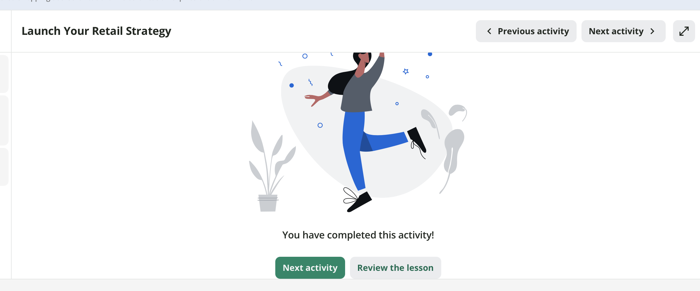
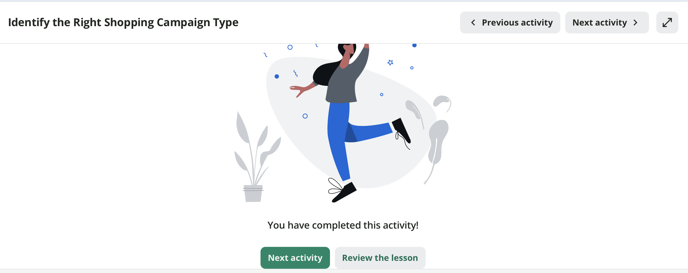
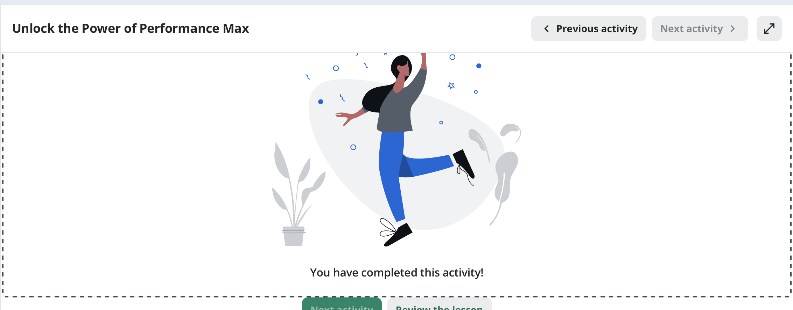

## Introduction

This report documents the completion of three Google Skillshop modules as part of the Google Shopping Ads Certification Part 2 assignment for IBM 6300. The modules covered retail campaign strategy, Shopping campaign types, and Performance Max — Google's automated, cross-channel campaign solution. Together these modules build directly on the Part 1 foundations and connect to the CPP Farm Store campaign plan developed in GP4.[^1]

[^1]: All three modules were completed via Google Skillshop at skillshop.google.com in Summer 2026 as part of the IBM 6300 individual certification work connected to the CPP Farm Store omnichannel consulting project.

------------------------------------------------------------------------

## Module Completion Evidence {#sec-completion}

The following section provides proof of completion for all three assigned Google Skillshop modules.[^2]

[^2]: Screenshots were captured upon successful completion of each module. Google Skillshop displays a completion confirmation screen or badge upon finishing each module — these are included below as required evidence.

::: panel-tabset
### Module 1 — Launch Your Retail Strategy

**Module title:** Launch Your Retail Strategy **Platform:** Google Skillshop **Path:** Google Shopping Ads

**Completion screenshot:**

{width="85%"}

------------------------------------------------------------------------

### Module 2 — Identify the Right Shopping Campaign Type

**Module title:** Identify the Right Shopping Campaign Type **Platform:** Google Skillshop **Path:** Google Shopping Ads

**Completion screenshot:**

{width="85%"}

------------------------------------------------------------------------

### Module 3 — Unlock the Power of Performance Max

**Module title:** Unlock the Power of Performance Max **Platform:** Google Skillshop **Path:** Google Shopping Ads

**Completion screenshot:**

{width="85%"}
:::

------------------------------------------------------------------------

## Key Concepts from the Modules {#sec-concepts}

Based on the three Skillshop modules, the following section summarizes the most important concepts related to retail campaign strategy, campaign type selection, and Performance Max.[^3]

[^3]: All concepts in this section are drawn directly from the three Google Skillshop modules completed for this assignment.

### Retail Campaign Objectives

Before selecting a campaign type or building any ads, a retailer must define a clear campaign objective. Google identifies three primary retail objectives:

-   **Online sales** — drive purchases through the retailer's website or e-commerce store
-   **Store visits** — drive foot traffic to a physical location
-   **Omnichannel** — drive both online and in-store activity simultaneously, treating the two as one connected customer journey

The campaign objective determines everything that follows — which campaign type to use, how to bid, which channels to prioritize, and which KPIs to track.

### Shopping Campaign Types

| Campaign Type | Best For | Control Level | Automation |
|:---|:---|:--:|:--:|
| Standard Shopping | Retailers with strong product data who want manual control | High | Low |
| Performance Max | Retailers ready to let Google optimize across all channels | Low | High |

: Shopping Campaign Type Comparison {#tbl-campaigns .striped .hover}

See @tbl-campaigns for the key differences between Standard Shopping and Performance Max.

### Performance Max

Performance Max is Google's most automated campaign type. Rather than targeting specific placements or keywords, the retailer provides:

-   A product feed from Google Merchant Center
-   Creative assets (headlines, descriptions, images, videos)
-   Audience signals (who to prioritize)
-   A campaign goal and budget

Google's machine learning then serves ads across Search, Shopping, Display, YouTube, Gmail, and Maps — automatically optimizing delivery toward the campaign goal. The advantage is reach and efficiency. The tradeoff is reduced transparency and control compared to Standard Shopping.

::: callout-tip
Performance Max is most effective when the retailer has sufficient conversion data for Google's algorithm to learn from. For a new or small retailer like CPP Farm Store with limited conversion history, starting with Standard Shopping may produce more predictable results before graduating to Performance Max.
:::

------------------------------------------------------------------------

## CPP Farm Store Application Reflection {#sec-farmstore}

Completing these three modules clarified both the campaign strategy options available to CPP Farm Store and the realistic starting point the store should consider given its current digital maturity.

### Campaign Objective

The most appropriate retail campaign objective for CPP Farm Store is an **omnichannel objective** — one that simultaneously drives online awareness and discovery through Google Shopping while converting that interest into in-store pickup visits at 4102 S. University Drive, Pomona. CPP Farm Store does not currently offer home delivery, which means the final purchase step always requires a physical visit. A pure online sales objective would not fit the store's fulfillment model. A pure store visit objective would ignore the online discovery gap that our group identified in the journey map. An omnichannel objective threads the needle — using Google's digital channels to reach customers who are searching for local, farm-fresh, or gift products online, and converting that awareness into a pickup order or in-store visit.

### Product Prioritization

Based on the GP3 product feed work and our group's GP4 campaign plan, the products that should be prioritized in a Google Shopping campaign are the gift basket offerings — specifically the Classic Farm Basket (\$35), the Anti-Pasti Gift Box (\$55), and the Sweet Gift Box (\$40). These products have the highest search intent potential, the clearest gifting occasion tie-ins, and the strongest visual differentiation from what a shopper would find at a grocery store. The local honey and strawberry preserves should also be included as lower-price-point entry items for community shoppers discovering the store for the first time. The fresh produce and seasonal items are better promoted through organic channels like Instagram and campus signage rather than paid Shopping campaigns, because their availability changes too frequently to maintain a consistent product feed without significant operational overhead.

### Campaign Type Recommendation

For CPP Farm Store's current stage of digital development, I would recommend starting with a **Standard Shopping campaign** rather than Performance Max. Standard Shopping offers more control over which products appear, how bids are set, and what the campaign spends — which is important for a small, budget-constrained store that is just beginning to build Google Shopping presence. Standard Shopping also requires less conversion history data to function effectively, whereas Performance Max relies on machine learning that needs a baseline of conversions to optimize toward. Once the store has accumulated several months of Shopping campaign data and established a baseline conversion rate, graduating to Performance Max would allow the campaign to scale across Google Search, Display, and Maps simultaneously — reaching both the CPP student audience and the local community audience across multiple touchpoints without requiring the store to manage separate campaigns for each channel.

### Channels and Touchpoints

A Google Shopping campaign for CPP Farm Store should support the following customer touchpoints in order of priority:

-   **Google Shopping** — primary paid channel for community members searching with gift-buying intent
-   **Google Maps** — free listing that supports store visit goals and local discovery for both segments
-   **Google Search** — text ads supporting seasonal and occasion-based searches (e.g., "Mother's Day gift basket Pomona")
-   **Instagram** — organic social channel supporting the campus segment and building brand familiarity before a search occurs

### KPIs

Based on the campaign objective and product priorities, CPP Farm Store should track the following KPIs:

| KPI | Why It Matters |
|:---|:---|
| Click-through rate (CTR) | Measures whether product titles and images are compelling enough to earn a click |
| Product page views | Indicates whether shoppers are engaging with the gift basket listings after clicking |
| Pickup order conversions | The primary success metric — did the Shopping click result in an online pickup order? |
| Store visit lift | Did Google Shopping exposure increase in-store foot traffic? |
| Cost per conversion | Ensures the campaign is generating pickup orders at a sustainable cost |
| Return on ad spend (ROAS) | Measures revenue generated per dollar of ad spend |
| Impression share | How often CPP Farm Store appears when a relevant search occurs |

: CPP Farm Store Recommended KPIs {.striped .hover}

### Connection to Group Project Deliverables

The concepts from these modules connect to three of our group's remaining deliverables. The **GP4 campaign plan** already defined the campaign objective (omnichannel, drive gift basket awareness and pickup orders), the target audiences (CPP students and local community members), and the channel strategy — all of which align directly with the retail campaign framework covered in Module 1. The **GP5 creative brief and assets** should now be understood as the asset group inputs for a potential Performance Max campaign — the headlines, descriptions, images, and campaign message we developed map directly to what Google would require to run a Performance Max campaign for CPP Farm Store. And the **project dashboard** should track the KPIs listed above CTR, product page views, pickup order conversions, and ROAS; so that CPP Farm Store's management can evaluate campaign performance and make data-informed decisions about whether to continue, adjust, or scale their Google Shopping investment after the initial campaign period.

::: callout-important
The most important insight from these modules for CPP Farm Store is that campaign success starts with product data quality, not campaign budget. A Standard Shopping campaign with five well-prepared, high-quality product listings will outperform a Performance Max campaign built on an incomplete or poorly structured product feed. The GP3 product feed work the group completed is therefore the most critical prerequisite before any paid campaign should be launched.
:::

------------------------------------------------------------------------

## Appendix {.unnumbered}

| Resource | Link |
|:---|:---|
| GitHub Repository | <https://github.com/dmcpp26/ibm6300-assignments> |
| GitHub Pages (Live Report) | <https://dmcpp26.github.io/ibm6300-assignments/OACP-W08-Shopping-Ads-Cert2/DMEZA_8GSACpt2.html> |
| Google Skillshop | <https://skillshop.google.com> |
| Google Shopping Ads Path | <https://skillshop.exceedlms.com/student/path/69612-learn-the-basics-of-shopping-ads> |
| Google Merchant Center | <https://merchants.google.com> |

: Assignment Links {.striped .hover}

------------------------------------------------------------------------

*Submitted for IBM 6300 — Business Analytics \| Cal Poly Pomona \| Summer 2026*
