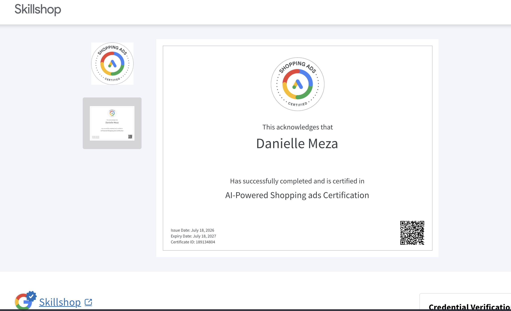

## Certification Completion Evidence {#sec-cert}

The following screenshot provides proof of completion of the Google Shopping Ads Certification assessment through Google Skillshop.

{width="85%"}

::: callout-tip
The certification certificate includes a shareable link that can be added directly to a LinkedIn profile under the Licenses and Certifications section. The certificate link is included in the Appendix of this report.
:::

------------------------------------------------------------------------

## Final Application Summary {#sec-summary}

### Three Most Useful Concepts from the Certification

The Google Shopping Ads certification process across all three parts covered a significant amount of ground, but three concepts stood out as especially useful and applicable beyond this course.

The first is the distinction between **product data quality and campaign budget** as drivers of Shopping Ad performance. Before completing this certification, I assumed that better performance required more spending. The certification made clear that product titles, images, descriptions, and feed completeness determine whether a product even becomes eligible for Shopping Ads — and that a well-prepared product feed will consistently outperform a poorly-prepared one regardless of budget. This fundamentally changed how I think about retail media: the creative and data work comes first, the spending comes second.

The second concept is **Performance Max and its relationship to automation**. Performance Max was the most technically complex topic in the certification, and understanding it clarified both its power and its limitations. The idea that a single campaign type can serve ads across Search, Shopping, Display, YouTube, Gmail, and Maps simultaneously — optimizing automatically toward a defined conversion goal — is genuinely transformative for small retailers who cannot manage six separate campaigns. But the certification also made clear that Performance Max requires sufficient conversion data to function effectively, which means it is not appropriate as a starting point for a store with no prior advertising history. That nuance is practically important for advising a client like CPP Farm Store.

The third concept is **the omnichannel campaign objective** as a distinct goal from either online sales or store visits. Naming this as its own objective — and understanding that it requires both digital product data and in-store fulfillment infrastructure — gave me a vocabulary and framework for something I already intuitively understood from the IBM 6300 coursework but could not previously articulate in Google's language. An omnichannel campaign objective is exactly what CPP Farm Store needs, and now I can explain specifically what it requires and how to measure it.

### How the Certification Helped Me Understand CPP Farm Store's Omnichannel Opportunities

Working through the full certification path deepened my understanding of CPP Farm Store's specific situation in two important ways. First, it clarified exactly what the store would need to prepare before launching any Google Shopping campaign — a custom domain, complete product data, high-quality images, shipping and return policies, and a verified Google Merchant Center account. These requirements are no longer abstract; I now understand each one as a specific, actionable step with a clear reason behind it. Second, the certification reinforced that CPP Farm Store's most realistic and highest-value starting point is free product listings through Google Merchant Center, not paid Shopping Ads. Free listings require the same product data preparation as paid campaigns but carry no cost, which is appropriate for a university farm store with a limited marketing budget. This is a recommendation I feel confident making and defending.

### Personal Contribution to the Group Project

My direct contributions to the group project drew on the knowledge built across all three parts of this certification. For GP3, the product feed work I completed — writing all ten product descriptions and conducting the image readiness assessment — was directly informed by the product data quality standards covered in Part 1. For GP4, the omnichannel channel integration and campaign tactics I developed were built around the channel strategy frameworks from Part 2. For GP5, the Google Shopping product listing copy I wrote for the Creative Brief reflected the product title and description best practices from the certification, including the format of brand plus product type plus key attribute plus size. And for GP6, my contribution to the Looker Studio dashboard — including the CTR by product chart and the conversion funnel — was grounded in the KPI and measurement frameworks from Part 2. The certification was not background learning; it directly shaped the quality of each deliverable I contributed.

### Professional Confidence

The area where I now feel most confident professionally is **discussing product feed quality and its relationship to Google Shopping performance**. Before this certification, I could describe omnichannel strategy conceptually. Now I can explain to a client exactly why their product title format matters, what a Google Product Category is and why it is required, how image specifications affect eligibility, and what the difference between a disapproved and an active product listing means in practice. That level of specificity is what separates a general marketing recommendation from a technically credible one — and it is something I can bring into any e-commerce or digital marketing role.

### Resume and LinkedIn Application

This certification can be represented on a resume and LinkedIn profile in the following ways:

**Resume — Certifications section:** \> Google Shopping Ads Certification · Google Skillshop · 2026

**Resume — Skills section:** \> Google Merchant Center · Product feed management · Google Shopping \> Ads · Performance Max · Retail media strategy · E-commerce \> analytics

**LinkedIn — Licenses and Certifications:** \> Google Shopping Ads · Issued by Google · June 2026 \> Credential ID: 0xb58507c7cbe56e4eba828f6a3a6c39124f68e8061a53311155a578591424e41a \>

**LinkedIn — About section or project description:** \> Completed Google Shopping Ads Certification through Google Skillshop \> as part of an omnichannel retail consulting project for CPP Farm \> Store at Cal Poly Pomona, covering product feed development, retail \> campaign strategy, Performance Max, and campaign measurement.

::: callout-important
The Google Shopping Ads Certification is valid for one year from the date of completion and should be renewed annually to keep the credential current on LinkedIn and professional profiles.
:::

------------------------------------------------------------------------

## Appendix {.unnumbered}

| Resource | Link |
|:--------------------------------------------|:--------------------------|
| GitHub Repository | <https://github.com/dmcpp26/ibm6300-assignments> |
| GitHub Pages (Live Report) | <https://dmcpp26.github.io/ibm6300-assignments> |
| Google Skillshop | <https://skillshop.google.com> |
| Google Shopping Ads Certification Path | <https://skillshop.exceedlms.com/student/path/69612-learn-the-basics-of-shopping-ads> |
| Certification Certificate Link | PASTE YOUR CERTIFICATE URL HERE |

: Assignment Links {.striped .hover}

------------------------------------------------------------------------

*Submitted for IBM 6300 — Business Analytics \| Cal Poly Pomona \| Summer 2026*
